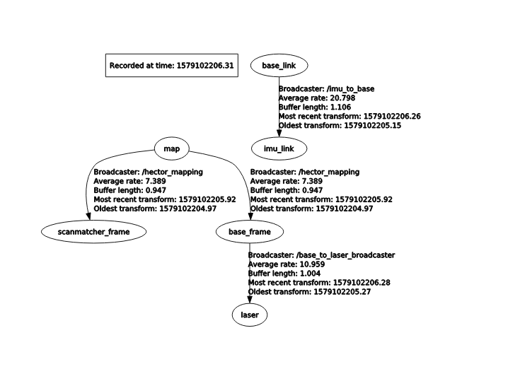
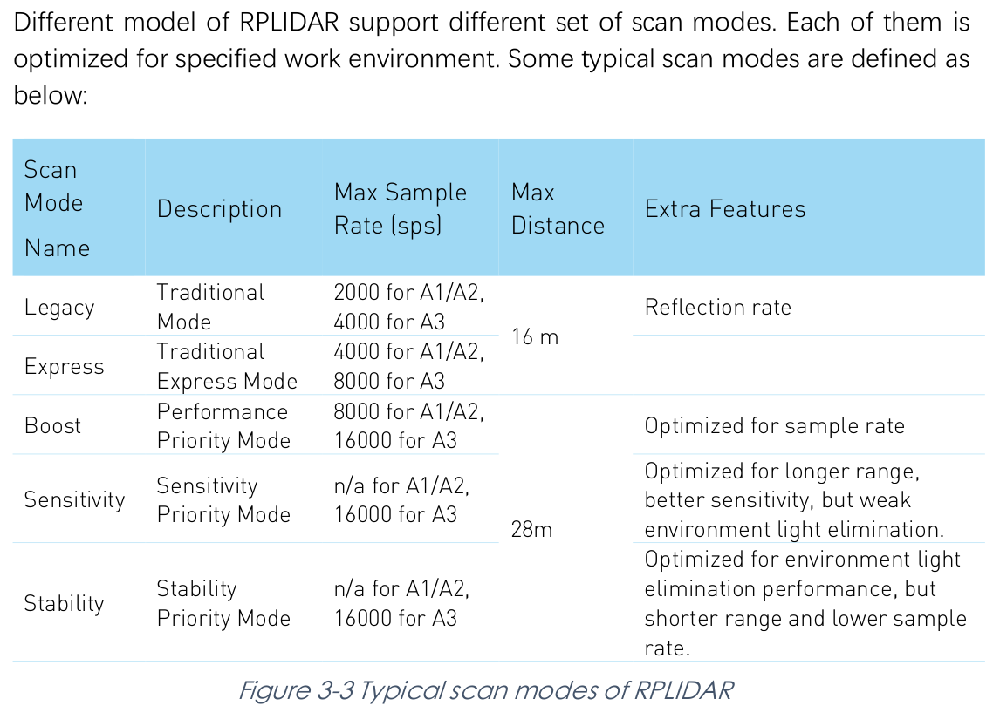
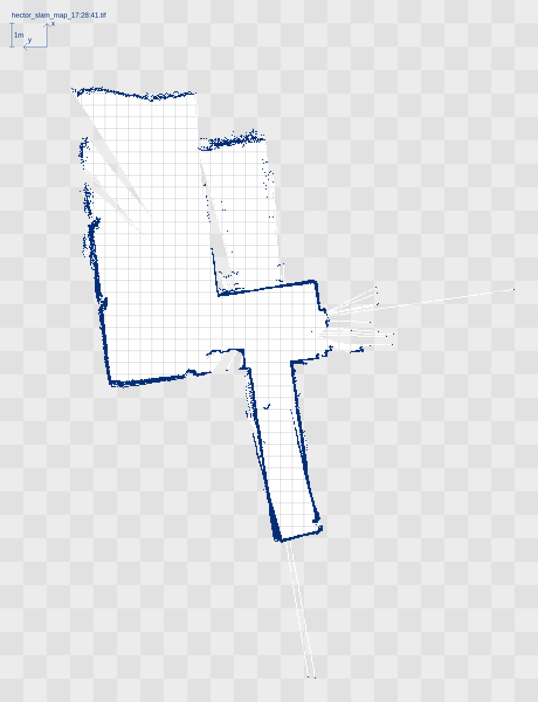

# Dokumentation
Dieser Leitfaden soll bei der Konfiguration, weiterentwicklung und Veränderung des Scoomatics behilflich sein.

- [Dokumentation](#dokumentation)
  - [Einführung in das Projekt](#einf%c3%bchrung-in-das-projekt)
  - [ROS](#ros)
    - [ROS Package-Struktur](#ros-package-struktur)
    - [Node & Topic Übersicht](#node--topic-%c3%9cbersicht)
      - [scoomatic-ros1](#scoomatic-ros1)
      - [scoomatic-drive](#scoomatic-drive)
      - [ROS Logs](#ros-logs)
    - [Parameter Einstellungen](#parameter-einstellungen)
    - [How To Use](#how-to-use)
      - [Raspberry Pi einschalten](#raspberry-pi-einschalten)
      - [ROS (Core) Starten](#ros-core-starten)
      - [SLAM starten](#slam-starten)
      - [Navigation starten](#navigation-starten)
  - [ROS 2](#ros-2)
    - [ROS2 starten](#ros2-starten)
    - [ROS2 Nodes stoppen](#ros2-nodes-stoppen)
  - [TF](#tf)
    - [Aktuelle TF Baumstruktur](#aktuelle-tf-baumstruktur)
  - [Hardware](#hardware)
    - [Scoomatic Maße](#scoomatic-ma%c3%9fe)
  - [Software](#software)
    - [Hector SLAM Installation](#hector-slam-installation)
    - [Hector SLAM ausführen](#hector-slam-ausf%c3%bchren)
    - [Navigation installieren & ausühren](#navigation-installieren--aus%c3%bchren)
    - [SLAM-Karte speichern und bereitstellen](#slam-karte-speichern-und-bereitstellen)
    - [RViz](#rviz)
  - [Konfiguration](#konfiguration)
    - [ssh Verbindung einrichten](#ssh-verbindung-einrichten)
    - [Bash Aliasse](#bash-aliasse)
    - [udev Regeln](#udev-regeln)
    - [RPLidar | Scan Modes](#rplidar--scan-modes)
  - [Tips & Tricks](#tips--tricks)
    - [Hilfreiche Commands](#hilfreiche-commands)
    - [Numerische Werte der TF Transformationen anzeigen](#numerische-werte-der-tf-transformationen-anzeigen)
    - [Motor des LIDAR starten & stoppen](#motor-des-lidar-starten--stoppen)
    - [Mehrere Fenster in einer Shell verwenden](#mehrere-fenster-in-einer-shell-verwenden)
    - [BAG Files](#bag-files)
    - [Odometrie Daten anzeigen in rviz](#odometrie-daten-anzeigen-in-rviz)
    - [Unterschiedliche Geschwindigkeiten Räder](#unterschiedliche-geschwindigkeiten-r%c3%a4der)
  - [Bestehende Probleme](#bestehende-probleme)
    - [Performance Probleme des RPi](#performance-probleme-des-rpi)
    - [RViz: "Fixed Frame [map] does not exist"](#rviz-%22fixed-frame-map-does-not-exist%22)
    - [TF Transform Error](#tf-transform-error)
  - [Hinweise](#hinweise)
    - [Geschwindigkeit des Scoomatics](#geschwindigkeit-des-scoomatics)
    - [Odometrie Differenz zwischen Ein- & Ausgabe](#odometrie-differenz-zwischen-ein---ausgabe)
    - [SLAM fortführen / Karte nachträglich verbessern](#slam-fortf%c3%bchren--karte-nachtr%c3%a4glich-verbessern)
    - [Hector GeoTIFF wird nicht gespeichert](#hector-geotiff-wird-nicht-gespeichert)

## Einführung in das Projekt
Das Projekt Scoomatic baut insbesondere auf dem von Martin Schoerner auf. Es wurde einige Veränderungen vorgenommen. Insbesondere wurden die Treiber von ROS2 auf ROS1 backported. Dadurch wurde sich eine ausgereiftere Software und bessere Dokumentation versprochen. Die Dokumentation des vorherigen Projekts findet sich hier: [Projektmodul-MS](../projektmodul-ms/index.md).

Zudem wurde die Einstellungen so geändert, dass der Zugang und die Konfiguration vereinfacht wurden. Beispielhaft wurde das aufwendige sortierte einstecken der USB-Geräten mit udev Regeln vereinfacht.

Als kleine Übersicht, das grobe Message-passing:

```
  Map Server
      |
      | → provides (nav_msgs/OccupancyGrid)
      ↓
  Localization
      |
      | → provides (geometry_msgs/PoseWithCovarianceStamped) & (tf/tfMessage)  & uses (sensor_msgs/LaserScan) & (tf/tfMessage)
      ↓
  Navigation
      |
      | 
      ↓
  Moves Robot
```

## ROS

### ROS Package-Struktur
Das System ist in zwei ROS Packages aufgeteilt. Das ist zum einen das ```scoomatic-ros1```, welche die Sensordaten des Scoomatics bereitstellt, eventuell auch umrechnet sowie die Eingabemöglichkeiten wie Gamepad verwaltet. Letzteres, das ```scoomatic-drive``` Package stellt die Nodes zur Benutzung der Navigation und SLAM bereit. 

* Sensordata & Input Publishing
  * Motor diagnostics/debug
  * LIDAR
  * Ultrasonic
  * IMU
  * Gamepad
  * Joystick
* Drive Processing
  * SLAM
  * Localisation
  * Navigation
  * Obstacle Avoidance

### Node & Topic Übersicht


Dies gibt eine Übersicht über die Topics zwischen den Nodes und den Nodes selbst.

Es existieren Paramter, welche über ein launchfile gesetzt werden. Sie sind nutzbar über ```NodeName/Parameter```. Beispiel: Bei der Node ```MotorDriver``` ist der Parameter *port* per ```MotorDriver/port```. Mit ```rosparam``` lassen sich im Terminmal die Werte auslesen. Zudem werden diese beim Starten des ROS Core angezeigt.

#### scoomatic-ros1
* /imu/
  * i2c_imu_node (i2c_imu/i2c_imu_node)
* /
  * GamepadDriver (scoomatic_ros1/gamepad_driver.py)
  * MotorDiag (scoomatic_ros1/motor_diag.py)
  * MotorDriver (scoomatic_ros1/motor_driver.py)
  * OdomPublisher (scoomatic_ros1/odom_publisher.py)
  * RPLidar (rplidar_ros/rplidarNode)
  * base_to_laser (tf/static_transform_publisher)
  * imu_to_base (tf/static_transform_publisher)

#### scoomatic-drive
**TODO**

#### ROS Logs
Alle Ausgaben der Nodes bzw. Topics landen in der Topic ```/rosout```. Dies gilt natürlich auch für selbst erstellte Nodes. In Python kann mit ```rospy.loginfo(STRING)``` ein STRING als Info veröffentlicht werden. Mit ```rospy.logwarn(WARNING)``` kann eine Warnung veröffentlicht werden.

Mehr Infos zum Thema [Logging](http://wiki.ros.org/rospy/Overview/Logging).

> /rosout kann einfach mit ```rostopic echo /rosout``` angeschaut werden

### Parameter Einstellungen

Die Nodes werden über Launchfiles, also Dateien mit *.launch* gestartet und eingestellt. Parameter zum einstellen erfolgen also überwiegend in diesen Dateien, die als XML File strukturiert sind.

Im Package ```scoomatic_ros1``` existieren zwei Launchfiles. ```mpu_9259.launch``` ist zum starten der IMU, ```launch_drivers.launch``` für das starten aller anderen Sensoren und Eingabe-Nodes. Durch auskommentieren kann das Starten einer Node deaktiviert werden.

In ```scoomatic_drive``` existieren mehrere, insbesondere für SLAM notwendige und angepasste Launchfiles. Mit ```start_hector_slam.launch``` kann der SLAM Vorgang gestartet werden und startet auch sofort. Mit ```start_navigation.launch``` werden alle Nodes notwendig für die Navigation gestartet. Dafür muss allerdings eine Karte erstellt worden sein und dessen YAML-Datei im Argument *map_file* korrekt festgelegt werden.

### How To Use

#### Raspberry Pi einschalten
Es ist möglich den Raspberry Pi mit dem vorhandenen Micro-USB Kabel, mit der Stromversorgung des Scoomatics zu versorgen. Zudem ist es aber auch möglich den RPi direkt per Micro-USB an eine USB Stromversorgung anzuschließen. Ein Computer reicht in der Regel dafür aus.

> Voraussetzung ist, wenn die Stromversorgung des Scoomatics verwendet wird, dass die Verbindung zwischen Akku und Mainboard hergestellt ist

#### ROS (Core) Starten

> Diese Anleitung setzt voraus, dass die Umgebung wie im Kapitel eingerichtet wurde.

1. Scoomatic, also insbesondere den Raspberry Pi, anschalten. Kurz warten.
2. Mit ```ssh scoomatic``` per SSH verbinden
3. ROS & Nodes starten: ```startros1```
Dies ist generell notwendig um weitere Schritte auszuführen.

#### SLAM starten
Nun kann HectorSLAM auf dem Remote Rechner gestartet werden:

1. Neues Terminal öffnen und
2. In den korrekten Ordner ```ros-drivers/scoomatic_drive/launch``` wechseln
3. Hector SLAM ```roslaunch start_hector_slam.launch``` starten
4. Wenn eine visuelle Darstellung gewünscht ist: Dann in einem neuen Terminal in den Ordner ```code/configuration/``` wechseln
5. RViz mit ```rviz -d 'odometry-and-map.rviz'``` starten
6. Ein neues Terminal öffnen, wenn das Kartieren abgeschlossen ist, damit die Karte gespeichert werden kann
7. Mithilfe des Map servers ```rosrun map_server map_saver -f mapfilename``` ausführen

> Hector SLAM kann **statt** auf dem Remote Rechner auf dem Raspberry Pi ausgeführt werden. Die Performance sinkt jedoch stark, die Leistung des RPi ist nicht ausreichend. Insbesondere die Darstellung von RViz über SSH ist faktisch nicht benutztbar.

#### Navigation starten
Nachdem die Karte per SLAM erstellt worden ist, kann die Navigation verwendet werden.

**TODO**

## ROS 2

Für ausführliche Erklärungen sei auf [Projektmodul-MS#ros2-bedienung](../projektmodul-ms/index.md#ros2-bedienung) verwiesen. Eine kurze Übersicht ist hier zu finden.

### ROS2 starten
```sourceros2``` sourced alle notwendigen ROS2 Dateien. Dies ist bpsw. bei einem wechsel von ROS1 zu ROS2 im gleichen Terminal Fenster notwendig.
```startros2``` startet ROS2.

### ROS2 Nodes stoppen
Es gibt keine einfache Möglichkeit die Gesamtheit der ROS2 Nodes zu stoppen. Dies kann höchstens Node-weise passieren.

Nach Anleitung von [answers.ros.org](https://answers.ros.org/question/323329/how-to-kill-nodes-in-ros2/), gelingt das stoppen von einer ROS2 Node folgendermaßen:
```
ros2 lifecycle set <nodename> shutdown
```

Allerdings hat dies in diesem Projekt nicht funktioniert.
Schlussendlich bleibt nur die Möglichkeit, den Prozess mithilfe von ```kill PID``` und der passenden PID zu beenden. Die PID kann per ```top``` oder ```htop``` ermittelt werden. Allerdings gibt es unter Umständen für eine Node mehrere Prozesse. 

## TF

ROS bietet die Möglichkeit Transformationen, also Beziehungen zwischen Roboter-Teilen und zwischen des Roboters und der realten Welt abzubilden. Dafür wird eine Baumstruktur von TF erstellt, in der Beziehungen von Nodes gepublisht und verwendet werden können. Da dieser Roboter, ausgenommen die beiden Räder, keine beweglichen Teile enthält, sind die existierenden Transformationen statisch.

> Am besten folgenden Befehl auf dem Remote Rechner ausführen

Mit 

```
rosrun rqt_tf_tree rqt_tf_tree
``` 

kann eine Übersicht aller tf frames angezeigt werden. Ähnlich zu den Topics&Nodes.

### Aktuelle TF Baumstruktur

Die derzeitige Baumstruktur, während HectorSLAM geöffnet ist. Die einzelnen Ellipsen werden ```frames``` gennant. Die ```map``` stellt die Welt-Referenz dar. Der frame ```odom``` stellt die Daten des Motors bereit und wird von der Node /OdomPublisher/odom veröffentlicht. Die Beziehung zwischen map und odom wird von HectorSLAM hergestellt.

Der ```base_link``` frame sollte im Rotationszentrum des Roboters liegen. Der LIDAR wird dann ausgehend vom ```base_link``` frame per statischem Publisher festgelegt, genauso wie die IMU.

**TODO: Bild aktualisieren!!!**



## Hardware

Zunächst sei angemerkt, dass keine Hardwareänderungen vorgenommen wurden. Zudem sei auf [Projektmodul-MS](docs/projektmodul-ms/index.md) verwiesen.

Es wurden alle Treiber, außer der GPS Treiber auf ROS1 portiert, da aktuell und in naher Zukunft kein Bedarf für diesen Treiber besteht.

### Scoomatic Maße
Die Breite des Scoomatics ist **622mm**. Dies wurde jeweils in der Mitte der Reifen gemessen. Bedeutet, dort wo der Reifen abrollt.

**TODO**

## Software

Die Installation von SLAM und der Navigation wird hier beschrieben.

### Hector SLAM Installation
Die Installation erfolgt über Ubuntus Packetverwalter. Weil aktuell ROS melodic verwendet wird, lautet die Installation:

```
sudo apt-get install ros-melodic-hector-slam
```

Dabei werden alle benötigten Dependencies mitinstalliert. Es gibt dann zwei entscheidende Default-Launchfiles: in ```hector_slam_launch/tutorial.launch``` und in ```hector_mapping/mapping_default.launch```. Ersteres ist für den Start von dem gesamten HectorSLAM verantwortlich. Dieses startet unteranderem auch Letzteres. Dies enthält die maßgeblichen Paramter Einstellungen für das SLAM.

Die notwendigen Einstellungen für das RPLidar A1 ist von NickL77 hier abzurufen: [RPLidar_Hector_Slam](https://github.com/NickL77/RPLidar_Hector_SLAM/blob/master/README.md#Sources). Der frame der Laserdaten ist per default ```laser``` und kann in der ```scoomatic1/launch/launch_drivers.launch``` Datei geändert werden.

### Hector SLAM ausführen
```
roslaunch scoomatic_ros1 hector_slam.launch
```
kann Hector SLAM eigenständig ausgeführt werden. Sie liegt in ```scoomatic_ros1/launch/hector_slam.launch```

### Navigation installieren & ausühren
**TODO**

### SLAM-Karte speichern und bereitstellen

Mit dem package **map_server** aus *navigation* kann die Karte, welche per SLAM erzeugt wird, gespeichert werden. Es wird eine pgm Bilddatei zusammen mit einer YAML Konfigurationsdatei erstellt.

```
rosrun map_server map_saver -f mapfilename
```

Wenn die Karte bereitgestellt werden soll, kann dies mit dem *scoomatic_drive* passieren. Wenn das **navigation.launch** gelauncht wird, wird auch die Karte bereitgestellt. Dafür muss diese aber im korrekten Ordner sich befinden bzw. der Pfad im Launchfile angegeben sein.

Mehr Infos: [map_server](http://wiki.ros.org/map_server#YAML_format)

### RViz
**TODO**
Mit RViz ist es möglich viele Daten rund um den Scoomatic innerhalb der Welt anzeigen zu lassen.

Dies umfasst unter anderem folgende Daten:

* LaserScan
* Odometry
* Map
* PoseWithCovariance (Also Pose mit Unsicherheit)
* Trajectory

RViz kann auch auf einem externen Rechner, anstatt auf dem RPi, gestartet werden. Dafür muss jedoch zunächst die ROS MASTER URI neu gesetzt werden.

## Konfiguration
### ssh Verbindung einrichten
> Voraussetzungen dafür sind: Rechner & RPi sind mit dem ```rt``` WiFi-Netzwerk verbunden
> und der avahi-daemon unter Ubuntu läuft. Dies kann mit ```systemctl status avahi-daemon``` überprüft werden.

Im Ordner ```configuration``` liegt die [SSH-Config](../../code/configuration/ssh-config), welche sich mit dem Raspberry Pi verbinden kann. Diese Config muss unter Ubuntu 18.04 unter ```~/.ssh/config``` gespeichert werden.

Dann sich kann mit ```ssh ubuntu``` und dem Passwort ```notubuntu``` mit dem RPi verbunden werden.

> In der Regel wird vom DHCP dem RPi die IP 192.168.140.16 vergeben

Alternative kann jedes Mal ```ssh -X ubuntu@ubuntu.local``` eingegeben werden.

### Bash Aliasse
**TODO: Alias config in configuration packen** 
In diesem Projekt wurden alias in bash verwendet. Dies vereinfacht die Benutzung von ROS deutlich. Die verwendeten Alias können in der [bash-aliases](../../code/configuration/bash-aliases) nachgelesen werden.

Wenn diese in der Bash verwendet werden wollen müssen diese einfach in die ```~/.bashrc``` am Ende der Datei eingefügt werden.

```
alias sourceros2="source /opt/ros/crystal/setup.bash && source ~/ros2_ws/install/setup.bash"
alias startros2="~/ros2_ws/src/scoomatic_drivers/start_ros2.bash"
alias startros1="~/lennart_catkin_ws/src/scoomatic_ros1/start_ros1.bash"
```

 Mehr Infos bei [ubuntuusers/alias](https://wiki.ubuntuusers.de/alias/).

### udev Regeln

Die udev Regeln sind notwendig, weil Linux die USB-Geräte nicht deterministisch Identifikationsnummern zuweist. Damit wird ein früheres Problem behoben, dass die USB-Geräte immer nach einem Systemneustart in der korrekten Reihenfolge eingesteckt werden mussten. Die udev Regeln erkennen die Geräte anhand der USB-Steckplätze und weisen diesen konkrete lesbare Namen wie ```/rplidar``` zu.

Alle USB-Geräte können mit ```ls /dev/ttyUSB*``` angezeigt werden. Dort stehen auch die passenden Zuordnungen dabei.

> !Achtung! Die USB-Geräte müssen trotzdem immer noch immer in die vorherigen USB-Steckplätze gesteckt werden. Sonst werden die die Zuordnungen nicht korrekt durchgeführt.

Unter Ubuntu 18.04 liegen die udev-Regeln unter ```/etc/udev/rules.d``` und die konkreten für Scoomatic in ```/etc/udev/rules.d/10-local.rules```. Dies ist jedoch nur eine Symbolische Verknüpfung und liegt im Repository unter ```code/configuration/10-local.rules```. Änderungen können mit ```udevadm control --reload-rules``` bzw ```sudo service udev reload``` & ```sudo service udev restart``` neu eingelesen werden, ohne das System neustarten zu müssen.

Die udev Regeln sind im Format 
```
SUBSYSTEM=="tty", KERNELS=="(ermittelbar mit udevadm info --name=/dev/ttyUSBXXX --attribute-walk)", SYMLINK+="gerätename"
```
zu schreiben.
Wobei XXX durch den von Linux vergebenen Port geändert werden muss.

### RPLidar | Scan Modes



Es existieren verschiedene Scan Modes des RPLidars, welche sich in der Sample Rate, max. Distanz und anderen Features unterscheiden. Für eine Übersicht und Erklärung ist die Dokumentation des Protokoll des RPLidar zu empfehlen. Auf Seite 12 werden die verschiedenen Scan Modes erklärt.

**TODO was ist besser Express oder Boost?**
> SLAM wurde mit Boost und Express erfolgreich getestet.

Zur [Dokumentation RPlidar Protocol](https://download.slamtec.com/api/download/rplidar-protocol/2.1.1?lang=en)

## Tips & Tricks
### Hilfreiche Commands
> Voraussetzung hierfür ist, dass die [Konfiguration](#Konfiguration) abgeschlossen wurde.
* Alle Topics listen: ```rostopic list```
* Alle Nodes listen: ```rosnode list```
* Topic Nachrichten anschauen: ```rostopic echo /topic_name```
* ROS1 starten: ```startros1```
* ROS2 starten: ```startros2```
* Parameter listen: ```rosparam list```

### Numerische Werte der TF Transformationen anzeigen
Bspw. die in Beziehung stehenden frames *turtle1* und *turtle2*
``` 
rosrun tf tf_echo turtle1 turtle2
```

Siehe Auch 

### Motor des LIDAR starten & stoppen
Es ist möglich den LIDAR Motor manuell zu stoppen, so dass er sich nicht mehr dreht. Dies ist mit einem ROS Service erreichbar:

```
rosservice call /stop_motor
```
Genauso kann dieser auch wieder gestartet werden:

```
rosservice call /start_motor
```

### Mehrere Fenster in einer Shell verwenden
> Hierfür muss tmux installiert sein, was mit apt-get erledigt werden kann.

**TODO original config file**
In Terminal ```tmux``` eingeben. Neuer Tab: ```Ctrl+A C```. Wechseln der Tabs mit ```Shift+ArrowKey```.

### BAG Files
BAG Files nehmen alle Messages spezifischer Topics auf und können sie dann zu einem späteren Zeitpunkt wieder "abspielen".

> ```rosbag``` ist das Tool in ROS um .bag Dateien aufzunehmen bzw. abzuspielen.

Aufgenommen werden kann indem ein oder mehrere Topics spezifiziert werden:
```
rosbag record -O NAMEDESBAGFILES /TOPIC1 [/TOPIC2 ...]
```

Also für das Beispiel (Hector) SLAM: 
```
rosbag record -O laserdata /scan 
```

Wenn dann die Karte erstellt werden soll, kann das BAG-File in zweifacher Geschwindigkeit abgespielt werden 
```
rosbag play -r 2 laserdata.bag
```

Mit -r kann die Abspielrate verändert werden.

Siehe auch: [Recording and playing back data (ROS wiki)](http://wiki.ros.org/rosbag/Tutorials/Recording%20and%20playing%20back%20data)

### Odometrie Daten anzeigen in rviz
1. Starte Hector SLAM
2. Starte RViz mit ```rosrun rviz rviz``` oder, siehe unten.
3. Füge den Odometry Layer hinzu
4. Wähle die ```/OdomPublisher/odom``` Topic aus


>Eine spezifische rviz config kann mit
>```
>rosrun rviz rviz -d "odometry-and-map.rviz"
>```
>gestartet werden

### Unterschiedliche Geschwindigkeiten Räder
Aufgrund der pneumatischen Reifen kann es vorkommen, dass durch den unterschiedlichen Druck in linkem und rechtem Reifen bei vorgegebener, gerader Fahrt eine Kurve gefahren wird.

Dann muss der Reifendruck überprüft werden und, wie auf dem Reifen angegeben auf 35 PSI aufgepumpt werden. In diesem Fall hat der Reifen einen Durchmesser von **ca. 250mm**.

## Bestehende Probleme
### Performance Probleme des RPi
Der RPi ist beim ausführen von SLAM sehr träge. Deshalb gibt es verschiedene Möglichkeiten dies zu verbessern bzw. zu umgehen.

Es ist möglich:

1. Die Daten zunächst nur aufzunehmen, in einem BAG File zu speichern und später auf einem leistungsstärkeren Rechner auszuführen oder
2. Über Das Netzwerk in Echtzeit per SLAM eine Karte auf dem Rechner berechnen zu lassen während der RPi die Daten aufnimmt.

### RViz: "Fixed Frame [map] does not exist" 
In rviz auf **Reset** klicken

### TF Transform Error
Beispiel Fehler:

> [ERROR] [1581586277.372654655]: Transform failed during publishing of map_odom transform: Lookup would require extrapolation into the future.  Requested time 1581586276.552239413 but the latest data is at time 1581586276.399903637, when looking up transform from frame [base_link] to frame [odom]

In diesem Fall kann es sein, dass der frame ```odom``` zu häufig die TF Transformationen veröffentlicht bzw. im Verhältnis zu den in Beziehung stehenden Frames.

## Hinweise
### Geschwindigkeit des Scoomatics
Die Geschwindigkeit des Scoomatics muss ermittelt werden, damit anhand der Einheitslosen Geschwindigkeitswerten des Motors eine Wegstrecke bzw. Geschwindigkeit in SI-Einheiten berechnet werden kann.

Dies kann unteranderem durch diese beiden Verfahren erfolgen:
1. Der Radumfang wird berechnet/gemessen und dann innerhalb einer bestimmten Zeit die Anzahl der umdrehungen gemessen
2. Für eine vorgegebene Geschwindigkeit wird die Wegstrecke gemessen, die der Scoomatic in einer bestimmten Zeit absolviert hat

Zur ermittlung wurde Erstere Variante verwendet.

**TODO verschönern**

22 U/10sec bei 199,2 v_scoomatic_eingabe und bei 35 PSI ≈ 2,41 bar Reifenluftdruck
199,2 v_scoomatic in der eingabe entspricht 190 gemessene geschwindigkeit am scoomatic

Umfang [cm] = 2 * Pi * 25cm Radius = 157,1cm

=> Bei 10sec : 157,1cm * 22 = 3456cm / 10sec
=> m/s: 3,456 m/s bei 190 v_scoomatic

Standardisierte m/s Geschwindigkeit in Abhängigkeit der v_scoomatic

Standardisierte v: 3,456 m/s / 190 v_scoomatic ≈ 18,2 mm/s /1 v_scoomatic

=> Bei voller Geschwindigkeit von 996 entspricht dies: 996 * 18,2 mm/s = 18,13m/s = 65,26 km/h. Wohlgemerkt im leerlauf, ohne belastung.

Dies entspricht allerdings nicht der Realität, wenn der Scoomatic auf dem Boden fährt! Die liegt etwa bei 4mm/s /1 v_scoomatic

### Odometrie Differenz zwischen Ein- & Ausgabe
Im Leerlauf besteht etwa eine 5%iger Unterschied zwischen Eingabe Geschwindigkeit und der tatsächlichen Geschwindigkeit. Bsp: -199 Eingabe; -190 Tatsächlich. Dieser kann aber auch höher sein. Beachtenswert ist die negative Geschwindigkeit bei Vorwärtsbewegung. Und umgekehrt bei Rückwärtsbewegung.

Beispiel: Bei voller Geschwindigkeit von 996 ist die tatsächliche Geschwindigkeit 987.

Teilweise werden auch nicht die volle Geschwindigkeit mithilfe des Gamepads erreicht.

Grund dafür ist unteranderem, dass die Numerischen Bereiche unterscheidlich sind: Der Eingabe Parameter ist im Bereich [0..1023]. Die Ausgabe des Motors ist im Bereich [0..1000].

### SLAM fortführen / Karte nachträglich verbessern
Nach aktuellem Kenntnis Stand des Autors ist es nicht möglich eine abgeschlossene und gespeicherte SLAM Karte von Hector SLAM in irgendeiner Art und Weise fortzuführen oder den Prozess zu pausieren.

Mehr Infos: [ROS Answers](https://answers.ros.org/question/9448/loading-a-prior-map-with-gmapping/#13721)

Allerdings ist es möglich eine PGM Karte mithilfe eines Bildbearbeitungsprogramms, bspw. [GIMP](https://www.gimp.org/) zu bearbeiten.

### Hector GeoTIFF wird nicht gespeichert
Im Regelfall sollte mit dem Aufruf von ```rostopic pub syscommand std_msgs/String "savegeotiff"``` eine Karte unter dem angegeben Dateinamen, der in ```geotiff_mapper.launch```  bestimmt ist, gespeichert werden.

Allerdings bestehen keine ausreichenden Rechte, weil HectorSLAM per apt-get installiert wurde. Deswegen wurde vorgeschlagen die Rechte für die Nutzenden zu erlangen:

```
sudo chown -R USER:GROUP /opt/ros/melodic/share/hector_geotiff
```
Dabei sind User und Group in der Regel identisch. Allerdings konnte damit das Problem nicht behoben werden.

Dafür kann regelmäßig eine Karte gespeichert werden im ```hector_geotiff``` ROS Package mit dem Parameter ```geotiff_save_period``` in der Datei ```geotiff_mapper.launch``` in Sekunden.

Siehe auch: https://answers.ros.org/question/209730/saving-geotiff-map-in-hector_slam/

Beispiel Karte kann so aussehen:
