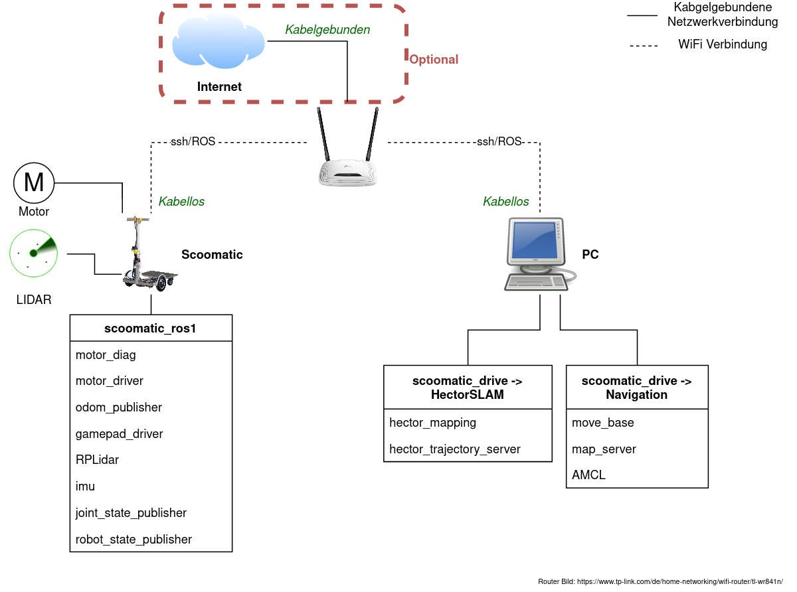
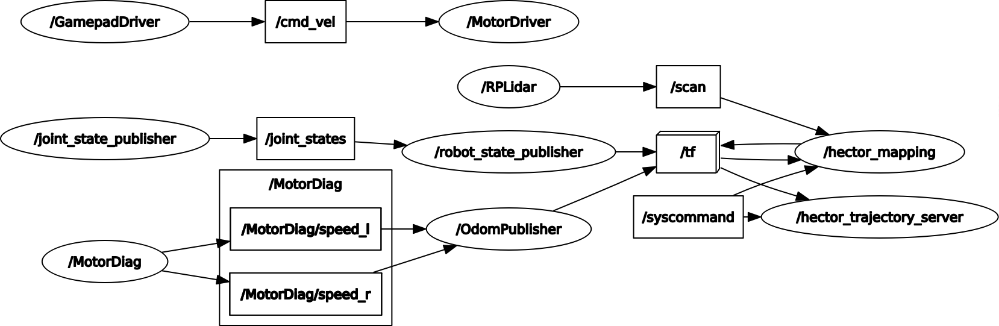

# Dokumentation
Dieser Leitfaden soll bei der Konfiguration, Weiterentwicklung und Veränderung des Scoomatics behilflich sein.

- [Dokumentation](#dokumentation)
  - [Einführung in das Projekt](#einf%c3%bchrung-in-das-projekt)
  - [ROS Package-Struktur](#ros-package-struktur)
  - [ROS Nodes & Topics Übersicht](#ros-nodes--topics-%c3%9cbersicht)
  - [ROS Logs](#ros-logs)
  - [ROS Parameter Einstellungen](#ros-parameter-einstellungen)
  - [ROS How-To's](#ros-how-tos)
    - [Raspberry Pi einschalten](#raspberry-pi-einschalten)
    - [ROS (Core) Starten](#ros-core-starten)
    - [SLAM starten](#slam-starten)
    - [Navigation starten](#navigation-starten)
  - [Lokalisierung Global durchführen](#lokalisierung-global-durchf%c3%bchren)
  - [TF](#tf)
    - [Aktuelle TF Baumstruktur](#aktuelle-tf-baumstruktur)
  - [Hardware](#hardware)
    - [RPLidar A1](#rplidar-a1)
    - [Scoomatic Maße](#scoomatic-ma%c3%9fe)
  - [Software](#software)
    - [Hector SLAM Installation](#hector-slam-installation)
    - [Hector SLAM ausführen](#hector-slam-ausf%c3%bchren)
    - [Navigation installieren & ausführen](#navigation-installieren--ausf%c3%bchren)
    - [SLAM-Karte speichern und bereitstellen](#slam-karte-speichern-und-bereitstellen)
    - [RViz](#rviz)
  - [Konfiguration](#konfiguration)
    - [ssh Verbindung einrichten](#ssh-verbindung-einrichten)
    - [ROS Netzwerkkonfiguration](#ros-netzwerkkonfiguration)
    - [Aktivieren des Ubuntu WiFi Hotspots](#aktivieren-des-ubuntu-wifi-hotspots)
    - [Einrichtung ~/.bashrc auf RPi](#einrichtung-bashrc-auf-rpi)
    - [Einrichtung ~/.bashrc auf PC](#einrichtung-bashrc-auf-pc)
    - [udev Regeln](#udev-regeln)
    - [Catkin Workspace einrichten](#catkin-workspace-einrichten)
    - [RPLidar | Scan Modes](#rplidar--scan-modes)
    - [Integration von pyLint in VS Code](#integration-von-pylint-in-vs-code)
    - [WiFi Netzwerk Verbindung & Konfiguration](#wifi-netzwerk-verbindung--konfiguration)
    - [Scoomatic URDF Modell](#scoomatic-urdf-modell)
  - [Tips & Tricks](#tips--tricks)
    - [Hilfreiche Commands](#hilfreiche-commands)
    - [Numerische Werte der TF Transformationen anzeigen](#numerische-werte-der-tf-transformationen-anzeigen)
    - [Motor des LIDAR starten & stoppen](#motor-des-lidar-starten--stoppen)
    - [Mehrere Fenster in einer Shell verwenden](#mehrere-fenster-in-einer-shell-verwenden)
    - [BAG Files](#bag-files)
    - [Odometrie Daten anzeigen in rviz](#odometrie-daten-anzeigen-in-rviz)
    - [Unterschiedliche Geschwindigkeiten Räder](#unterschiedliche-geschwindigkeiten-r%c3%a4der)
    - [PGM / YAML Karten umbenennen](#pgm--yaml-karten-umbenennen)
    - [ROS Topic-Messages werden nicht empfangen](#ros-topic-messages-werden-nicht-empfangen)
    - [Odometrie Node ausschalten](#odometrie-node-ausschalten)
    - [ROS2 Nodes stoppen](#ros2-nodes-stoppen)
  - [Mögliche Probleme](#m%c3%b6gliche-probleme)
    - [ssh: Could not resolve hostname ubuntu.local: Name or service not known](#ssh-could-not-resolve-hostname-ubuntulocal-name-or-service-not-known)
    - [Performance Probleme des RPi](#performance-probleme-des-rpi)
    - [RViz: "Fixed Frame [map] does not exist"](#rviz-%22fixed-frame-map-does-not-exist%22)
    - [TF Transform Error](#tf-transform-error)
    - [........ escalating to SIGKILL / SIGTERM](#escalating-to-sigkill--sigterm)
    - [Festlegen von 2D Estimate Pose / 2D Goal nicht möglich](#festlegen-von-2d-estimate-pose--2d-goal-nicht-m%c3%b6glich)
  - [Hinweise](#hinweise)
    - [Geschwindigkeit des Scoomatics](#geschwindigkeit-des-scoomatics)
    - [SLAM fortführen / Karte nachträglich verbessern](#slam-fortf%c3%bchren--karte-nachtr%c3%a4glich-verbessern)
    - [Hector GeoTIFF Karte (wird nicht gespeichert)](#hector-geotiff-karte-wird-nicht-gespeichert)

## Einführung in das Projekt



Das Projekt Scoomatic baut insbesondere auf der Arbeit von Martin Schoerner auf. Es wurde einige Veränderungen vorgenommen. Insbesondere wurden die Treiber von ROS2 auf ROS1 backported. Dadurch wurde sich eine ausgereiftere Software und bessere Dokumentation versprochen. Die Dokumentation des vorherigen Projekts findet sich hier: [Projektmodul-MS](../projektmodul-ms/index.md).

Zudem wurde die Einstellungen so geändert, dass der Zugang und die Konfiguration vereinfacht wurden. Beispielhaft wurde das aufwendige sortierte einstecken der USB-Geräten mit udev Regeln vereinfacht.

Das Projekt ist so aufgebaut, dass ein Paket die gesamte Sensorik zur Verfügung stellt, ein Anderes die gesamte Verarbeitung (SLAM, Navigation). 

Die Sensordaten, welche per I2C, UART bzw. Serieller Verbindung gelesen werden, werden per ROS Node als ROS Messages zur Verfügung gestellt. Damit kann jeder Rechner im Netzwerk auf diese Werte ebenfalls zugreifen.

Der Prozess, der es ermöglicht eine Navigation zu starten, setzt voraus, dass vorher eine Karte erstellt wurde. Sonst ist eine Navigation und Lokalisierung nicht möglich. Dementsprechend ist der grobe Ablauf folgender:

1. Gerät vorbereiten und starten
2. SLAM Vorgang starten und manuell Roboter durch Raum bewegen
3. Nach fertigstellen der Karte, selbige speichern & SLAM Prozess stoppen
4. Nun kann der Navigation Modus gestartet werden
5. Der Roboter lokalisiert sich (evtl. mit Hilfe), dann kann ein Ziel-Punkt festgelegt werden
6. Der Roboter fährt autonom zum Ziel-Punkt
7. Es wird so lange 5.-6. ausgeführt bis Navigation gestoppt wird

Als kleine Übersicht, das grobe Message-passing für die Navigation:
```
Map Server
    |
    | → provides nav_msgs/OccupancyGrid
    | → uses mapfile
    ↓
Localization
    |
    | → provides geometry_msgs/PoseWithCovarianceStamped & tf/tfMessage
    | → uses sensor_msgs/LaserScan & tf/tfMessage
    ↓
Navigation
    |
    | → provides geometry_msgs/Twist
    | → uses geometry_msgs/PoseStamped [goal]
    ↓
Moves Robot
```

Die Navigtion benötigt nicht alle Packages, welche im folgenden Schaubild zu sehen sind. Bestimmte sind optional, aber hilfreich. In diesem Projekt wurden alle 6 Nodes verwendet.


Aktuell gelten folgende Einschränkungen:
* Der GPS Treiber existiert nur für ROS2
* Glastüren bzw. Hindernisse aus Glas können nicht erkannt werden
* Hindernisse werden nur auf Höhe des Lasers erkannt
* SLAM & Navigation funktionieren nur auf einer Ebene, mehrere Ebenen gleichzeitig werden nicht unterstützt

Zu Konfiguration sei gesagt, dass ein Großteil, insbesondere die wichtigsten Parameter, in den Launchfiles bearbeitet werden können. Dort ist es auch möglich einzelne Nodes auszuschalten bzw. einzuschalten. So ist es ganz einfach möglich mehrere Nodes, bspw. den SLAM Prozess, mit einer Zeile zu starten.

Für angenehmes Arbeiten mit der Dokumentation und Code wurde [VS Code](https://code.visualstudio.com/) verwendet. Es existiert dafür eine passende Extension für das Arbeiten mit ROS: [Extension ROS](https://marketplace.visualstudio.com/items?itemName=ms-iot.vscode-ros). Es stellt unter anderem Syntax Highlighting bereit.

Bei der Python Programmierung wurde für den CodeStyle, Fehler & Warnungen [pyLint](https://www.pylint.org/) verwendet. Für beide ist die Konfiguration im Kapitel [Konfiguration](#integration-von-pylint-in-vs-code) zu finden.

>Im Folgenden wird davon ausgegangen, dass sich das Terminal beim ausführen von Commands im Home-Verzeichnis befindet.

## ROS Package-Struktur
Das System ist in drei ROS Packages aufgeteilt. Das ist zum einen das ```scoomatic-ros1```, welche die Sensordaten des Scoomatics bereitstellt, eventuell auch umrechnet sowie die Eingabemöglichkeiten wie Gamepad verwaltet. Zum Zweiten, das ```scoomatic-drive``` Package stellt die Nodes zur Benutzung der Navigation und SLAM bereit. Und als letztes das ```scoomatic_description```. Dieses stellt das Roboter Modell als URDF zur Verfügung und damit auch die TF Transformationen.

Der ROS Master wird auf dem RPi ausgeführt. Der Grund dafür ist, dass die Sensordaten vor dem ausführen von bpsw. HectorSLAM zur Verfügung stehen müssen. Deshalb wird dieser gleichzeitig mit dem ```scoomatic_ros1``` gestartet. Allerdings kann das bei Bedarf geändert werden.

* Sensordata & Input Publishing
  * Motor diagnostics/debug
  * LIDAR
  * Ultrasonic
  * IMU
  * Gamepad
  * Joystick
* Drive Processing
  * SLAM
  * Localisation
  * Navigation
  * Obstacle Avoidance
* Roboter Description
  * URDF Model

## ROS Nodes & Topics Übersicht



Dies gibt eine Übersicht über die Topics zwischen den Nodes und den Nodes selbst.

Es existiert die Möglichkeit mithilfe von

```bash
rosrun rqt_graph rqt_graph
```

sich die Nodes und deren Beziehungen über die Topics anzeigen zu lassen.

Es existieren Parameter, welche über ein Launchfile gesetzt werden. Sie sind nutzbar über ```NodeName/Parameter```. 

Beispiel für festlegen eines Parameters:
```XML
<param name="maxspeed_factor" type="int" value="2"/> 
```

>Beispiel rosparam: Bei der Node ```MotorDriver``` ist der Parameter *port* per ```MotorDriver/port```. Mit ```rosparam``` lassen sich im Terminmal die Werte auslesen. Zudem werden diese beim Starten des ROS Core angezeigt. Der *port* ist in diesem Fall durch die udev Regel auf ```/dev/motor_driver``` festgelegt.

## ROS Logs
Alle Ausgaben der Nodes bzw. Topics landen in der Topic ```/rosout```. Dies gilt natürlich auch für selbst erstellte Nodes. In Python kann mit ```rospy.loginfo(STRING)``` ein STRING als Info veröffentlicht werden. Mit ```rospy.logwarn(WARNING)``` kann eine Warnung veröffentlicht werden.

Mehr Infos zum Thema [Logging](http://wiki.ros.org/rospy/Overview/Logging).

> /rosout kann einfach mit ```rostopic echo /rosout``` angeschaut werden

## ROS Parameter Einstellungen

Die Nodes werden über Launchfiles, also Dateien mit *.launch* gestartet und eingestellt. Parameter zum einstellen erfolgen also überwiegend in diesen Dateien, die als XML File strukturiert sind.

Im Package ```scoomatic_ros1``` existieren zwei Launchfiles. ```mpu_9259.launch``` ist zum starten der IMU, ```launch_drivers.launch``` für das starten aller anderen Sensoren und Eingabe-Nodes. Durch auskommentieren kann das Starten einer Node deaktiviert werden.

In ```scoomatic_drive``` existieren mehrere, insbesondere für SLAM und die Navigation notwendige und angepasste Launchfiles. Mit ```start_hector_slam.launch``` kann der SLAM Vorgang gestartet werden und startet auch sofort. Mit ```start_navigation.launch``` werden alle Nodes notwendig für die Navigation gestartet. Dafür muss allerdings eine Karte erstellt worden sein und dessen YAML-Datei im Argument *map_file* korrekt festgelegt werden.

Zeile in ```start_navigation.launch```:
```XML
<arg name="map_file" value="/home/<USERNAME>/maps/room1-map.yaml" />
```
>Hier wurde ein symbolischer Link vom scoomatic-hoverboard Ordner zum maps verwendet.

## ROS How-To's
### Raspberry Pi einschalten

> Voraussetzung ist, wenn die Stromversorgung des Scoomatics verwendet wird, dass die zentrale Stromversorgung zwischen Akku und Mainboard hergestellt ist

Es ist möglich den Raspberry Pi mit dem vorhandenen Micro-USB Kabel, mit der Stromversorgung des Scoomatics zu versorgen. Zudem ist es aber auch möglich den RPi direkt per Micro-USB an eine USB Stromversorgung anzuschließen. Ein Computer reicht in der Regel dafür aus.

### ROS (Core) Starten
> Diese Anleitung setzt voraus, dass die Umgebung wie im Kapitel [Konfiguration](#konfiguration) eingerichtet wurde.

1. Scoomatic, also insbesondere den Raspberry Pi, anschalten. Kurz warten.
2. Mit ```ssh scoomatic``` per SSH verbinden
3. ROS & Nodes starten: ```startros1```
Dies ist generell notwendig um weitere Schritte auszuführen.

### SLAM starten
Nun kann HectorSLAM auf dem Remote Rechner gestartet werden:

1. Neues Terminal öffnen und
2. Hector SLAM ```roslaunch scoomatic_drive start_hector_slam.launch``` starten
3. Wenn eine visuelle Darstellung gewünscht ist: In neuem Terminal in den Ordner ```code/configuration/``` wechseln
4. RViz mit ```rviz -d mapping-and-odometry.rviz``` starten
5. Ein neues Terminal öffnen, wenn das Kartieren abgeschlossen ist, damit die Karte gespeichert werden kann
6. Mithilfe des Map servers ```rosrun map_server map_saver -f <mapfilename>``` ausführen

> Hector SLAM kann **statt** auf dem Remote Rechner auf dem Raspberry Pi ausgeführt werden. Die Performance sinkt jedoch stark, die Leistung des RPi ist nicht ausreichend. Insbesondere die Darstellung von RViz über SSH ist faktisch nicht benutzbar.

### Navigation starten


Nachdem die Karte per SLAM erstellt worden ist, kann die Navigation verwendet werden.

> Folgender Ausdruck ist nur verfügbar, wenn der Catkin Workspace korrekt eingerichtet wurde. Dies ist unter [Catkin Workspace einrichten](#catkin-workspace-einrichten) erläutert.

```bash
roslaunch scoomatic_drive start_navigation.launch
```

Damit werden unter anderem der MapServer, welcher die Karte bereitstellt, die per SLAM erstellt wurde, AMCL, zur Lokalisierung und der restliche Navigation Stack, insbesondere move_base gestartet.

AMCL benötigt initial eine ungefähre, vorgegebene Pose, damit AMCL den Roboter global schneller und besser, eventuell sogar überhaupt lokalisieren kann. Standardmäßig ist die Pose das Zentrum der Karte.


Dies kann in RViz einfach mit dem Button **2D Pose Estimate** erledigt werden.

Nachdem eine Lokalisierung mit geringer Kovarianz besteht, kann ein Navigationsziel festgelegt werden. Dazu kann in RViz über den Button ```2D Nav Goal``` eine Ziel-Pose festgelegt werden.

## Lokalisierung Global durchführen
Es ist auch möglich einen Service zu starten, der alle möglichen Posen, die in RViz als **PoseArray** dargestellt werden, ungefähr gleich im Raum verteilt. Dann kann durch herumfahren im Raum eine Pose mit geringerer Kovarianz gefunden werden:

```bash
rosservice call global_localization
```


## TF
ROS bietet die Möglichkeit Transformationen, also Beziehungen zwischen Roboter-Teilen und zwischen des Roboters und der realen Welt abzubilden. Dafür wird eine Baumstruktur von TF erstellt, in der Beziehungen von Nodes veröffentlicht und verwendet werden können. Da der Scoomatic, ausgenommen die beiden Räder, keine beweglichen Teile enthält, sind die existierenden Transformationen statisch. Sie wurden im ```scoomatic.urdf``` festgelegt.

>Den folgenden Befehl am besten auf dem Remote PC ausführen

```bash
rosrun rqt_tf_tree rqt_tf_tree
``` 

kann eine Übersicht aller tf frames angezeigen. Ähnlich zu den Topics&Nodes.

### Aktuelle TF Baumstruktur


Die derzeitige Baumstruktur, während HectorSLAM geöffnet ist. Die einzelnen Ellipsen werden ```frames``` gennant. Die ```map``` stellt die Welt-Referenz dar und wird entweder von HectorSLAM oder vom map_server bereitgestellt. Die Beziehung von ```odom``` zu ```base_link``` wird von der Node ```/OdomPublisher``` veröffentlicht und stellt die Motordaten zur Verfügung.

Der ```base_link``` Frame sollte im Rotationszentrum des Roboters liegen. Der LIDAR wird dann ausgehend vom ```base_link``` Frame per statischem Publisher festgelegt, genauso wie die IMU.
Der ```imu_link``` Frame wird von dem MPU 9250 Treiber bereitgestellt.

## Hardware

Zunächst sei angemerkt, dass keine Hardwareänderungen vorgenommen wurden. Für Hardware Informationen sei auf [Projektmodul-MS](docs/projektmodul-ms/index.md) verwiesen.

Es wurden alle Treiber, außer der GPS Treiber auf ROS1 portiert, da aktuell und in naher Zukunft kein Bedarf für diesen Treiber besteht.

### RPLidar A1
Das Koordinatensystem des RPLidar A1 sind wie folgt durch das RPLidar Package/SDK:


Dies entspricht dann auch der Koordinaten in TF. Deswegen ist der Frame ```laser``` einmal um 180° (pi radiant) an der Z-Achse gedreht, damit die x-Achse wie gewünscht nach vorne zeigt. Dies kann mit einem *static_transform_publisher* realisiert werden. In diesem Fall wurde es allerdings mit einem URDF Modell realisiert. Die ```scoomatic.urdf``` Datei beschreibt den Roboter und dessen Links sowie Joints.

### Scoomatic Maße
Die Breite des Scoomatics ist **622mm**. Dies wurde jeweils in der Mitte der Reifen gemessen. Bedeutet, dort wo der Reifen abrollt.

Der Reifenumfang hat einen Durchmesser von **ca. 250mm**. Mehr zu [möglichen Problemen](#unterschiedliche-geschwindigkeiten-r%c3%a4der)

## Software
Die Installation von SLAM und der Navigation wird hier beschrieben.

### Hector SLAM Installation
Die Installation erfolgt über Ubuntus Packetverwalter. Weil aktuell ROS melodic verwendet wird, lautet die Installation:

```bash
sudo apt-get install ros-melodic-hector-slam
```

Dabei werden alle benötigten Dependencies mitinstalliert. Es gibt dann zwei entscheidende Default-Launchfiles: in ```hector_slam_launch/tutorial.launch``` und in ```hector_mapping/mapping_default.launch```. Ersteres ist für den Start von dem gesamten HectorSLAM verantwortlich. Dieses startet unteranderem auch Letzteres. Es enthält die maßgeblichen Parameter Einstellungen für das SLAM.

>Folgendes ist nur bei erstmaligem einrichten von HectorSLAM notwendig.

Die notwendigen Einstellungen für das RPLidar A1 ist von NickL77 hier abzurufen: [RPLidar_Hector_Slam](https://github.com/NickL77/RPLidar_Hector_SLAM/blob/master/README.md#Sources). Der Frame der Laserdaten ist per default ```laser``` und kann in der ```scoomatic_ros1/launch/launch_drivers.launch``` Datei geändert werden.

### Hector SLAM ausführen
Für das ausführen von HectorSLAM gibt es ein vorgefertigtes Launchfile und eine RViz Konfiguration.

```bash
roslaunch scoomatic_drive start_hector_slam.launch
```

Die RViz Konfiguration kann, wie in [RViz](#rviz) erläutert folgendermaßen gestartet werden:

```bash
$ cd scoomatic-hoverboard/code/configuration
$ rviz -d mapping-and-odometry.rviz
```

### Navigation installieren & ausführen
Das Paket *navigation* installiert mehrere davon abhängige Pakete mit. 

Die Installation ist möglich mit

```bash
sudo apt-get install ros-melodic-navigation
```

Die Konfiguration der Navigation ist unter []()

### SLAM-Karte speichern und bereitstellen


Mit dem package **map_server** aus *navigation* kann die Karte, welche per SLAM erzeugt wird, gespeichert werden. Es wird eine PGM Bilddatei zusammen mit einer YAML Konfigurationsdatei erstellt.

```bash
rosrun map_server map_saver -f <map-roomname>
```

Wenn die Karte bereitgestellt werden soll, kann dies mit dem *scoomatic_drive* passieren. Wenn das **navigation.launch** gelauncht wird, wird auch die Karte bereitgestellt. Dafür muss diese sich aber im korrekten Ordner befinden bzw. der Pfad im Launchfile angegeben sein.

Mehr Infos: [map_server](http://wiki.ros.org/map_server#YAML_format)

### RViz
Mit RViz ist es möglich viele Daten rund um den Scoomatic innerhalb der Welt anzeigen zu lassen.

Dies umfasst unter anderem folgende Daten:

* LaserScan
* Odometry
* Map
* PoseWithCovariance (Also Pose mit Unsicherheit)
* Path (Trajectory)

RViz kann auch auf einem PC, anstatt auf dem RPi, gestartet werden. Dafür muss unter Umständen jedoch *ROS_MASTER_URI* neu gesetzt werden.

> Die ROS_MASTER_URI kann folgendermaßen gesetzt werden: ```export ROS_MASTER_URI="http://<ADRESSE>:11311"``` Der Port ist in der Regel 11311, diese Einstellung gilt nur für das aktuelle Terminal und wird beim schließen verworfen. ADRESSE kann eine IP Adresse, .local-Adresse oder Ähnliches sein. Aktuell ist die Adresse: ```http://ubuntu.local:11311```.

Es gibt zwei vorgefertigte Ansichten für RViz. Diese sind unter ```code/configuration/``` mit der Endung *.rviz* gespeichert.

* **odometry-and-mapping.rviz** ist für das Erstellen von SLAM Karten geeignet
* **amcl.rviz** ist geeignet für das Debugging der korrekten Lokalisierung
* **navigation.rviz** ist geeignet für das Debugging von move_base und ganz allgmein der Navigation

Eine RViz Instanz mit einer bestimmten Konfiguration kann im Terminal gestartet werden:

```bash
rviz -d <configuration>.rviz
```
bzw.
```bash
rosrun rviz rviz -d <configuration>.rviz
```

[RViz](http://wiki.ros.org/rviz)

## Konfiguration
### ssh Verbindung einrichten
> Voraussetzungen dafür sind: PC & RPi sind mit einem passendem WiFi-Netzwerk verbunden und der avahi-daemon unter Ubuntu läuft, was standardmäßig der Fall ist. Dies kann mit ```systemctl status avahi-daemon``` überprüft werden.

Im Ordner ```configuration``` liegt die [SSH-Config](../../code/configuration/ssh-config), welche sich mit dem Raspberry Pi verbinden kann. Diese Config muss unter Ubuntu 18.04 unter ```~/.ssh/config``` gespeichert werden.

Das wird am besten mithilfe eines symbolischen Links gemacht.:
```
$ ln -s /home/<USERNAME>/scoomatic-hoverboard/code/configuration ~/.ssh/
$ cd ~/.ssh/
```

Danach die Datei nur noch umbenennen: ```mv ssh-config config```

Dann sich kann mit ```ssh scoomatic``` und dem Passwort ```notubuntu``` mit dem RPi verbunden werden.

>In der Regel wird vom DHCP im ```rt``` Netzwerk dem RPi die IP 192.168.140.16 vergeben.

Alternativ kann jedes Mal ```ssh -X ubuntu@ubuntu.local``` eingegeben werden.

### ROS Netzwerkkonfiguration
In diesem Projekt gibt es mehrere Teilnehmende in der ROS Umgebung. Dementsprechend muss die Konfiguration von ROS so vorgenommen werden, dass alle Teilnehmende sich gegenseitig finden können. Im Netzwerk existiert, bzw. sollte immer nur einen ROS Master existieren. Dementsprechend wird auf den jeweiligen Computern ein identischer, eindeutiger ROS Master festgelegt.

Zudem hat jeder Rechner eine eindeutige Bezeichnung, welche als ```ROS_HOSTNAME``` festgelegt wird, damit dieser Rechner auch im Netzwerk gefunden werden können. Alternativ kann eine ```ROS_IP``` festgelegt werden, was allerdings nicht bevorzugt wird, da sich diese Ändern kann.

Diese Einstellungen werden in der ```~/.bashrc``` vorgenommen und in den folgenden zwei Abschnitten erklärt.

Mehr Infos zu [ROS Environment Variables](http://wiki.ros.org/ROS/EnvironmentVariables#ROS_IP.2BAC8-ROS_HOSTNAME).

>Das Netzwerk rt vergibt an den RPi in der Regel die IP ```192.168.140.16```. Im Netzwerk TP-LINK_A264 wurde dafür eine statische IP festgelegt. Damit ist die IP in der Regel die Gleiche. Der Ubuntu WiFi-Hotspot spielt eine Sonderrolle.

### Aktivieren des Ubuntu WiFi Hotspots


In den WLAN Einstellungen kann im Hamburger-Menü auf *WLAN-Hotspot einschalten...* gedrückt werden.

Im folgenden kann nach dem erneuten drücken von *EInschalten* die SSID und das Passwort angesehen werden, sowie der Hotspot wieder ausgeschaltet werden:


### Einrichtung ~/.bashrc auf RPi
In diesem Projekt wurden alias in bash verwendet. Dies vereinfacht die Benutzung von ROS deutlich. Zudem ist es eine Erleichterung automatisch die notwendigen Dateien von ROS source-Befehle ausführen zu lassen.

Wenn diese auf dem RPi in der Bash verwendet werden sollen, müssen diese einfach in die ```~/.bashrc``` am Ende der Datei eingefügt werden.

```bash
# Auto-source ROS1
source /opt/ros/melodic/setup.bash
source ~/lennart_catkin_ws/devel/setup.bash
# Create alias
alias sourceros2="source /opt/ros/crystal/setup.bash && source ~/ros2_ws/install/setup.bash"
alias startros2="~/ros2_ws/src/scoomatic_drivers/start_ros2.bash"
alias startros1="~/lennart_catkin_ws/src/scoomatic_ros1/start_ros1.bash"
# Set ROS Hostname
export ROS_HOSTNAME=ubuntu.local
export ROS_MASTER_URI=http://ubuntu.local:11311
```

Mehr Infos bei [ubuntuusers/alias](https://wiki.ubuntuusers.de/alias/).

### Einrichtung ~/.bashrc auf PC
Auf dem PC können folgende Vereinfachungen in der ```~/.bashrc``` festgelegt werden:

```bash
# Eigenen Hostname fuer ROS festlegen
export ROS_HOSTNAME=imech139.local
# Externen ROS Master festlegen
export ROS_MASTER_URI=http://ubuntu.local:11311/

# ROS1 Workspace automatisch einrichten
source /opt/ros/melodic/setup.bash
source ~/catkin_ws/devel/setup.bash
```

Die Bezeichnung ```imech139``` entspricht hier dem PC-Namen und muss ggf. angepasst werden.

Dadurch wird der ROS Master auf den RPi festgelegt und der ROS1 Workspace bei jedem neuen Terminal automatisch eingerichtet, so dass die ROS Tools, wie ```rostopic``` verwendet werden können.

### udev Regeln

Die udev Regeln sind notwendig, weil Linux die USB-Geräte nicht deterministisch Identifikationsnummern zuweist. Damit wird ein früheres Problem behoben, dass die USB-Geräte immer nach einem Systemneustart in der korrekten Reihenfolge eingesteckt werden mussten. Die udev Regeln erkennen die Geräte anhand der USB-Steckplätze und weisen diesen konkrete lesbare Namen wie ```/rplidar``` zu.

Alle USB-Geräte können mit ```ls /dev/ttyUSB*``` angezeigt werden. Dort stehen auch die passenden Zuordnungen dabei.

> !Achtung! Die USB-Geräte müssen trotzdem immer noch immer in die vorherigen USB-Steckplätze gesteckt werden. Sonst werden die die Zuordnungen nicht korrekt durchgeführt.

Unter Ubuntu 18.04 liegen die udev-Regeln unter ```/etc/udev/rules.d``` und die konkreten für Scoomatic in ```/etc/udev/rules.d/10-local.rules```. Dies ist jedoch nur eine Symbolische Verknüpfung und liegt im Repository unter ```code/configuration/10-local.rules```. Änderungen können mit ```udevadm control --reload-rules``` bzw ```sudo service udev reload``` & ```sudo service udev restart``` neu eingelesen werden, ohne das System neustarten zu müssen.

Die udev Regeln sind im Format 
```bash
SUBSYSTEM=="tty", KERNELS=="(ermittelbar mit udevadm info --name=/dev/ttyUSBXXX --attribute-walk)", SYMLINK+="gerätename"
```
zu schreiben.
Wobei XXX durch den von Linux vergebenen Port geändert werden muss.

### Catkin Workspace einrichten
Catkin ist das Builld-System von ROS1. Damit die Packages gebaut und von ROS verwaltet werden können, richten wir einen Workspace auf dem PC ein.

Wir führen folgende Befehle aus:
```bash
mkdir -p ~/catkin_ws/src
$ cd ~/catkin_ws/
$ catkin_make
$ source devel/setup.bash
```

Jetzt kann überprüft werden ob der Pfad auch in ROS festgelegt wurde:
```bash
$ echo $ROS_PACKAGE_PATH
/home/<USERNAME>/catkin_ws/src:/opt/ros/melodic/share
```
So sieht der korrekte Pfad aus.

Nun müssen wir noch die programmierten Packages mit einem symbolischen Link verlinken, damit diese in ROS verfügbar sind und gefunden werden:
```
<USERNAME>@imech139-u:~/catkin_ws$ ln -s /home/<USERNAME>/scoomatic-hoverboard/code/ros-drivers/scoomatic_drive src/scoomatic_drive
```

Schlussendlich muss, wie in [Einrichtung ~/.bashrc auf PC](#einrichtung-bashrc-auf-pc) gezeigt, noch das ```source``` statement hinzugefügt werden, falls dies noch nicht geschehen ist.

[Tutorial im ROS Wiki](http://wiki.ros.org/catkin/Tutorials/create_a_workspace)

### RPLidar | Scan Modes


Der Scan mode mit den maximalen Sample Rate für den A1 ist der **Boost** Mode.

Es existieren verschiedene Scan Modes des RPLidars, welche sich in der Sample Rate, max. Distanz und anderen Features unterscheiden. Für eine Übersicht und Erklärung ist die Dokumentation des Protokoll des RPLidar zu empfehlen. Auf Seite 12 werden die hier abbgebildeten Scan Modes erklärt.

Zur [Dokumentation RPlidar Protocol](https://download.slamtec.com/api/download/rplidar-protocol/2.1.1?lang=en)

### Integration von pyLint in VS Code
Zunächst einmal muss pyLint durch die Paketverwaltung installiert werden:
```bash
sudo apt-get install pylint
```

Nun kann in VS Code die [Extension Python](https://marketplace.visualstudio.com/items?itemName=ms-python.python) installiert werden. Die Warnungen und Fehler werden dann direkt angezeigt. 

Nun möchten wir aber auch den Code Style einhalten und entfernen deshalb in den Extension Einstellungen den Haken bei:
```
Python › Linting: Pylint Use Minimal Checkers
Whether to run Pylint with minimal set of rules.
```


Nun werden uns beim klicken in der Statusliste auf die Warnungen & Fehler (oder ```STRG+SHIFT+P > Problems: Focus on Problems View```) auch Code Style Probleme angezeigt.

### WiFi Netzwerk Verbindung & Konfiguration
Auf dem RPi sind vier WiFi-Netzwerke eingerichtet. Diese sind mit unterschiedlichen Prioritäten festgelegt.

Folgende 4 Netzwerke sind mit absteigender Priorität eingerichtet:
* ll7-hp-eb | Passwort: Eq2tsmc3 (WiFi Hotspot HP-Elitebook)
* TP-LINK_A264 | Passwort: 95394787
* imech139 | Passwort siehe WLAN-Hotspot Ubuntu imech139
* rt

Dies bedeutet, dass sich der RPi mit ll7-hp-eb automatisch verbindet, wenn alle vier zur Verfügung stehen. Wenn das nicht der Fall ist mit TP-LINK_A264 und so weiter.

Diese Konfiguration kann mit ```nmcli``` verändert werden. Siehe deshalb für das erstmalige verbinden mit WiFi Netzwerken: [Projektmodul-MS](../projektmodul-ms/index.md#netzwerkkonfiguration).

Die Prioritäten der Netzwerke kann mithilfe diesen Befehls verändert bzw. gesetzt werden. Höhere Integer bedeuteten höhere Priorität:
```bash
nmcli c mod <SSID> connection.autoconnect-priority <priority>
```

Das Netzwerk kann manuell gewechselt werden:
```bash
nmcli c up <SSID>
```

>Zu beachten ist natürlich, dass nach dem wechseln des Netzwerks, die SSH Verbindung abbricht. Diese kann dann, nach dem wechseln des Netzwerks am PC, wieder aufgebaut werden.

Mehr Infos zum thema NM Priorities auf [NetworkManager connection priority](http://bss.technology/tutorials/red-hat-enterprise-linux-v7-networking/networkmanager-connection-priority-manage-network-profile-priority-in-linux/)

### Scoomatic URDF Modell


In der Datei ```scoomatic.urdf``` wird der Scoomatic als 3 dimensionales Objekt in XML beschrieben. Diese Joints werden dann zu TF veröffentlicht und stehen dann dort verfügbar. Außerdem ist es möglich das Modell in RViz anzuzeigen. Dies wurde bereits vorkonfiguriert und steht in den RViz Konfigurationen unter ```configurations/``` zur Verfügung.

## Tips & Tricks
### Hilfreiche Commands
> Voraussetzung hierfür ist, dass die [Konfiguration](#Konfiguration) abgeschlossen wurde.
* Alle Topics listen: ```rostopic list```
* Alle Nodes listen: ```rosnode list```
* Topic Nachrichten anschauen: ```rostopic echo /topic_name```
* ROS1 starten: ```startros1```
* ROS2 starten: ```startros2```
* Parameter listen: ```rosparam list```
* Launchfile starten: ```roslaunch package file.launch```

### Numerische Werte der TF Transformationen anzeigen
Rotationen, Translationen, usw. die in TF veröffentlich werden, können im Terminal betrachtet werden.

Bspw. die in Beziehung stehenden frames *map* und *base_link*
```bash
rosrun tf tf_echo map base_link
```

Siehe Auch [tf](http://wiki.ros.org/tf#tf_echo) und [Debugging Tools TF](http://wiki.ros.org/tf/Debugging%20tools)

### Motor des LIDAR starten & stoppen
Es ist möglich den LIDAR Motor manuell zu stoppen, so dass er sich nicht mehr dreht. Dies ist mit einem ROS Service erreichbar:

```bash
rosservice call /stop_motor
```
Genauso kann dieser auch wieder gestartet werden:

```bash
rosservice call /start_motor
```

### Mehrere Fenster in einer Shell verwenden
> Hierfür muss tmux installiert sein, was mit apt-get erledigt werden kann.

In Terminal ```tmux``` eingeben. Neuer Tab: ```Ctrl+B C```. Wechseln der Tabs mit ```Ctrl+B ArrowKey```.

> Der Vorteil liegt hier darin, dass nicht mehrere SSH-Sessions eröffnet werden müssen.

Mehr Infos: [Ubuntuusers/tmux](https://wiki.ubuntuusers.de/tmux/)

### BAG Files
BAG Files nehmen alle Messages spezifischer Topics auf und können sie dann zu einem späteren Zeitpunkt wieder "abspielen".

> ```rosbag``` ist das Tool in ROS um .bag Dateien aufzunehmen bzw. abzuspielen.

Aufgenommen werden kann indem ein oder mehrere Topics spezifiziert werden:

```bash
rosbag record -O <NAMEDESBAGFILES> /<TOPIC1> [/<TOPIC2> ...]
```

Also für das Beispiel (Hector) SLAM: 
```bash
rosbag record -O laserdata /scan 
```

Wenn dann die Karte erstellt werden soll, kann das BAG-File in zweifacher Geschwindigkeit abgespielt werden 
```bash
rosbag play -r 2 laserdata.bag
```

Mit -r kann die Abspielrate verändert werden.

Siehe auch: [Recording and playing back data](http://wiki.ros.org/rosbag/Tutorials/Recording%20and%20playing%20back%20data)

### Odometrie Daten anzeigen in rviz
1. Starte Hector SLAM
2. Starte RViz mit ```rviz``` 
3. Füge den Odometry Layer hinzu
4. Wähle die ```/OdomPublisher/odom``` Topic aus

Mehr Infos in [RViz](#rviz)

### Unterschiedliche Geschwindigkeiten Räder
Aufgrund der pneumatischen Reifen kann es vorkommen, dass durch den unterschiedlichen Druck in linkem und rechtem Reifen bei vorgegebener, gerader Fahrt eine Kurve gefahren wird.

Dann kann der Reifendruck überprüft werden und, wie auf dem Reifen angegeben auf 35 PSI aufgepumpt werden. In diesem Fall hat der Reifen einen Durchmesser von **ca. 250mm**.

### PGM / YAML Karten umbenennen
Wenn der Datei Name der PGM Karte geändert wird, muss dieser auch in der dazugehörigen YAML Datei geändert werden. Sonst wird die PGM Datei nicht gefunden.

> Es ist zu beachten, dass in dem Launchfile immer nur der Dateiname der YAML Datei angegeben werden muss und diese einen beliebigen Namen haben kann.

### ROS Topic-Messages werden nicht empfangen
Wenn die ROS Topics zwar über ```rostopic list``` gelistet aber mit ```rostopic echo /tf``` nicht angezeigt werden können, sollte die [ROS Netzwerkkonfiguration](#ros-netzwerkkonfiguration) ausgeführt werden.

### Odometrie Node ausschalten
Um ein debuggen von SLAM zu erleichtern, kann die Odometrie Daten ausgeschaltet werden.

Dazu wird in ```launch_drivers.launch``` die Zeile des OdomPublisher auskommentiert:
```XML
<!--<node name="OdomPublisher" pkg="scoomatic_ros1" type="odom_publisher.py"></node>-->
```

Zudem muss in ```start_hector_slam.launch``` die Zeilen mit ```odom_frame``` ein- bzw. auskommentiert werden:
```XML
<!-- use odom frame; comment out either this or next line -->
<!--<arg name="odom_frame" default="odom"/>-->
<!-- don't use odom frame-->
<arg name="odom_frame" default="base_link"/>
```

### ROS2 Nodes stoppen
>Ein kleiner Abschnitt zu ROS2 Nodemanagement. Für das debugging und testen wurde teilweise ROS2 benötigt. Allerdings gab es keine einfache Möglichkeit ROS2 zu stoppen. Das sind die Erfahrungen des Autors.

Es gibt keine einfache Möglichkeit die Gesamtheit der ROS2 Nodes zu stoppen. Dies kann höchstens Node-weise passieren.

Nach Anleitung von [answers.ros.org](https://answers.ros.org/question/323329/how-to-kill-nodes-in-ros2/), gelingt das stoppen von einer ROS2 Node folgendermaßen:
```
ros2 lifecycle set <nodename> shutdown
```

Allerdings hat dies in diesem Projekt nicht funktioniert.
Schlussendlich bleibt nur die Möglichkeit, den Prozess mithilfe von ```kill <PID>``` und der passenden PID zu beenden. Die PID kann per ```top``` oder ```htop``` ermittelt werden. Allerdings gibt es unter Umständen für eine Node mehrere Prozesse. 

## Mögliche Probleme

<!-- ### Template Problemlösungen
**Tritt auf**: 

**Mögliche Gründe**:

**Mögliche Lösungen**:
-->

### ssh: Could not resolve hostname ubuntu.local: Name or service not known
**Tritt auf**: Beim Verbinden zum RPi

**Mögliche Gründe**:
* Der ```avahi-daemon``` läuft nicht
* PC oder RPi ist in einem anderem WiFi-Netzwerk als der jeweilige Partner

**Mögliche Lösungen**:
* ```sudo systemctl start avahi-daemon``` ausführen. Zum permanent machen: ```sudo systemctl enable avahi-daemon```
* WiFi-Netzwerk wechseln

### Performance Probleme des RPi
**Tritt auf**: Beim Karte erstellen mit SLAM

**Mögliche Gründe**:
* (Hector)SLAM wird auf RPi ausgeführt, RPi ist zu langsam dafür

**Mögliche Lösungen**:
* SLAM auf PC ausführen
* Die Daten zunächst nur aufzunehmen, in einem BAG File speichern und danach auf einem leistungsstärkeren PC SLAM ausführen mit dem BAG File

### RViz: "Fixed Frame [map] does not exist"
**Tritt auf**: In RViz, beim Anzeigen der Karte oder immer

**Mögliche Gründe**:
* Es kommen tatsächlich keine Daten an, überprüfen mit ```rostopic echo /tf```
* Angaben/Daten sind veraltet

**Mögliche Lösungen**:
* In RViz links unten auf "Reset" klicken
* RViz neustarten
* Die Netzwerkkonfiguration überprüfen, eventuell stimmt [ROS Netzwerkkonfiguration](#ros-netzwerkkonfiguration) nicht

### TF Transform Error
**Tritt auf**: Bei HectorSLAM

**Mögliche Gründe**:
* ROS war noch nicht fertig gestartet
* Andere TF Nodes veröffentlichen zu häufig bzw. zu wenig oft ihre TF Transformationen
* Uhrzeiten auf den Rechnern sind zu unterschiedlich

**Mögliche Lösungen**:
* HectorSLAM beenden und neustarten
* Publishing Häufigkeit ändern
* Uhrzeiten angleichen; http://wiki.ros.org/ROS/NetworkSetup#Timing_issues.2C_TF_complaining_about_extrapolation_into_the_future.3F

> **Beispiel Fehler**:
> ```
> [ERROR] [1581586277.372654655]: Transform failed during publishing of map_odom transform: Lookup would require extrapolation into the future.  Requested time 1581586276.552239413 but the latest data is at time 1581586276.399903637, when looking up transform from frame [base_link] to frame [odom]
> ```
> In diesem Fall kann es sein, dass der frame ```odom``` zu häufig die TF Transformationen veröffentlicht bzw. im Verhältnis zu den in Beziehung stehenden Frames.

### ........ escalating to SIGKILL / SIGTERM
**Tritt auf**: Beim Beenden von ROS / einzelnen Nodes.

**Möglicher Grund**: Der Threshold von ROS ist für den RPi zu niedrig eingestellt, da dieser zu lange braucht um sie zu beenden

**Mögliche Lösungen**:
* Keine Notwendig

>Konnte nicht gelöst werden, hat bisher allerdings auch keine Probleme bereitet. In der Regel werden auch alle Nodes korrekt terminiert.

### Festlegen von 2D Estimate Pose / 2D Goal nicht möglich
**Tritt auf**: Festlegen in RViz, Ausführung bei AMCL bzw. Navigation

**Möglicher Grund**: Netzwerkkonfiguration nicht korrekt eingestellt; ```ROS_HOSTNAME``` bzw. ```ROS_IP``` wurde nicht oder falsch konfiguriert.

**Mögliche Lösungen**:
Die [ROS Netzwerkkonfiguration](#ros-netzwerkkonfiguration) ausführen.

## Hinweise
### Geschwindigkeit des Scoomatics
Die Geschwindigkeit $`v`$ des Scoomatics muss ermittelt werden, damit anhand der Einheitslosen Geschwindigkeitswerten des Motors eine Wegstrecke bzw. Geschwindigkeit in SI-Einheiten berechnet werden kann.

Dies kann unteranderem durch diese beiden Verfahren erfolgen:
1. Der Radumfang wird berechnet/gemessen und dann innerhalb einer bestimmten Zeit die Anzahl der Umdrehungen gemessen
2. Für eine vorgegebene Geschwindigkeit wird die Wegstrecke gemessen, die der Scoomatic in einer bestimmten Zeit absolviert hat

Zur Ermittlung wurde Erstere Variante verwendet. Allerdings ist diese mit einem zu hohen Fehler behaftet und kann nicht sinnvoll verwendet werden.

Der Schätzwert der Geschwindigkeit $`v`$ in Abhängigkeit der Einheitslose Geschwindigkeit $`v_{scoomatic}`$

$`v\approx 5\frac{mm}{s}*v_{scoomatic} = 0,005\frac{m}{s}*v_{scoomatic}`$


### SLAM fortführen / Karte nachträglich verbessern
Nach aktuellem Kenntnis Stand des Autors ist es nicht möglich eine abgeschlossene und gespeicherte SLAM Karte von Hector SLAM in irgendeiner Art und Weise fortzuführen oder den Prozess zu pausieren.

Allerdings ist es möglich eine PGM Karte mithilfe eines Bildbearbeitungsprogramms, bspw. [GIMP](https://www.gimp.org/) zu bearbeiten. Allerdings sollte dies nur in geringem Umfang passieren

Mehr Infos: [ROS Answers](https://answers.ros.org/question/9448/loading-a-prior-map-with-gmapping/#13721)

### Hector GeoTIFF Karte (wird nicht gespeichert)
> Es ist zusätzlich, zu dem unter [SLAM Karte speichern und bereitstellen](#slam-karte-speichern-und-bereitstellen) beschriebenen Möglichkeit eine PGM Karte mithilfe des map_server zu erstellen, möglich eine GeoTIFF zu speichern. Diese Möglichkeit bietet das Paket ```hector_geotiff```, welches mit HectorSLAM geliefert wird. Allerdings ist es zum aktuellen Zeitpunkt nicht möglich diese Karte auch wieder als [OccupancyGrid](http://docs.ros.org/melodic/api/nav_msgs/html/msg/OccupancyGrid.html) als Node auszuliefern. Deswegen ist dieses Paket für dieses Projekt aktuell nicht hilfreich.


Im Regelfall sollte mit dem Aufruf von ```rostopic pub syscommand std_msgs/String "savegeotiff"``` eine Karte unter dem angegeben Dateinamen, der in ```geotiff_mapper.launch```  bestimmt ist, gespeichert werden.

Allerdings bestehen keine ausreichenden Rechte, weil HectorSLAM per apt-get installiert wurde. Deswegen wurde vorgeschlagen die Rechte für die Nutzenden zu erlangen:

```bash
sudo chown -R <USER>:<GROUP> /opt/ros/melodic/share/hector_geotiff
```
Dabei sind User und Group in der Regel identisch. Allerdings konnte damit das Problem nicht behoben werden.

Dafür kann regelmäßig eine Karte gespeichert werden im ```hector_geotiff``` ROS Package mit dem Parameter ```geotiff_save_period``` in der Datei ```geotiff_mapper.launch``` in Sekunden.

Siehe auch: [Saving geotiff map in Hector_slam](https://answers.ros.org/question/209730/saving-geotiff-map-in-hector_slam/)

<!-- TODOs
* AMCL Parameter verbessern für gute konstante lokalisierung
* navigation extrapolation problem fixen
* probablistic robotics p.127: "The less accurate a robot, the larger these parameters."
* hector imu attitude bug fixen
* sonar in rviz integrieren
* improve navigation for slow velocities
* joystick reparieren?
* schreiben: rqt 
* /opt/ros/melodic/lib/python2.7/dist-packages/sensor_msgs/msg
-->