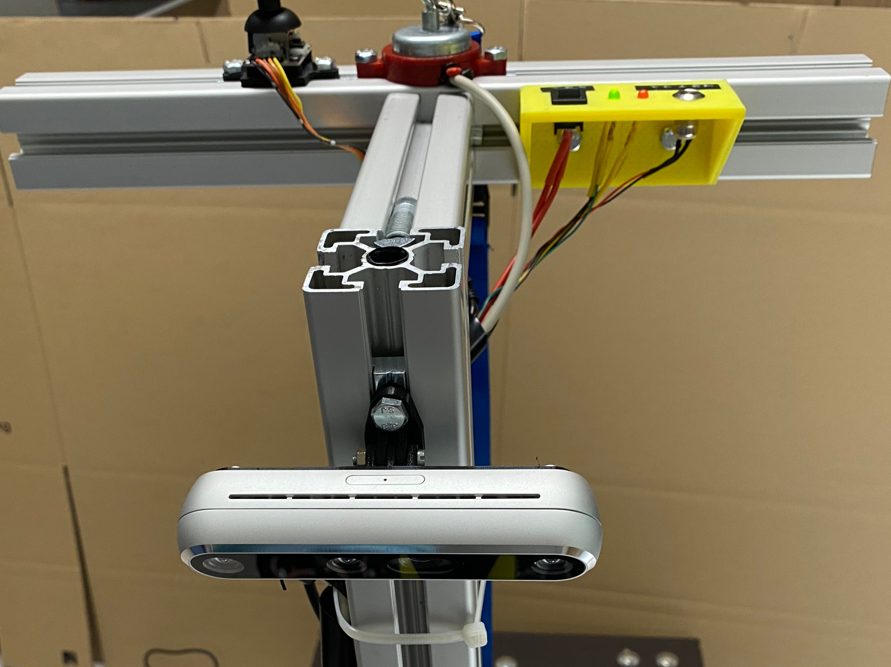

# Dokumentation


- [Dokumentation](#dokumentation)
  - [Einführung](#einführung)
  - [Änderungen](#änderungen)
    - [Austausch der Hoverboard-Platine](#austausch-der-hoverboard-platine)
    - [Erweiterung um einen Motor-Controller](#erweiterung-um-einen-motor-controller)
    - [Montage des Nvidia Jetson AGX Xavier Boards](#montage-des-nvidia-jetson-agx-xavier-boards)
    - [Montage und Anbindung der Intel RealSense Kamera](#montage-und-anbindung-der-intel-realsense-kamera)
    - [Umstieg auf ROS Foxy Fitzroy und Navigation2](#umstieg-auf-ros-foxy-fitzroy-und-navigation2)
      - [ROS Foxy Fitzroy](#ros-foxy-fitzroy)
      - [Navigation2](#navigation2)
  - [Aufbau](#aufbau)
    - [Logische Struktur](#logische-struktur)
    - [Software](#software)
    - [Hardware](#hardware)
      - [Stromversorgung](#stromversorgung)
      - [Motorcontroller](#motorcontroller)
  - [Bedienung](#bedienung)
    - [Hardware vorbereiten](#hardware-vorbereiten)
    - [Verbindung herstellen](#verbindung-herstellen)
    - [Software vorbereiten](#software-vorbereiten)
      - [Bauen der Docker-Images](#bauen-der-docker-images)
      - [Einrichten und Bauen des RealSense-Workspace](#einrichten-und-bauen-des-realsense-workspace)
    - [Software-Komponenten starten](#software-komponenten-starten)
      - [Docker-Container](#docker-container)
      - [RealSense](#realsense)
      - [RVIZ und Übergabe von Navigationszielen](#rviz-und-übergabe-von-navigationszielen)
      - [Manuelle Steuerung mittels Gamepad](#manuelle-steuerung-mittels-gamepad)
    - [Konfiguration](#konfiguration)
      - [Motor-Controller](#motor-controller)
        - [Grundlagen](#grundlagen)
        - [IMU](#imu)
        - [Flashen der Änderungen](#flashen-der-änderungen)
      - [Scoomatic Core](#scoomatic-core)
        - [Neigungswinkel der RealSense Kamera](#neigungswinkel-der-realsense-kamera)
        - [Verstärkungsfaktor](#verstärkungsfaktor)
      - [Navigation](#navigation)
    - [Wartung](#wartung)
      - [Motor-Controller](#motor-controller-1)
      - [Jetson-Board](#jetson-board)
  - [Herausforderungen](#herausforderungen)
    - [Jetson Board: ROS foxy unterstützt offiziell nicht Ubuntu 18.04](#jetson-board-ros-foxy-unterstützt-offiziell-nicht-ubuntu-1804)
    - [Docker: Kommunikation der Container untereinander und mit dem Hostsystem schlägt fehl](#docker-kommunikation-der-container-untereinander-und-mit-dem-hostsystem-schlägt-fehl)
    - [Jetson Board: Gamepad wird nicht korrekt erkannt](#jetson-board-gamepad-wird-nicht-korrekt-erkannt)
    - [Docker: Intel RealSense Watchdog-Timer](#docker-intel-realsense-watchdog-timer)
    - [Navigation2: Bilder der Intel RealSense Kamera in Costmap verwenden](#navigation2-bilder-der-intel-realsense-kamera-in-costmap-verwenden)
    - [Navigation2: Local Planner failed](#navigation2-local-planner-failed)
  - [Fazit](#fazit)
  - [Problembehebung](#problembehebung)
    - [Motorcontroller LED blinkt](#motorcontroller-led-blinkt)
    - [Scoomatic bewegt sich nicht / Motorcontroller LED leuchtet](#scoomatic-bewegt-sich-nicht--motorcontroller-led-leuchtet)
    - [RealSense: Device not available](#realsense-device-not-available)
    - [Slam-Karte falsch](#slam-karte-falsch)
    - [Navigation2 ignoriert Goal-Pose und Log zeigt "set goal pose failed"](#navigation2-ignoriert-goal-pose-und-log-zeigt-set-goal-pose-failed)
    - [Scoomatic hat nicht genug Leistung](#scoomatic-hat-nicht-genug-leistung)
    - [Raspberry Pi benötigt Internet-Zugriff](#raspberry-pi-benötigt-internet-zugriff)

## Einführung

In den vorangegangen Arbeiten am Scoomatic wurde in vielen Bereichen ROS 1 eingesetzt, da zum jeweiligen Zeitpunkt die Entwicklung an der neuen Generation ROS 2 noch im vollen Gange war. Jedoch endet der Support für ROS 1 (Noetic Ninjemys) im Mai 2025 ([Ros Wiki](http://wiki.ros.org/Distributions)) und es wird keine weitere Version im Sinne von ROS 1 entwickelt. \
Daher bringt die weitere Entwicklung auf Basis von ROS 2 (foxy) den Vorteil, auf zukünftige Releases von ROS vorbereitet zu sein und somit eine langfristige Erweiterbarkeit sicherzustellen. \
Ebenso bietet der neue Navigation-Stack *Navigation 2* verschiedene neue Ansätze und verspricht Verbesserungen in der Navigation (verbessertes Plugin-System und Verhaltenssteuerung mit Behaviour Trees).

Des Weiteren zeigte sich bei der bisherigen Verwendung eines Raspberry Pi 3B als Steuerungsrechner, dass die Rechenleistung des Einplatinencomputers zu gering ist. Aus diesem Grund ist es auch das Ziel, auf ein leistungsstärkes System, ein Nvidia Jetson AGX Xavier Board, umzusteigen.

Neben diesen Änderungen zeigte die Arbeit von Henry Chilla, dass der verwendete Laser-Scanner durch seine 2D-Erfassung manche Hindernisse ungenügend zuverlässig erkennt. Als Konsequenz daraus soll der Scoomatic um eine Intel Real Sense erweitert werden.

Während der Arbeiten am Scoomatic kam es zu einem Defekt an der Controller-Platine des Hoverboards und diese wurde durch eine vorhandene Ersatz-Platine getauscht (siehe [Austausch der Hoverboard-Platine](#austausch-der-hoverboard-platine)). \
Im Rahmen dieses Umbaus wurde das System um einen [Motor-Controller](#erweiterung-um-einen-motor-controller) erweitert. 
Anschließend wurden die bereits oben genannten Änderungen durchgeführt.

Die nachfolgenden Abschnitte gehen auf die [Änderungen](#änderungen), den darausfolgenden angepassten [Aufbau](#aufbau) und die [Bedienung](#bedienung) ein. Zudem wird abschließend im [Fazit](#fazit) der Erfolg bewertet und im Abschnitt [Herausforderungen](#herausforderungen) die Hindernisse während der Durchführung näher beleuchtet.
## Änderungen

Wie bereits genannt ergaben sich im Laufe des Projektmoduls verschiedene Anpassungen am Scoomatic. Aus diesem Grund wird auf die jeweiligen Bereiche kurz eingegangen. Der resultierende Aufbau wird dann im späteren Kapitel [Aufbau](#aufbau) konsolidiert betrachtet und erlaubt somit eine bessere Übersicht über den endgültigen Aufbau.

### Austausch der Hoverboard-Platine

Unglücklicherweise kam es während den Arbeiten am Projekt früh zu einem Hardware-Defekt am Hoverboard. Als Folge des technischen Fehlers nahm das Board keine Steuerungbefehle mehr entgegen und signalisierte mittels eines andauernden gleichbleibenden Pfeiftons diesen Umstand. \
Dieses Verhalten wird auch in einem [Github-Issue](https://github.com/NiklasFauth/hoverboard-firmware-hack/issues/51) der verwendeten Firmware des Hoverboards beschrieben. 
Der darin gemachte Vorschlag, die Darlington-Transistor der Platine zu tauschen, gestaltete sich schwierig, da sich die eingesetzte Platine im Hoverboard vom Referenz-Board des Hoverboard-Firmware-Hacks unterscheidet und eine genaue Aussage über die eingesetzten Transistoren nicht möglich war. \
Aus diesem Grund und der Tatsache, dass dem Lehrstuhl noch Ersatzplatinen vorlagen, wurde stattdessen die gesamte Platine mit allen Bauteilen getauscht.

Für den Austausch wurden die von Martin Schörner vorgenommenen Anpassungen (Ergänzung der Stromabnahme, Flashen der Firmware und Vorbereiten der Leitungen zur Kommunikation) an der Ersatzplatine ebenfalls wiederholt. Das genaue Vorgehen zum Flashen und die gemachten Anpassungen können der entsprechenden [Dokumentation](../projektmodul-ms/index.md) entnommen werden.

[](img/platine.jpg) \
*Bild der Platine*


### Erweiterung um einen Motor-Controller

Bereits vor dem Defekt der Platine zeigte sich die Schwachstelle, dass wenn die Steuerungssoftware auf dem Raspberry Pi ausfällt oder keine neuen Befehle mehr über UART an das Hoverboard sendet, der letzte Befehl aktiv bleibt. Sollte nun beispielsweise eine der ROS-Nodes ausfallen oder einfach der Accessory-Power-Schalter für die Zusatzkomponenten (z.B. dem Raspberry) ausgeschaltet werden, dann fährt der Scoomatic mit dem letzten Befehl an das Hoverboard weiter und kann nur über das Betätigen des Ein/Aus-Schalters des Hoverboards gestoppt werden. \
Auch erwähnte Martin Schörner bereits die Möglichkeit, dass eine Art Not-Aus-Schalter verbaut werden könnte, um im Falle eines fehlerhaften Befehls den Scoomatic schnell anzuhalten. 

Die Aufgabe des Motor-Controllers soll sein, die Abwesenheit neuer Steuerungsbefehle zu erkennen und über einen manuellen Totmannschalter zu überwachen, ob weiterhin eine Fahrfreigabe vorliegt. 
Trifft einer dieser beiden Fälle ein, wird der Scoomatic zum Stillstand gebracht und der Fehlerfall mittels einer LED angezeigt.
Zusätzlich soll der Motorcontroller die Diagnose-Daten des Hoverboard sammeln und in aufbereiteter Form an seinen Master weiterleiten. 
Die Daten werden dabei bereits in eine sinnvolle Darstellung gebracht und um weitere Informationen, z.B. liegt ein Not-Aus vor, ergänzt. 
Außerdem wird als Repräsentation keine zahlenindizierte Folge an Strings (siehe [Dokumentation Martin Schörner](../projektmodul-ms/index.md))  gewählt, sondern die Daten werden in ein JSON-Format umgewandelt, da so eine leichtere Erweiterbarkeit sichergestellt ist.

Zur Umsetzung dieser Anforderungen wurde ein ESP32-Mikrocontroller eingesetzt, da er wie das Hoverboard mit einem logischen HIGH-Signal von 3,3V arbeitet, über drei Hardware-Serial/UART-Controller verfügt und leistungsstärker als andere Mikrocontroller ist. \
Der Motorcontroller nimmt nun den Steuerungsbefehl entgegen, prüft die bereits genannten Freigabe-Bedingungen und leitet daraus den Steuerungsbefehl für das Hoverboard ab. 
Außerdem ist er in der Lage, die Daten des angeschlossen IMU einzulesen und an seinen Master zu senden. \
Erhält er nicht innerhalb einer definierten Zeit einen neuen Steuerungsbefehl, wechselt er in den Not-Halt-Modus und bremst bis zum Stillstand ab. Eine Weiterfahrt ist erst möglich, wenn der Scoomatic zum Stillstand gekommen ist und neue Steuerungsbefehle übermittelt werden.

Als Totmannschalter fungiert ein Hall-Switch (Typ *A3213EUA-T*), welcher das Magnetfeld eines Magneten überwacht und somit als OK-Signal geschaltet sein muss. Auf der Platine des Motorcontrollers sorgt ein Pull-Up-Widerstand für ein High-Signal, das durch den Hall-Switch dann über GND aus LOW gezogen wird, sollte der Magnet den Hall-Switch betätigen. Dies stellt auch bei einer Unterbrechung sicher, dass der Scoomatic nicht weiterfahren kann.

[](img/totmannschalter_offen.jpg) \
*Der geöffnete Totmannschalter: In der Mitte ist der Hallswitch erkennbar und die darum liegende Beilagscheibe, welche als Anziehungspunkt für den Magneten dient.*

Die Stromversorgung des Motorcontrollers erfolgt über die 14V Klemme des Hoverboard und einem LM2596S Step-Down-Modul, welches die Spannung auf 5V regelt und das ESP32-Development-Board speist. \
Als Konsequenz aus dieser Änderung ist der Motor-Controller die alleinige Schnittstelle zum Antrieb (Hoverboard) und definiert das grundlegende Fahrverhalten.


*Das schwarze Gehäuse beinhaltet den Motorcontroller.*

Befestigt wurde der Controller in einem 3D-gedruckten Gehäuse am Chassis des Scoomatic zwischen dem Hoverboard und der Siebdruckplatte.

### Montage des Nvidia Jetson AGX Xavier Boards

Da das Nvidia Jetson AGX Xavier Board die rechenintensive autonome Navigation des Scoomatic übernehmen soll, muss es am Scoomatic befestigt werden. 
Als Ort der Montage wurde die Unterseite der Siebdruckplatte ausgewählt, da hierdurch der größte Schutz vor mechanischen Einwirkungen gegeben ist und auch der Schwerpunkt wird, im Gegensatz zu einer Anbringung an der Lenkstange, nicht angehoben, wodurch die Kippgefahr reduziert wird.
Dazu wird das Jetson-Board mit zwei 3D-gedruckten Klammern und einem verschraubbaren Deckel ab der Siebdruckplatte befestigt.
Diese Montageart schränkt die Belüftung nicht ein und reduziert nur geringfügig die Kühlkörperfläche. \
Zusätzlich wurde durch Brücken der Pins 5 und 6 J508 (“automation header”) auf der Unterseite des Jetson-Boards das automatische Booten beim Einschalten der Spannungsversorgung aktiviert.

Zur Stromversorgung wird einer der Step-Down-Wandler (bisher 12V) auf 18V Ausgangsspannung gestellt und mit einer selbstgebauten Leitung mit passendem Niedervolt-Steckverbinder verbunden. 
Diese speist dann das Jetson-Board über die normale Buchse zur Spannungsversorgung mittels Netzteil. \
Zur Kommunikation mit dem Motorcontroller wird einer der bisher am Raspberry eingesetzten USB UART Adapter eingesetzt und über den ebenfalls an der Siebdruckplatte befestigten USB-C Hub angeschlossen. 
Der Hintergrund dabei ist, dass der USB-Anschluss des Motorcontrollers so frei für Debugging bleibt und der verbaute Mikrocontroller immer erst beim Einschalten des Antriebs mit Strom versorgt wird.

Der RP-Lidar und die Intel RealSense werden mittel eines USB-Verlängerungskabels und dem bereits an der Lenkstange verbauten USB 2.0-Hubs angesprochen. 
Des Weiteren wird der sehr geringe interne Speicher (32GB, nach der Installation ca. 13 Gb frei) des Jetson-Boards mittels einer 128GB Micro-SD-Karte erweitert.
Außerdem verfügt das Jetson-Board über kein bereits verbautes WLAN-Modul, jedoch kann über einen M.2 Anschluss ein INTEL AC8265 WLAN und Bluetooth Modul nachgerüstet werden. Dieses wird jeweils mittels einem MHF 4 zu RP-SMA Kabels mit zwei WLAN-Stab-Antennen verbunden.


*Auf der rechten Seite der Siebdruckplatte ist das Jetson-Board angebracht. Die vier Schrauben drücken es dabei innerhalb der Klammern an die Siebdruckplatte. Auf der anderen Seite der Platte (links) sind die beiden Funkantennen des WLAN/Bluetooth-Moduls angebracht.*


Softwareseitig wurde über den Nvidia SDK Manager die Version 4.6 von Nvidia Jetpack installiert. Dies basiert auf dem Betriebssystem Ubuntu 18.04 und erlaubt somit keine direkte Verwendung von ROS foxy aus den bereitgestellten Debian-Paketen. Die genaue Einrichtung wird im Abschnitt [Bedienung](#software-vorbereiten) erklärt.

### Montage und Anbindung der Intel RealSense Kamera

Damit die Umgebung zur Navigation besser wahrgenommen werden kann, soll eine Intel RealSense D455 den Laser-Scanner bei der Erfassung des Raums ergänzen.
Dazu ist die RealSense an der Lenkstange oberhalb des Laser-Scanners montiert. Zur Montage wird ein 3D-gedrucktes Scharnier mittels eines Nut-Steins am Profil der Lenkstange befestigt. 
Der derzeit eingestellte Winkel muss der eingestellten Rotation im URDF-File des Robotermodells entsprechen (siehe [Konfiguration -> Neigungswinkel der RealSense Kamera](#neigungswinkel-der-realsense-kamera)).

[](img/realsense_mounted.jpg) \
*RealSense Kamera an der Lenkstange des Scoomatic*


Zur Verwendung der RealSense Kamera mit ROS wird die RealSense-Library und der RealSense-ROS-Wrapper benötigt. \
Im Verzeichnis [docker/realsense](../../docker/realsense) ist ein Docker-Container-Image beschrieben, welches auf dem Jetson-Board funktioniert und auch mit der RealSense kommuniziert. 
Jedoch kommt es häufig nach einer längeren Ausführungszeit zu einem Abbruch der Verbindung zur RealSense, welcher mit dem Auslösen eines "Watchdogs" begründet wird. 
Aus diesem Grund wird im tatsächlichen Betrieb der Workspace direkt auf dem Jetson-Board installiert. 
Dazu wird die RealSense-Library, ROS foxy und der ROS-Wrapper mitsamt der Abhängigkeiten aus dem jeweiligen Source-Code selbst gebaut.

Die nachfolgenden Schritte beschreiben das Vorgehen:


**C-Make aktualisieren**

Für das Bauen der RealSense-Library wird mindestens Cmake 3.8 benötigt.
Der zu Beginn erstellte Ordner kann angepasst werden, muss aber dann im gesamten Verlauf entsprechend berücksichtigt werden.

``` bash
mkdir –p /mnt/sd/cmake-build ; cd /mnt/sd/cmake-build 
wget https://cmake.org/files/v3.13/cmake-3.13.0.tar.gz 
tar xpvf cmake-3.13.0.tar.gz cmake-3.13.0/ 
cd cmake-3.13.0/ 
./bootstrap --system-curl 
make -j6 
echo 'export PATH=/mnt/sd/cmake-build/cmake-3.13.0/bin/:$PATH' >> ~/.bashrc 
source ~/.bashrc 
```

**RealSense-Library bauen**

Nun wird die RealSense-Library in der Version 2.48.0 gebaut und installiert.
Der zu Beginn erstellte Ordner kann angepasst werden, muss aber dann im gesamten Verlauf entsprechend berücksichtigt werden.

``` bash
cd /mnt/sd/ 

curl https://codeload.github.com/IntelRealSense/librealsense/tar.gz/refs/tags/v2.48.0 -o librealsense.tar.gz 

tar -zxf librealsense.tar.gz    && rm librealsense.tar.gz  

mkdir build && cd build 

cmake ../ -DFORCE_RSUSB_BACKEND=ON -DBUILD_PYTHON_BINDINGS:bool=true -DPYTHON_EXECUTABLE=/usr/bin/python3.6 -DCMAKE_BUILD_TYPE=release -DBUILD_EXAMPLES=true -DBUILD_GRAPHICAL_EXAMPLES=true -DBUILD_WITH_CUDA:bool=true 

make -j4  

sudo make install 

# Python library fix
sudo cp /mnt/sd/librealsense/wrappers/python/pyrealsense2/__init__.py /usr/lib/python3/dist-packages/pyrealsense2/
``` 

Die nachstehenden Zeilen müssen nun am Ende der ```.bashrc``` Datei des Benutzers ergänzt werden.
``` bash
export PATH=$PATH:~/.local/bin  
export PYTHONPATH=$PYTHONPATH:/usr/local/lib 
export PYTHONPATH=$PYTHONPATH:/usr/local/lib/python3.6/pyrealsense2 
 ``` 

 
**ROS-Wrapper bauen**

Da derzeit die Costmap die Pointcloud der RealSense nicht korrekt verarbeitet (siehe [Herausforderungen](#herausforderungen)) wird im Workspace auch zusätzlich das Paket ```pointcloud_to_laserscan``` installiert, das erlaubt, aus der Pointcloud einen Laserscan zu extrahieren. 
Der zu Beginn erstellte Ordner ```/mnt/sd/realsense-ros/src``` kann angepasst werden, muss aber dann im gesamten Verlauf entsprechend berücksichtigt werden.
 
``` bash
mkdir –p /mnt/sd/realsense-ros/src 
ln –s /mnt/sd/realsense-ros/s /opt/ros/realsense 

cd /opt/ros/realsense/src
git clone https://github.com/IntelRealSense/realsense-ros.git -b foxy

# get dependencies
# xacro 
git clone https://github.com/ros/xacro.git -b ros2  
# opencv_bridge 
git clone https://github.com/ros-perception/vision_opencv.git -b ros2 
#image common 
git clone https://github.com/ros-perception/image_common.git -b ros2 


# Workaround wegen Fehler in local costmap -> Pointcloud in laser scan wandeln 
git clone https://github.com/ros-perception/pointcloud_to_laserscan.git -b foxy 

# Build
cd ..
source /opt/ros/foxy/setup.sh
rosdep install -y --from-path src --ignore-src -r
colcon build --symlink-install
```

[](img/realsense_image.png) \
*PointCloud mit RGB Bilddaten*

### Umstieg auf ROS Foxy Fitzroy und Navigation2

In diesem Abschnitt wird auf die Änderungen im Zusammenhang mit ROS Foxy Fitzroy und Navigation2 eingegangen. Der daraus resultierende Aufbau und die Funktionsweise der einzelnen Komponenten kann dem Kapitel [Aufbau](#aufbau) und der Dokumentation innerhalb des Codes entnommen werden.
#### ROS Foxy Fitzroy
Wie bereits erwähnt löst ROS 2 die bisherigen ROS 1 Distributionen sukzessive ab. Dabei gibt es auch bei ROS 2 verschiedene Distributionen, welche über einen gewissen Zeitraum offiziell supportet und verbessert werden. ROS Foxy Fitzroy (nachfolgend kurz *ROS foxy*) stellt dabei eine der zwei derzeit veröffentlichten Stable-Releases dar (Stand May 2021). 
Das End-of-Life-Datum liegt bei ROS foxy jedoch weiter in der Zukunft (Mai 2023). Folglich ist so garantiert, dass in nächster Zeit kein weiterer Umstieg auf eine andere Distribution erfolgen muss. [https://docs.ros.org/en/foxy/Releases.html]

Jedoch unterstützt ROS foxy offiziell nur die Ubuntu-Version 20.04 und nicht die auf dem Jetsonboard installierte Version 18.04. Aber auch die Prozessorarchitektur ```aarch64``` wird offiziell nicht unterstützt. Aus diesen Gründen ist es nicht möglich, die bereits kompilierten Pakete zu nutzen. 
Aber mit Hilfe von Docker Containern kann man auf dem Jetson-Board mit ROS foxy und den bereits kompilierten Paketen arbeiten. Daher dient als Basis für die erstellten Docker Images das Image ```ros:foxy``` von Dockerhub. \
Das genaue Vorgehen zur Verwendung der Container kann dem Abschnitt [Bedienung](#bedienung) entnommen werden.

Zunächst wurde der Code der Nodes ```gamepad_driver``` und ```odom_publisher``` auf ROS foxy portiert und getestet. 
Um die Steuerbefehle und die Diagnosedaten mit dem Motorcontroller austauschen zu können muss der Node ```motor_controller``` entwickelt werden. 
Dieser kommuniziert über ```pyserial``` mit dem Motorcontroller und empfängt bzw. sendet über die entsprechenden Topics die benötigten bzw. erhaltenen Informationen.
Zudem wurde der Nodes ```gamepad_safety``` erstellt, der es erlaubt, über den Gamepad-Controller ein Freigabesignal zu geben. Dieses Signal wird bei entsprechender Konfiguration im ```motor_controller``` Node verarbeitet und stoppt bei dessen Abwesenheit den Scoomatic. 

#### Navigation2

Bisher wurde auf dem Scoomatic ```move_base``` und ```hector_slam``` eingesetzt. 
Unter ROS foxy sind die verwendeten Pendants ```navigation2``` und ```slam_toolbox```.  \
```navigation2``` übernimmt dabei die globale und lokale Navigation sowie die Verhaltenssteuerung mittels Behaviour-Trees. 
Die ```slam_toolbox``` stellt eine Implementierung zur Lösung des SLAM-Problems (Simultaneous Localization and Mapping) dar und erzeugt somit eine Karte der Umgebung während es zudem die Pose des Fahrzeugs in der selbigen ermittelt.

Da sowohl die ```slam_toolbox``` als auch ```navigation2``` die Odometrie-Daten benötigen, wird zudem ein *Laser-Scan-Matcher* verwendet, der aus den Daten des Laser-Scanners Odometrie-Daten ableitet. Die bisher verwendete Schätzung anhand der Diagnose-Daten des Hoverboard stellten sich als unzureichend genau heraus.

## Aufbau

Der Aufbau der verschiedenen Komponenten lässt sich auf mehreren Ebenen unterschiedlich beschreiben.

### Logische Struktur

In diesem Abschnitt wird die Aufteilung der einzelnen logischen Bestandteile aus Hard- und Software beschrieben.

Das nachstehende Bild stellt diese Struktur grafisch dar. Der Raspberry Pi und das Jetsonboard kommunizieren über ihre Ethernet-Schnittstellen und ermöglichen so den Austausch von Daten untereinander.
Der Raspberry Pi wird als Schnittstelle zum Gamepad für die manuelle Steuerung(*gamepad_driver*) genutzt. Zudem ist es mit dem Node *gamepad_safety* möglich, ein Freigabesignal durch Drücken des ```A``` Button bereitzustellen. Dies kann im ```motor_controller``` genutzt werden, um den Scoomatic bei autonomer Fahrt im Bedarfsfall zu stoppen.

Das Jetson-Board ist die Plattform für die verbleibenden ROS-Nodes. 
Diese werden in mehreren Docker-Containern betrieben, da für das Betriebssystem (Ubuntu 18.04) keine offiziellen kompilierten Packages bereitgestellt werden. 
Des Weiteren ist durch Docker ein möglicher Umzug auf eine andere Plattform deutlich einfacher. \
Zwar wurde auch für den ```realsense_wrapper``` Node ein Docker-Container-Image erstellt, jedoch zeigte sich im Betrieb, dass der Node regelmäßig aufgrund eines *Watchdog-Timers* abstürzt. 
Aus diesem Grund wurde ROS foxy, der ```realsense_wrapper``` Node und alle Abhängigkeiten aus den Quelldateien übersetzt und installiert. 
So ist es möglich, den genannten Fehler zu umgehen.

Die gezeigten ROS-Nodes übernehmen dabei verschiedene Aufgaben (```slam_toolbox``` und ```navigation``` als Abstraktion der internen Nodes):
- ```motor_controller```:
  - nimmt die Steuerungsbefehle entgegen und setzt sie in Kommandos an den Motorcontroller (HW) um und reicht sie via UART weiter
  - empängt Diagnosedaten vom Motorcontroller (HW) und stellt diese über verschiedene ROS Topics bereit
  - kann so konfiguriert werden, dass er auf ein Freigabesignal (ROS-Topic) achtet und beim Ausbleiben des Signals die Bewegung stoppt.
- ```robot_description```:
  - liest Datei mit der Beschreibung des Roboters ein und stellt die Transformationen zwischen den verschiedenen Koordinatensystemen am Scoomatic bereit
  - stellt visuelles (abstraktes) Modell des Roboters für graphische Darstellung bereit
- ```rp_lidar```:
  - empfängt Daten vom RP-LiDar und stellt diese via ROS-Topic bereit
  - steuert den RP-Lidar
- ```laser_scan_matcher```:
  - leitet aus dem Laserscans des LiDars Odometriedaten über die Bewegung des Scoomatic im Raum ab
- ```realsense_wrapper```:
  - wandelt die Daten der RealSense für die Verwendung in ROS um
- ```slam_toolbox```:
  - Zeichnet eine Karte der Umgebung
  - lokalisiert den Roboter darin
  - Stellt diese Informationen via ROS-Topics bereit
- ```navigation2```:
  - Navigation und Steuerung des Scoomatic in der erstellten Karte
  - nutzt die Daten des LiDars und der RealSense Kamera für die Erstellung von Costmaps für die lokale Navigation
  - Verhaltenssteuerung über Behaviour-Trees
- ```gamepad_driver```
  - empfängt die Events vom Gamepad und wandelt sie in Steuerungsbefehle um
  - dient der manuellen Steuerung
- ```gamepad_safety```
  - empfängt die Events vom Gamepad und stellt entsprechend ein Freigabesignal bereit, wenn der korrekte Button (```A```) gedrückt wird


*Logische Struktur von Software und Hardware. ROS-Nodes (blau), Docker-Container (orange), Hardware-Plattform (grün), Steuerungshardware (grau) (LiDar Icon von Azam Ishaq, PK via noun project)*

### Software

Im vorangegangen Teil wurde bereits die grundlegende Struktur auf logischer Ebene vorgestellt. Dieser Aufbau findet sich so auch auf der Software-Seite wieder.

Zum besseren Verständnis wird der Daten- und Kontrollfluss nun etwas tiefergreifend beschrieben. 
Auf der Seite der Sensoren lässt sich zunächst der Intel RealSense Wrapper Node ```/camera/camera``` mit dem Topic ```/camera/depth/color/points``` erkennen. 
Dieses Topic und der LaserScan (```/scan```) des ```/RPLidar```-Node werden in der Costmap verarbeitet. 
Ebenso nutzen die SLAM-Toolbox (```/slam_toolbox```) und der LaserScanMatcher  (```/LaserOdom```) die Daten des Laserscanners. \
Die von der SLAM-Toolbox erzeugte Karte (```/map```-Topic) wird in der globalen Costmap zusammmen mit dem LaserScan zur globalen Navigation genutzt. 
Der LaserScanMatcher stellt neben den Odometrie-Daten (```/odom```) auch die Transformation zwischen dem Odometrie- und dem Weltkoordinatensystem bereit. 
Ergänzend dazu stellt die SLAM-Toolbox die Transformationsdaten zwischen dem Karten- und dem Odometriekoordinatensystem bereit.\
Der ```/controller_server``` und ```/revovery_server``` nutzen die Daten der Odometrie bzw. der Costmap zur Erzeugung von Steuerungsbefehlen über das ```/cmd_vel```-Topic. 
Diese Steuerungsnachrichten werden dann vom ```/MotorController``` empfangen und in die entsprechenden Kommandos für das Hoverboard umgewandelt. 
Zudem nutzt der ```/OdomPublisher``` die Diagnosedaten zur jeweiligen aktuellen Motorleistung (```/scoomatic/speed_l``` und ```/scoomatic/speed_r```), um daraus ebenfalls eine Odometrie abzuleiten. \
Der Komplex aus verschiedenen ROS-Nodes im rechten oberen Bereich ist Bestandteil der Verhaltenssteuerung von Navigation2. \
Der ```/RealsenseTFPublisher``` übernimmt die Verbindung zwischen dem Koordinatensystem der Intel RealSense und dem entsprechenden Koordinatensystem am Roboter. Die verbleibenden Nodes am linken Bildrand gehören zu Navigation2. \
Abschließend beschreiben die Nodes ```/robot_state_publisher``` und ```/joint_state_publisher``` den Aufbau des Roboters (```/robot_description```) sowie den Zustand der Gelenke ```/joint_states```. Diese beinhalten auch die Transformationsdaten der Koordinatensysteme am Roboter relativ zu seiner Basis.


*Zusammenspiel der verschiedenen Nodes in ROS (Rechtecke = Topics, Ovale = Nodes): Das TF-Topic (=Topic mit Koordinatentransformationen) ist der Übersichtlichkeit wegen ausgeblendet*

### Hardware


*Darstellung der verbundenen Hardware (LiDar Icon von Azam Ishaq, PK via noun project)*

#### Stromversorgung

Durch Anpassungen und die Erweiterung um das Jetsonboard musste die Stromversorgung des Scoomatic entsprechend verändert werden.

Weiterhin speist der Akku des Hoverboards den Hoverboard-Treiber und versorgt über das Meanwell PSU das *Acessory Power Module* und den Raspberry Pi über ein Stepdown-Modul mit Strom. \
Zur Versorgung des Motorcontrollers wird der 14.4V Anschluss des Motortreiber-Boards des Hoverboards genutzt. 
Intern verwendet der Motorcontroller ein Step-Down-Modul, um die Spannung von 14.4V auf 5V zu reduzieren.
Der Motorcontroller wird an die Spannungsversorgung des Hoverboards gekoppelt, da er auch dann stets mit Strom versogt werden muss, wenn das Hoverboard aktiv ist.

Das Jetson-Board nutzt das *Accessory Power Module* als Spannungsquelle. 
Dazu wurde ein Step-Down-Regler von 12V auf 18V umgestellt, welcher das Jetson-Board speist. 
Mehrere Messungen im Vorfeld ergaben, dass die Strombegrenzung von 2A ausreicht, da die Ströme bei 18V, hoher Rechenlast und verbundener Peripherie (Intel-RealSense) 1,2A nicht übersteigen.


*Darstellung der Stromversorgung innerhalb des Scoomatics*

#### Motorcontroller

Der Motorcontroller besteht aus einem ESP32 Dev Kit von AZDelivery, mehreren Widerständen, einem Step-Down-Wandler und einer LED. Zudem überprüft er über das Signal des Totmannschalters, ob die Fahrfreigabe gewährt wird. \
Der Totmannschalter setzt sich aus einem Hall-Switch (```B1```) vom Typ *A3213EUA-T* von Allegro und einem Pullup-Widerstand (```R1```) zusammen. 
Der Pullup-Widerstand zieht den GPIO-Pin auf *HIGH*, solange der Hall-Switch nicht geschaltet ist. 
Wird ein Magnet in das nahe Umfeld des Hall-Switches gebracht, schaltet dieser und zieht somit die Spannung am GPIO-Pin auf *LOW*. 
Der Pullup-Widerstand ist im Gehäuse verbaut, da somit auch eine Unterbrechungssicherheit gegeben ist. Wenn die Verbindung zum Hall-Switch unterbrochen ist, kann dieser das Spannungslevel am GPIO-Pin nicht mehr auf *LOW* ziehen, wodurch keine Freigabe mehr möglich ist. 
Solange sich der Magnet in der unmittelbaren Nähe des Hall-Switches befindet, wird so die Freigabe gemeldet.


*Aufbau des Motorcontrollers*

Die Stromversorgung des Motorcontrollers wird über die 14.4V Spannung am Sensorboard-Anschluss (siehe [Dokumentation von Martin Schörner](../projektmodul-ms/index.md)) des Hoverboards in Verbindung mit einem Step-Down-Wandlers (```U1```) realisiert. 
Der Step-Down-Wandler reduziert hierzu die Spannung von 14,4V auf 5V für das Development-Kit. 
Durch den Anschluss am ```5V```-Pin des Boards wird der interne regulierende Spannungswandler für die Reduzierung der Spannung auf 3,3V genutzt, wodurch der ESP32 zusätzlich vor Spannungsschwankungen geschützt ist. 
Außerdem ist zwischen dem ```5V```-Pin des Board und der Versorgungsleitung des USB-Anschlusses eine Schutzdiode verbaut, welche einen Stromfluss in Richtung des Computers verhindert. 
So kann ein PC ohne Gefahr für die Anpassung an der Software oder dem Zugriff auf die Diagnose-Daten verbunden werden.

Zur Kommunikation mit dem *Master*, also dem Jetson-Board, wird der interne UART0-Controller so konfiguriert, dass er die Pins ```23``` für RX und ```TXD0```-Pin für TX verwendet. 
Durch die Veränderung des Standard RX-Pins ist der ESP32 von eingehenden Nachrichten über den internen USB-UART-Adapter am USB-Anschluss abgeschirmt. 
Folglich kann ein bereits erwähnter PC die eingehende Kommunikation nicht stören, aber die Nachrichten vom Motorcontroller an den Master mitlesen. \
Das Flashen von Software über den USB-Anschluss ist jedoch weiterhin möglich. 
Die neuen RX und Tx-Pins werden gemeinsam mit GND(```J1```) über einen USB-UART-Adapter zum Jetson-Board geführt.

 \
*Anschluss am Hoverboard für Motorcontroller*

Das Senden von Steuerungsbefehlen und das Empfangen von Diagnosedaten, also der Austausch mit dem Hoverboard, geschieht über die beiden UART-Schnittstellen (vormals Sensorboard-Anschlüsse) des Hoverboards. 
Dazu werden die RX- mit den TX- und die TX- mit den RX-Pins entsprechend verbunden. 
Ein Potentialwandler wie bei einem Ardunino ist nicht nötig, weil Hoverboard und ESP32 mit einem logischen *HIGH* bei 3,3V arbeiten. \
Die Verbindungen zum Hoverboard sind mittels eines Steckers (```J2```) umgesetzt, da somit in Zukunft der Ein- und Ausbau erleichtert wird.

>Jumper ist zwar bestellt aber nicht eingebaut

Für ein einfaches visuelles Feedback besitzt der Motorcontroller eine LED. Diese zeigt durch ein Blinken einen Fehler im Startvorgang und durch ein Dauerleuchten ein fehlendes Freigabekriterium an.

In Vorbereitung für zukünftige Arbeiten ist der Motorcontroller bereits mit einer I2C-Schnittstelle für den am Scoomatic verbauten IMU-Sensor versehen. Die entsprechenden Zeilen sind bereits im Code vorbereitet worden, jedoch nicht vollumfänglich getestet und derzeit deaktiviert.


*Verdrahtung des ESP32 Devkits innerhalb des Motorcontrollers*

## Bedienung

In den nachstehenden Unterkapiteln werden die grundlegenden Schritte für die Verwendung des Scoomatic beschrieben.

### Hardware vorbereiten


*Geräte zwischen Hoverboard und Siebdruckplatte: M = Motorcontroller, L = Ladeanschluss, 1 = Hauptanschluss-Spannungsquelle z.B. Batterie*


*Die Lenkstange mit Bedienpanel: B = Bedienpael mit Ein/Aus für Hoverboard(=Motor) und Ein/Aus für Accessory-Board(AUX), T = Totmannschalter mit Magnet, Joystick ist aktuell ohne Funktion

1. Stromversorgung zur Batterie herstellen: Sicherstellen, dass der *Hauptanschluss "Spannungsquelle"* mit der Batterie verbunden ist
2. Einschalten der Spannungsversorgung für Steuerungsrechner (Raspberry Pi & Jetson Board): Einschalten des AUX-Schalters am Bedienpanel (B), nun starten beide Rechner automatisch
3. Einschalten des Hoverboards über den Motorschalter am Bedienpanel (B)
   - Das Hoverboard spielt eine "Begrüßungsmelodie"
   - Nun sollte die LED am Motorcontroller durchgehend leuchten (PC sendet noch keine Steuerungsbefehle)
   - Es sollte ein wiederholendes Piepen vom Hoverboard zu hören sein. Dies signalisiert die Fahrbereitschaft.
4. Prüfen des korrekten (mittigen) Sitzes des Magneten auf dem Sockel des Totmannschalters (T). \
   Das Band am Magneten sollte gut erreichbar und locker herabhängen.


### Verbindung herstellen

Es gibt zwei Möglichkeiten, sich mit dem Scoomatic zu verbinden. 
Zum einen stellt das Jetson-Board einen Hotspot bereit. Zum anderen kann das Jetson-Board so konfiguriert werden, dass es sich mit einem weiteren WLAN Netzwerk verbindet.

Der Zugriff auf das Jetson-Board ist über VNC und über SSN möglich. Im Anschluss an eine Verbindung mit dem Jetson-Board kann so eine Verbindung mit dem Raspberry über SSH hergestellt werden. Der Raspberry Pi ist selbst nicht direkt erreichbar. Es ist aber möglich auch, dass der Raspberry Pi eine WLAN-Verbindung aufbaut.

### Software vorbereiten

Bei erstmaliger Installation oder nach Änderungen am Source-Code oder den Konfigurationsdateien sind einige Schritte nötig, um die aktuelle Version auszuführen. 
Diese Schritte werden nachfolgend näher erklärt.

#### Bauen der Docker-Images

Zur Verwendung der Docker-Container müssen nach bei erstmaliger Verwendung oder nach Änderungen am Source-Code oder der Konfigurationsdateien die Images neugebaut werden.
Die Beschreibungen der Images finden sich in den Unterordnern im Ordner ```docker```. 
Jeder Unterordner beinhaltet ein Skript mit dem Namen ```build.sh```, welches das entsprechende Container-Image baut.

Folgende Container-Images sind nötig:
- [scoomatic-base](../../docker/scoomatic_base): Laser Scanner, Motor_controller, Laser Scan Matcher für Odometrie, Koordinatensystembeschreibung
- [navigation](../../docker/nav2): SLAM toolbox und Navigation2

#### Einrichten und Bauen des RealSense-Workspace

Damit der RealSense-Workspace auf dem Hostsystem direkt läuft, muss der RealSense-Wrapper installiert sein. 
Das Vorgehen für die manuelle ROS Installation für das Jetson-Board hierzu ist unter [Änderungen -> Montage und Anbindung der Intel RealSense Kamera](#montage-und-anbindung-der-intel-realsense-kamera) beschrieben.

Der angebene Pfad zum Workspace kann angepasst werden.

``` bash
# Create workspace folder
mkdir ~/scoomatic-realsense-ws/
cd ~/scoomatic-realsense-ws/
# Assumption for git repository path: ~/git/scoomatic-hoverboard
ln -s ~/git/scoomatic-hoverboard/code/ros-drivers/ros-realsense-src src

# In case this is a ros installation from source without access to the debian packages (e.g. jetson board)
source /opt/ros/realsense/install/setup.sh

# otherwise source ros installation (if not done so far)
source /opt/ros/foxy/setup.sh

# now build
colcon build --symlink-install
```

### Software-Komponenten starten

Derzeit sind die Software-Komponenten so konfiguriert, dass der Scoomatic im SLAM-Modus betrieben wird. 
Das bedeutet, dass stets eine neue Karte erstellt wird und keine bereits vorhandene Karte geladen werden kann. 
Grundsätzlich ist der Code dafür vorbereitet (SLAM nicht starten und stattdessen Launch-File ```scoomatic_acml.launch.py``` starten), aber dies ist nicht getestet und in der aktuellen Konfiguration nicht ohne Anpassungen möglich. \
Aus diesem Grund wird in den nachfolgenden Schilderungen das Vorgehen für den Betrieb im SLAM-Modus erklärt.

Mit Ausnahme von der Anbindung der RealSense und den Software-Element von ```scoomatic_core``` können alle verbleibenden Container (z.B. navigation) oder ROS-Workspaces auch auf einem anderen Computer ausgeführt werden.

Zur Steuerung des Scoomatic mit dem Gamepad muss zudem der Raspberry Pi gestartet werden. Das genaue Vorgehen kann dem Abschnitt [Manuelle Steuerung mittels Gamepad](#manuelle-steuerung-mittels-gamepad) entnommen werden.

#### Docker-Container

Zunächst wird das "Basis"-Image zur Steuerung des Hoverboards, zur Kommunikation mit dem LIDAR und zur Bereitstellung des Robotermodells gestartet.

``` bash
# Go to git folder (depends on system. here current install on jetson board)
cd ~/git/scoomatic_hoverboard

cd docker/scoomatic_base

# Start container; add -d to run everything in background
docker-compose up 

# To stop just type Ctrl +C if running in foreground
# otherwise type `docker-compose down`
```

Soll der Scoomatic zur eigenständigen Navigation genutzt werden, müssen noch die SLAM-Toolbox und Navigation2 gestartet werden:

``` bash
# Go to git folder (depends on system. here current install on jetson board)
cd ~/git/scoomatic_hoverboard

cd docker/nav2

# Start containers; add -d to run everything in background
docker-compose up 

# To stop just type Ctrl +C if running in foreground
# otherwise type `docker-compose down`
```

Die beiden Container können aber auch getrennt von einander gestartet werden.


``` bash
# Go to git folder (depends on system. here current install on jetson board)
cd ~/git/scoomatic_hoverboard

cd docker/nav2

# Start containers

# terminal 1
docker-compose run slam

# terminal 2
docker-compose run navigation

# To stop just type Ctrl +C if running in foreground
```

#### RealSense

``` bash
# Soruce workspace
source ~/scoomatic-realsense-ws/install/setup.sh

ros2 launch realsense_scoomatic start_realsense.launch.py
```

#### RVIZ und Übergabe von Navigationszielen

Da ROS2 mit Cyclone DDS als ROS Middleware aktuell nur ein Netzwerkinterface nutzt und zur Kommunikation mit dem Raspberry ```eth0``` genutzt wird, ist es nicht möglich, über WLAN und einem zweiten PC RVIZ auszuführen.
Jedoch kann über VNC die Desktop-Umgebung des Jetson-Boards genutzt werden, um RVIZ auf dem Jetson Board selbst auszuführen und zu verwenden.

1. Verbinung über VNC herstellen
2. Terminal öffnen:
   1. Source ROS2 ```source /opt/ros/foxy/setup.sh```
   2. Zum Git-Repositories des Projekts gehen:  ```cd ~/git/scoomatic_hoverboard```)
   3. RVIZ starten ```rviz2 -d code/ros-drivers/nav2-src/scoomatic_navigation/rviz/nav.rviz```


\
*Verwendung von rviz über VNC*

Nun kann über den Cursor und das Werkzeug *"2D Goal Pose"* das Ziel zur Navigation übergeben werden.

#### Manuelle Steuerung mittels Gamepad

1. Verbindung mit Raspberry Pi innerhalb eines Terminals auf dem Jetson-Board über SSH herstellen
2. Im Homeverzeichnis des Nutzers *ubuntu* ist ein Workspace mit dem source code von ```scoomatic_core_src``` vorbereitet und ein Bash-Skript zum Starten der Software-Komponenten: \
```bash start_controller.sh``` 
3. Gamepad wie in der beiliegenden Anleitung beschrieben einschalten.

Inhalt des Bash-Skripts zum Starten der Controller-Steuerung:
```bash                          
#! /bin/bash

export RMW_IMPLEMENTATION=rmw_cyclonedds_cpp

cd ~/scoomatic_ws
source install/setup.sh
ros2 launch scoomatic_ros2 start_gamepad_driver.launch.py
```

### Konfiguration

Dieses Kapitel erklärt das Vorgehen bei der Konfiguration der einzelnen Bestandteile des Scoomatic.

#### Motor-Controller

Beim Code des Motorcontrollers handelt es sich um ein PlattformIO Projekt, das als solches geöffnet, bearbeitet, kompiliert und auf den Motorconroller geflasht werden kann.

##### Grundlagen

Die Datei [config.h](../../code/microcontroller/MotorController/include/config.h) enthält folgende Einstellung:

```cpp
/**
 * @brief Loop period for main loop, should be a fraction of every other period value
 * 
 */
#define LOOP_PERIOD_MS 10

/**
 * @brief The period in ms when new upstream data (sensor values etc) are sent to the master
 * 
 */
#define UPSTREAM_UPDATE_PERIOD_MS  30

/**
 * @brief The period new steering commands are sent to the hover board
 * 
 */
#define MOTOR_COMMAND_SEND_PERIOD_MS 20

/**
 * @brief Time out after that an emergency stop is fired because no new control commands are received from the master
 * 
 */
#define CONTROL_INPUT_TIMEOUT_MS 500

/**
 * @brief Whether the im u parts should be active
 * 
 */
// #define IMU_ACTIVE 0

/**
 * @brief Period for checking if imu is corresponding now
 * 
 */
#define IMU_INIT_ATTEMPT_PERIOD_MS 1000

/**
 * @brief Pins for the hoverboard diag interface
 * 
 */
#define UART_DIAG_PIN_RX 18
#define UART_DIAG_PIN_TX 19

/**
 * @brief Pin for the dead mans switch signal 
 * 
 */
#define E_STOP_PIN 32

/**
 * @brief Pin for indicating bad state
 * 
 */
#define BAD_STATE_LED_PIN 33

/**
 * @brief The maximum speed that is allowed
 * 
 * Limit the speed to [-MAX_SPEED, MAX_SPEED]
 * 
 * This is used for testing and safety during development
 *  
 * values exceeding 1000 are ignored
 */
#define MAX_SPEED 500

/**
 * @brief The maximum steer that is allowed
 * 
 * Limit the steer to [-MAX_STEER, MAX_STEER]
 * 
 * This is used for testing and safety during development
 * 
 * values exceeding 1000 are ignored
 */
#define MAX_STEER 500

```

Die Konfiguration der Pins sollte dabei unverändert bleiben, da sie mit den tatsächlichen Verbindungen im Motorcontroller zusammenhängen. \
Sehr interessant sind die letzten beiden Parameter ```MAX_SPEED``` und ```MAX_STEER```.
Sie begrenzen die Leistung des Hoverboards, indem sie den Wertebereich eingrenzen. 
Reicht die derzeitig eingestellte maximale Leistung nicht aus, können diese Parameter erhöht werden. \
Zudem kann durch Einkommentieren der Variable ```IMU_ACTIVE``` der IMU-Code aktiviert werden (wenig getestet).

##### IMU

Durch Einkommentieren der Variable ```IMU_ACTIVE``` in der Datei [config.h](../../code/microcontroller/MotorController/include/config.h) kann der IMU-Code aktiviert werden (wenig getestet).

##### Flashen der Änderungen

Sollen die Änderungen am Motorcontroller auf den Motorcontroller übertragen werden, muss wie folgt vorangegangen werden:

1. Hoverboard, Jetson-Board und Raspberry Pi ausschalten
2. Verbindung zur Batterie trennen
3. Micro-USB-Kabel verbinden
4. PlattformIO
   1. Projekt öffen
   2. Kompilieren und Flashen
   3. Warten bis Vorgang abgeschlossen ist
5. Micro-USB-Kabel trennen
6. Verbindung zur Batterie wiederherstellen

#### Scoomatic Core

Es gibt softwareseitig mehrere Einstellmöglichkeiten beim Betrieb des Scoomatic.
Die nachfolgenden Punkte decken dabei die grundlegenden Anforderungen ab.

##### Neigungswinkel der RealSense Kamera

Der Neigungswinkel der Intel RealSense muss im URDF-File, das den Scoomatic und seine einzelnen Koordinatensysteme beschreibt, hinterlegt werden.
Dazu wird der Winkel zwischen der Horizontalen und der Blickrichtung der Kamera benötigt. 
Dieser Wert kann auch über den Winkel zwischen der Rückseite der RealSense-Halterung und der Lenkstange bestimmt werden.

Die ermittelte Rotation wird dann in der Datei [```code/ros-drivers/scoomatic_core_src/scoomatic_description/urdf/scoomatic_description.urdf.xacro```](../../code/ros-drivers/scoomatic_core_src/scoomatic_description/urdf/scoomatic_description.urdf.xacro) gespeichert.
Hierfür gibt es zu Beginn der Datei einen Parameter ```realsense_angle```.

Nach dieser Änderung muss bei der Verwendung von Docker das Image ```scoomatic_base``` neugebaut werden (siehe [Bedienung > Software vorbereiten > Bauen der Docker-Images](#bauen-der-docker-images)).

##### Verstärkungsfaktor

Da aufgrund von mangelden Rad-Encodern am Hoverboard keine tatsächliche Geschwindigkeitsregelung möglich ist, sondern nur ein relativer Leistungswert an die Steuerungsplatine gesendet werden kann, wird in der Launch-Datei [```code/ros-drivers/scoomatic_core_src/scoomatic_ros2/launch/start_scoomatic.launch.py```](../../code/ros-drivers/scoomatic_core_src/scoomatic_ros2/launch/start_scoomatic.launch.py) mittels des ```max_speed_factor``` die Umrechung des Geschwindigkeitsbefehls aus dem Controller von Navigation2 und dem Gamepad-Controller konfiguriert.
Fährt der Scoomatic ohne eine Person, ist ein Wert von ```3```` sinnvoll.
Bei entsprechender Belastung muss dieser Wert erhöht werden.

Nach dieser Änderung muss bei der Verwendung von Docker das Image ```scoomatic_base``` neugebaut werden (siehe [Bedienung > Software vorbereiten > Bauen der Docker-Images](#bauen-der-docker-images)).

#### Navigation

Die Parameter für Navigation2 sind in der Datei [```code/ros-drivers/nav2-src/scoomatic_navigation/config/nav2_params.yaml```)(../../code/ros-drivers/nav2-src/scoomatic_navigation/config/nav2_params.yaml) zu finden.

Nach einer möglichen Änderung muss bei der Verwendung von Docker das Image ```scoomatic-nav``` neugebaut werden (siehe [Bedienung > Software vorbereiten > Bauen der Docker-Images](#bauen-der-docker-images)).

### Wartung

Für den Fall, dass einzelne Komponenten getauscht oder untersucht werden müssen, soll dieses Kapitel einen Einblick geben, wie auf die jeweiligen Bauteile am besten zugegriffen wird.

#### Motor-Controller 


**Trennen der Stecker**

Der Motor-Controller kann nach dem Öffnen des Deckels mittels der Stiftleiste vom IMU getrennt werden. 
Zum Trennen der restlichen Verbindungen müssen lediglich die beiden weißen Steckverbinder entkoppelt werden.

**Entnehmen der Platine**

Die Platine wird von zwei langen Streben, die von der Seite in das Gehäuse geschoben sind, festgehalten.
Die beiden Streben sind auf der jeweils gegenüberliegenden Seite durch ihr klammerartiges Ende gegen das Herausfallen gesichert.
Durch das Zusammendrücken der beiden Spitzen kann die Strebe von je einer Seite herausgeschoben werden.

**Auslesen der Diagnose-Daten**

1. Micro-USB-Kabel verbinden
2. Terminal-Programm der Wahl (z.B. Arduino IDE: Serial-Monitor, Platformio integrated Monitor) öffnen und Baud-Rate auf 115200 stellen
3. Ausgabe auf der Konsole beachten
4. Micro-USB-Kabel trennen
5. Verbindung zur Batterie wiederherstellen


#### Jetson-Board

**WLAN-Antennen**

Die WLAN-Antennen sind mit einem Winkel an der Siebdruckplatte befestigt. 
Nach dem Abschrauben der Antennen können die Muttern der beiden Kabel mit Hilfe zweier Gabelschlüssel der Größe 8 und 9 entfernt und die Anschlüsse vom Winkel gelöst werden.

**Entfernen des Jetson-Board**

> Hierzu müssen im Vorfeld die WLAN-Antennen samt Kabel vom Halter (Winkel) gelöst worden sein


*Jetson-Board: Winkel mit WLAN-Antennen (grün), Schrauben zur Befestigung (rot)*

1. Jetson-Board ausschalten und den Strom mittels des *AUX*-Schalters am Bedienpanel ausschalten
2. Hauptstrom-Anschluss (siehe [Hardware vorbereiten](#hardware-vorbereiten)) trennen
3. Scoomatic umdrehen
4. Trennen aller Verbindungen am Jetson-Board
5. Öffnen der vier Schrauben am Deckel
6. Hausnehmen des Jetson-Boards **samt** Deckel
7. Deckel kann ggf. entfernt werden

## Herausforderungen

Bei der Arbeit am Projektmodul tauchten einige Hürden auf. Diese werden in den nachstehenden Abschnitten kurz erläutert und die gegebenenfalls gefundene Lösung wird anschließend vorgestellt.

### Jetson Board: ROS foxy unterstützt offiziell nicht Ubuntu 18.04

Zum aktuellen Zeitpunkt (September 2021) stellt Nvidia als aktuelle Variante für den Betrieb des Jetson AGX Xavier nur die Version 4.6 von Nvidia Jetpack aus Basis von Ubuntu 18.04 bereit.
Daher ist es nicht möglich, die offiziellen Debian Pakete von ROS foxy aus dem Repository der ROS Communtiy zu verwenden, weil ROS offiziell nur Ubuntu 20.04 als einzige Ubuntu-Version unterstützt.

Folglich bedarf es einer Installation von ROS foxy und aller verwendeten Pakete (und deren Abhängigkeiten) aus den Source-Dateien.

**Lösung**

Zur Reduzierung des Kompilierungsaufwands kommt das Docker-Image ```ros:foxy``` von Dockerhub als Basis für die Umsetzung zum Einsatz. 
So können die benötigten Pakete aus den Repositories direkt genutzt werden.

### Docker: Kommunikation der Container untereinander und mit dem Hostsystem schlägt fehl

Beim Einsatz eines zweiten Containers mit ROS fiel auf, dass die beiden Container keine Nachrichten des Topics aus dem anderen Container empfangen, wenn beide Container im Netzwerkmodus ```host``` betrieben werden, damit sie ohne explizite Portfreigabe von anderen Hosts aus erreichbar sind und auf dem Host auch mehrere Container betrieben werden können. 
Eine explizite Portfreigabe pro Container ist nicht möglich, da zwei Container nicht auf denselben Port gemappt werden können.
Eine Recherche im Internet ergab, dass eProsima Fast DDS (Standard als *ROS 2 middleware implementation* bei foxy) als Data Distribution Service in Verbindung mit dem ```host```-Modus der Container annimmt, dass beide Instanzen von ROS foxy im selben Betriebssystem laufen und versucht, die Verbindung über den Shared Memory umzusetzen.
Wird dieser wie auf einigen Seiten als Volume dem Container bereitgestellt, funktioniert die Kommunikation auch, jedoch nur auf anderen Linux-Rechnern und nicht auf dem Jetson-Board.
Der Hintergrund dabei kann im modifizierten Kernel der Jetpack SDK liegen.

Weitere Tests mit der aktuellesten ROS2-Version *Galactic Geochelone* zeigten, dass hier die Kommunikation auch ohne Freigabe des Shared Memory funktioniert.
Ein Vergleich der Unterschiede zwischen den Versionen ergab, dass *Galactic Geochelone* Cyclone DDS als *ROS 2 middleware implementation* zum Datenaustausch verwendet.

**Lösung**

Weil es möglich ist, auch bei ROS foxy andere ROS 2 middleware implementations zu nutzen, wurden alle Docker-Container mit den nachstehenden Zeilen auf Cyclone DDS umkonfiguriert.

``` docker
# use cyclone dds
RUN /bin/bash -c 'apt-get update && apt-get install -y ros-foxy-rmw-cyclonedds-cpp'
#
# Set the default DDS middleware to cyclonedds
# https://github.com/ros2/rclcpp/issues/1335
#
ENV RMW_IMPLEMENTATION=rmw_cyclonedds_cpp
```

### Jetson Board: Gamepad wird nicht korrekt erkannt

Beim Versuch, das Gamepad zur Steuerung des Scoomatic am Jetson-Board zu nutzen, zeigte sich, dass dieses ebenfalls nicht korrekt erkannt wird und scheinbar die Events als PS3- und nicht als XBOX-Controller überträgt.
Selbst die Installation eines anderen Treibers und Anpassungen brachten hier keine Besserung. 
Im Verdacht steht auch hier der veränderte Kernel des Jetson-Boards.

**Lösung**

Weil die Steuerung nicht im Fokus der Arbeit am Scoomatic stand, wurde der Steuerungscode bzw. die entsprechenden ROS-Nodes auf den bereits vorhandenen Raspberry Pi ausgelagert. 


### Docker: Intel RealSense Watchdog-Timer

Ursprünglich sollte auch der Intel RealSense ROS Wrapper mittels Docker in einem eigenen Container ausgeführt werden.
Dabei trat aber das Phänomen auf, dass nach kurzer Zeit keine Sensordaten mehr über das Topic übermittelt wurden und nachstehende Meldung im Terminal geloggt wurde:

```
 [realsense2_camera_node-1]  11/09 15:43:08,287 ERROR [546584873376] (uvc-streamer.cpp:106) uvc streamer watchdog triggered on endpoint: 132
```

Die genaue Ursache hinter diesem Fehler ist unbekannt, da keine weitere Log-Ausgabe auf die Ursache hindeutet oder im Internet ähnliche Problembeschreibungen zu finden sind.

**Lösung**

Dieser Fehler konnte nur behoben werden, indem der ROS Wrapper auf dem Host-System direkt ohne Docker ausgeführt wird. 
Dazu wird, wie im Abschnitt [Änderungen -> Montage und Anbindung der Intel RealSense Kamera](#montage-und-anbindung-der-intel-realsense-kamera) erklärt, ROS kompiliert und der RealSense ROS Wrapper gebaut. 


### Navigation2: Bilder der Intel RealSense Kamera in Costmap verwenden

Zum derzeitigen Stand empfängt der Docker-Container der Navigation nur die ersten paar Nachrichten des Topics, das die Daten der RealSense beinhaltet.
Danach werden keine weiteren Nachrichten mehr empfangen. 
Wird der RealSense-Wrapper-Node neugestartet, überträgt er erneut ein paar Daten, aber im Anschluss nach wenigen empfangenen Nachrichten kommen keine weiteren mehr im Docker Container an.
Prüft man die Daten mittels RVIZ auf den Host-System (Jetson-Board) oder auf einem anderen Rechner, werden stets und durchgängig die korrekte Punktwolke dargestellt.\
Das ungewöhnliche ist, dass die übrigen Docker-Container ohne Probleme miteinander kommunizieren.
Die QOS des Topics oder eine andere ROS Middleware brachten keine Besserung.

Aufgrund des Zeitfortschritts war es nicht möglich, dieses Phänomen ausgiebiger zu testen und gegebenfalls zu beheben. \
Möliche Lösungen sind:
- RealSense Wrapper auf Raspberry laufen lassen
- Navigation Container/Code auf anderem Host-System ausführen (getestet)
- Ursache des Phänomens ergründen und beheben


### Navigation2: Local Planner failed

Derzeit erreicht der Scoomatic bei automatischer Navigation nicht das Ziel.
Der Local-Planner stürzt kurz vor dem Erreichen der Ziel-Pose mit der Meldung ```No valid path found``` ab.

Aufgrund der Zeitmangels konnte dieses Problem leider nicht behoben werden.
Gegebenfalls könnten eine Anpassung der Parametrisierung oder ein anderer Local-Planner das Problem beheben.

## Fazit

Leider konnte das Projektmodul im Rahmen der Umstellung und Erweiterung des Scoomatic nicht zu einem vollkommenen Abschluss gebracht werden. Während der Arbeit traten mehrere Herausforderungen auf. Dazu zählten neben dem Defekt am Hoverboard auch die verschiedenen Probleme im Umfeld von ROS2 und Docker. 
Der Ursprung dieser Komplexitäten lag meist am Umstand, dass das Jetson-Board zum einen nur mit Ubuntu 18.04 installiert werden kann und auch mit einem angepassten Kernel arbeitet. \
Sollte Nvidia wie angekündigt im zweiten Halbjahr 2022 Ubuntu 20.04 für die Jetson-Boards unterstützen, sollte der Bedarf zur Nutzung von Docker und somit die Hürden durch Docker (siehe [Herausforderungen](#herausforderungen)) entfallen.\
Zudem sorgten die vorangegangen Problemstellungen durch den zeitlichen Aufwand zur Behebung dafür, dass leider die Arbeit an Navigation2 nicht abgeschlossen werden konnte. 
In Folge dessen ist es derzeit leider noch nicht möglich, den Scoomatic wieder vollkommen eigenständig navigieren zu lassen.
Jedoch erlauben es die abgeschlossene Anbindung der Intel RealSense und die Umstellung in Zukunft, diese Arbeit weiterzuführen und auch zusätzliche Daten aus der Umgebung zu nutzen. 
Des Weiteren garantiert die Umstellung der Odometrie von einer groben Schätzung anhand der Diagnosedaten des Hoverboards zu einer Messung anhand der Lidar-Daten  eine höhere Genauigkeit und folglich auch bessere Ergebnisse beim Mapping. \
Als großer Gewinn ist der Motorcontroller zur Steigerung der Sicherheit der Plattform zu sehen. 
Er erlaubt es, den Scoomatic unkompliziert zu stoppen und kann unerwünscht hohe Geschwindigkeiten durch eine konfigurierbare Begrenzung der Motorleistung verhindern.

In Zukunft kann das Jetson-Board als leistungsstarke Plattform für zukünftige Projekte genutzt werden und stellt somit sicher, dass weitere Verbesserungen durch Ergänzung wie zusätzliche Sensoren möglich sind. 
Die Zuverlässigkeit der Motorregelung könnte verbessert werden, indem die Räder um Inkrementalgeber ergänzt werden und anhand der Messwerte eine Regelung der Motorleistung umgesetzt wird.
Denn bisher basiert die Umrechung der Geschwindigkeits- und Beschleunigungsvorgaben in die Steuerungsbefehle für das Hoverboard auf einer Abschätzung. 
Diese Sensorwerte könnten auch für eine verbeserte Odometriemessung genutzt werden.
Ebenso könnte das Paket ```robot_localization``` genutzt werden, um die Odometriedaten aus den verschiedenen Sensoren zur einer Odometriemessung zu vereinigen und folglich die Zuverlässigkeit der Daten erhöhen. Hierbei können auch die Messwerte des vorhandenen IMU-Sensor mit berücksichtigt werden.

Unglücklicherweise hat Intel das Ende der Produktion seiner RealSense-Kameras angekündigt. 
Dadurch bleibt zu beobachten, wie in Zukunft der Support und die Aktualisierung der genutzten Pakete gestaltet wird.

Aber auch Navigation2 erlaubt weitere Anpassungen und Verbesserungen. 
So kann die Parametrisierung an verschiedenen Stellen mit Sicherheit verbessert und auch ein individueller Behaviour-Tree zur Steuerung des Verhaltens ausgearbeitet werden. 
Leider waren diese Arbeiten aufgrund des Zeitmangels nicht mehr möglich.

## Problembehebung

### Motorcontroller LED blinkt

Der Motorcontroller konnte nicht starten.

1. IMU im Code aktiviert? -> IMU korrekt verbunden (LED zeigt fehlende Verbindung an)
2. Wie im Abschnitt [Wartung > Motor-Controller](#motor-controller-1) beschrieben die Debug-Verbindung herstellen und die Ausgabe beachten

### Scoomatic bewegt sich nicht / Motorcontroller LED leuchtet

- Ist die LED des Motorcontrollers nicht aktiv -> Überprüfe, ob Hoverboard noch eingeschaltet \

> Nach einiger Zeit ohne einen Befehl schaltet sich das Hoverboard aus.

**LED leuchtet**
- Ist der Totmannschalter betätigt?
- Steckverbinder zum Totmannschalter getrennt?

**LED leuchtet && beide Checks ohne Festellgung:**
- Prüfe das Topic ```/scoomatic/e_stop``` -> Wenn ```False``` oder Ohne Wert -> Verbindung zum Motorcontroller (UART) ggf. unterbrochen, prüfe Anschluss 
- Prüfe, ob das Topic ```/cmd_vel``` Nachrichten empfängt
- Logs des ```motor_controller``` Node prüfen
- Prüfen, ob ```motor_controller``` Node noch aktiv

### RealSense: Device not available

-> Neustart des Jetson-Boards, Ursache unklar, tritt sehr selten auf

### Slam-Karte falsch

-> Neustart SLAM node

### Navigation2 ignoriert Goal-Pose und Log zeigt "set goal pose failed"

-> navigation2 neu starten (container service)

### Scoomatic hat nicht genug Leistung

1. Leistungsbegrenzung im Motorcontroller prüfen und ggf. anpassen (siehe [Konfiguration -> Motor-Controller -> Grundlagen](#grundlagen))
2. Verstärkungsfaktor in ROS anpassen (siehe [Konfiguration -> Scoomatic Core -> Verstärkungsfaktor](#verstärkungsfaktor))
3. Batterie-Ladung prüfen


### Raspberry Pi benötigt Internet-Zugriff

Da der Raspberry nicht direkt mit dem Internet verbunden werden kann, da das Ethernet Interface für die Kommunikation mit dem Jetson-Board benötigt wird, ist der Raspberry Pi so konfiguriert, dass er das Jetson-Board als Proxy-Server nutzt.

Dazu muss der Proxy-Server in Form eines Docker-Containers auf dem Jetson-Board gestartet werden.
Dies kann über docker-compose im Verzeichnis [```docker/utils/proxy```](../../docker/utils/proxy) gestartet werden.