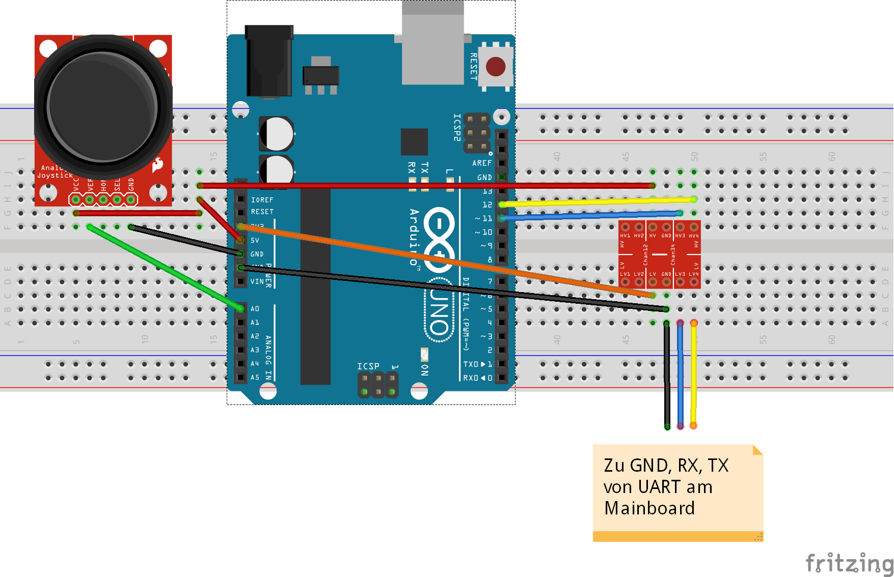

Scoomatic
=========
Ein Inhaltsverzeichnis müsste manuell erstellt werden. Wird später durch eine Startseite / ein Menü im Wiki gelöst, wenn sich an der Struktur nicht mehr viel ändert.

# Einleitung
Eine große Herausforderung im öffentlichen Personennahverkehr ist das Zurücklegen der sogenannten _letzten Meile_. Um von der nächsten Haltestelle von Bahn, S-Bahn und Bus zum eigentlichen Ziel zu kommen, sind oft noch mehr als ein Kilometer strecke zurückzulegen. Einige Unternehmen versuchen diese letzte Teiletappe mit Leihfahrrädern zu überbrücken. Diese Räder müssen allerdings später wieder vom Reisenden zu Sammelstationen zurückgebracht werden. Oft werden sie jedoch im Weg stehen gelassen wodurch sie bei vielen Menschen als störend angesehen werden. Diese Seminararbeit soll sich mit einem Lösungsansatz für dieses Problem beschäftigen. Nachfolgend werden Anforderungen für einen Prototypenaufbau präsentiert, der die oben genannten Probleme lösen kann. Anschließend werden verwandte Arbeiten vorgestellt und zwei Bauvorschläge für jeweils einen Prototypen gegeben.
# Aufgabenstellung
Im folgenden Abschnitt wird das Projekt im Detail vorgestellt und die Anforderungen an den Prototypen festgehalten.
## Vorstellung des Projekts
Im Rahmen des Scoomatic-Projects soll ein Elektrofahrzeug entwickelt werden, das in der Lage ist, eine Person die letzte Meile zum Zielort zu transportieren. Die aktuell in einigen Städten verwendete Lösung mit Leihfahrrädern hat den Nachteil, dass die Räder oft am falschen Ort stehen. Diese Problematik soll dadurch gelöst werden, dass die Fahrzeuge autonom zurück zur nächsten Sammelstation fahren können oder die Sammelstation wechseln können, um somit zu Stoßzeiten genug Fahrzeuge am richtigen Ort zu haben. Ebenso ist das Anfordern eines Fahrzeugs vergleichbar mit dem Rufen eines Taxis denkbar. Für dieses Projekt wird ein Fahrzeug benötigt, dass in einer urbanen Umgebung selbstständig selbstständig zu navigieren und eine Person zu befördern. Da diese Aufgabenstellung nicht trivial ist, soll in mehreren Iterationen ein Prototyp entwickelt werden, der stückweise um Funktionalitäten erweitert wird. Die Anforderungen an die erste Iteration des Prototypen werden nachfolgend dargestellt.


## Anforderungen an den Prototypen

Die Anforderungen des ersten Prototypen sind nah am gewünschten Endprodukt gehalten, jedoch wurde auf einige Features verzichtet, um schnell ein erstes Resultat zu erhalten. Die erste Iteration des Prototypen soll eine flexible Plattform zur Evaluation von Sensorik und Aktuatorik darstellen. Die Reichweite sollte in der Größenordnung 10-20km liegen. Dabei sollte die Antriebsart schon nahe am Endprodukt liegen. Kleinere Unebenheiten im Untergrund wie Kopfsteinpflaster und abgesenkte Bordsteine sollen von der Plattform bewältigt werden können. Bei der Auswahl der Hardware ist darauf zu achten, dass die kosten niedrig gehalten und die Konstruktion (in leicht abgewandelter Form) später leicht in größeren Stückzahlen gefertigt werden können. Für die autonome Navigation darf keine genaue Karte des nahen Umfelds (Bürgersteig) vorausgesetzt werden, öffentlich zugängliche Kartendaten dürfen aber genutzt werden. Im autonomen Betrieb muss die Plattform nicht schneller als Schrittgeschwindigkeit fahren können.
"Nice-to-have" wären die Fähigkeit eine Person schon im ersten Prototypen zu transportieren, CAD-Dateien für eine spätere Simulation und eine ansprechende und professionelle Optik des Aufbaus.

<!--
* letzte Meile, für 10-20km Reichweite nutzbar
* hardware für Selbstständige Navigation im urbanen Umfeld (exkl. vision f. ampel, etc.)
* Antriebstechnisch nah an Endprodukt
* Bordstein/Kopfsteinpflasterfähig
* niedrige kosten weil später massenprodukt
* möglichst leicht auf massenfertigbares produkt umsetzbar (problem ros)
* Keine genaue Karte des Bürgersteigs vorhanden (im Vorraus)
* im autonomen modus nur Schrittgeschwindigkeit

nice to have:
* evaluation menschentransport notwendig für 1. Prototypen?
* CAD-Files für Simulation
* Coolnes-Faktor
-->
# Related Work
Dieses Kapitel widmet sich der Vorstellung verwandter Arbeiten. Es werden dabei hauptsächlich verwandte Felder wie autonome Navigation in Fahrzeugen, Rollstühlen,und Staubsaugerrobotern betrachtet. Für jede Arbeit wird, sofern möglich, ein Überblick über Hardware, Software und deren Architektur und Schnittstellen sowie geplante Future Work gegeben.


## Autonome Navigation in Kraftfahrzeugen

Auf den ersten Blick scheinen autonom navigierende Autos sehr viel mit dem hier vorliegenden Problem gemeinsam zu haben. Sie navigieren in einer sich ständig verändernden, nicht genau kartografierten Umgebung und müssen auf andere Verkehrsteilnehmer Rücksicht nehmen. Allerdings fahren Autos die meiste Zeit deutlich schneller als die für das Scoomatic-Projekt geplante Schrittgeschwindigkeit. Außerdem unterscheidet sich die Umgebung, in der die jeweiligen Fahrzeuge navigieren und damit auch die auftretenden Hindernisse und Probleme.
Nachfolgend wird ein Überblick über gefundene Informationen zu Fahrassistenzprogrammen und selbstfahrenden Fahrzeugen im Automobilbereich gegeben. Hierbei wird aufgrund mangelnder Publikationen und fehlender Offenheit nicht auf Kommerzielle Systeme von Automobilherstellern wie Tesla, Audi, Mercedes oder von Dienstleistern wie Uber eingegangen. Sondern die beiden Open-Source Frameworks Autoware und Apollo und apex.ai betrachtet.


### Autoware
Das Open-Source Projekt [Autoware](https://github.com/CPFL/Autoware/wiki) ist ein ROS-Basiertes, modular aufgebautes Framework für selbstfahrende Fahrzeuge in urbanen Umgebungen. Es Bringt Module für Kartografierung und SLAM, sowie zur Fusion verschiedener Sensorwerte (GPS, Inertialsensoren, Kameras, LIDARs). Ebenso ist eine Pfadplanung und Regelung enthalten. Die erste Version ([Autoware.AI](https://www.autoware.ai/)) basiert auf ROS 1 und war als Forschungsplattform gedacht. Der ROS 2 Port [Autoware.auto](https://www.autoware.auto/) wurde mit Rücksicht auf eine gute Softwarearchitektur und "aufgeräumteren" Code komplett neu geschrieben und eignet sich aufgrund der Echtzeitkommunikationsfähigkeit von ROS 2 möglicherweise besser für den Produktiveinsatz. Allerdings ist Autoware.Auto nach der Aktuellen [Roadmap](https://autowareauto.gitlab.io/AutowareAuto/index.html#index-roadmap) noch nicht komplett implementiert. Allerdings sollen alle fehlenden Features noch im Jahr 2019 implementiert werden. Bis jetzt (Stand: Januar 2019) ist die Dokumentation des Projekts noch sehr unvollständig.

<!--
* Open Source
* research and development platform for autonomous driving technology.
* Localization is achieved by 3D maps and SLAM algorithms in combination with GNSS and IMU sensors.
* Detection uses cameras and LIDARs with sensor fusion algorithms and deep neural networks.
* Prediction and Planning are based on probabilistic robotics and rule-based systems, partly using deep neural networks as well.
* Haufenweise ROS Pakete für Kameraerkennung, Lidar, Mapping, Lane/Trafficlight, Traffic erkennung
* Evtl Probleme mit späterer Zulassung (ROS + KNN)
* Modulare EVA Architektur
-->

*Architektur von Autoware.AI: Modulares EVA- (Eingabe, Verarbeitung, Ausgabe) Muster. Die Sensordaten werden erfasst und fusioniert und eine Lokalisierung und Objekterkennung durchgeführt. Aufgrund dieser Daten werden Entscheidungen über das Fahrzeugverhalten getroffen, welche an die Missionsplanung weitergegeben werden. Diese steuert basierend darauf die Aktuatoren des Fahrzeugs an.*
### Apollo
[Apollo](https://apollo.auto) ist ein ebenfalls quelloffenes Framework für die autonome Navigation von Fahrzeugen. Gestartet vom Chinesischen Konzern Baidu und unterstützt von vielen Industriepartnern wurde seit 2017 eine Soft- und Hardwareplattform entwickelt, die im aktuellen Stand ein autonomes Fahren im urbanen Umfeld erlauben soll. Im laufe des Jahres 2019 sind erste Versuche mit massenproduktionsreifen Fahrzeugen in abgesteckten Testgebieten geplant, welche bis 2021 zu marktreifen vollständig autonom navigierenden Fahrzeugen für Autobahn- und Stadtverkehr füren sollen.
Als Software wird hier ebenfalls ROS verwendet, welches auf einem Ubuntu Linux mit selbst entwickeltem Echtzeitkernel läuft. Die [Architektur](https://github.com/ApolloAuto/apollo) scheint deutlich umfangreicher und komplexer zu sein, als die von Autoware, was sie für den Einsatz im Scoomatic Projekt ungeeignet, weil zu schwergewichtig, macht.

*Architektur von Apollo. Im Vergleich zu Autoware gibt es hier einen "Guardian", der Programmfehler detektiert und abfängt. ([Quelle](https://cdn-images-1.medium.com/max/800/1*EePl_JroHY8YnRIVTWMjJA.png))*
### apex.ai

* "Apex OS is a safe, secure and reliable software communication layer for self driving applications" Juan Pablo, Senior Software Engineer
* Safety + Security tief in System verankert
* Hardware- und Application agnostic
* Basiert auf ros2, erweitert um safety, security, echtzeit

* Apex.autonomy
* Applikationen für selbstfahrende Fahrzeug
* 3D Perception Fertig, einige lidars schon getestet
* Lokalisierung, Plannung und Steuerung für 2019 geplant
* harte echtzeit, gute softwaretechnik (Dokumentierte interfaces, integration tests etc)
* C++
* x86_64 und amd64 Support, Linux, QNX, Windows, OSX


https://spectrum.ieee.org/cars-that-think/transportation/self-driving/apexai-does-the-invisible-critical-work-that-will-make-selfdriving-cars-possible.amp.html


### Autonomous Campus Mobility Platform (2018)
https://digitalcommons.wpi.edu/mqp-all/3121/

### Autonomous navigation for mobile service robots in urban pedestrian environments (2011)
https://sci-hub.tw/10.1002/rob.20386
https://onlinelibrary.wiley.com/doi/abs/10.1002/rob.20386
TODO
## Autonome Navigation im Fußgängerbereich
Die autonome Navigation von Fahrzeugen im Fußgängerbereich ist Thema einiger wissenschaftlicher Arbeiten, allerdings auch von kommerziellen Produkten. Hier werden nicht nur Lösungen für den Transport von Menschen, wie z.B. mit selbstfahrenden Rollstühlen, sondern auch autonome Transportfahrzeuge und Serviceroboter betrachtet. Auch die nur im weiteren Sinne im "Fußgängerbereich" navigierenden Staubsaugerroboter werden aufgrund der Parallelen in Navigation und Pfadplanung kurz betrachtet.

### Smart Wheelchair System (2017)


Das [Smart wheelchair ecosystem for autonomous navigation in urban environments](https://link.springer.com/article/10.1007/s10514-016-9549-1) (SWS) ist ein autonom navigierender Elektrorollstuhl, welcher nur durch einige LIDARs und Odometrie und ohne die Hilfe von GPS mittels einer vorher erzeugten Karte von *Landmarks* selbstständig Routen abfahren kann. Auf dem Fahrzeug sind folgende Sensoren verbaut:
* 2x IFM O3D200 3D Kamera
* Hokuyo UTM-30LX 2D LIDAR
* Radencoder
* Microstrain 3DM-GX1 IMU
Zur Verarbeitung der Sensordaten kommt ein Laptop mit einem Intel Core i7-2760QM 2.4GHZ Prozessor und 4GB Arbeitsspeicher zum Einsatz.
Die im voraus generierte Karte wird durch ein Kartenmobil mit mehr Sensorik (IMU, GPS, Radencoder, 3 LIDARs) erstellt. Die detaillierten Sensorwerte werden auf eine vereinfachte Karte aus Landmarks zusammengeführt. Ein Landmark kann hierbei z.B. ein Straßenschild oder ein Hydrant sein.
Die Software für das SWS basiert auf ROS und nutzt die Point Cloud Library (PCL) für die Verarbeitung der LIDAR-Werte. Die Gesamtkosten für die Hardware des Rollstuhls belaufen sich laut Paper auf weniger als 10000 USD.
Diese Lösung ist für das Scoomatic-Projekt zu kostspielig. Allerdings könnte Versucht werden, die teuren LIDARs durch eine kostengünstigere Version wie den RPLIDAR zu ersetzen und die dadurch entstehenden Nachteile durch GPS auszugleichen.
Ebenso ist eine Kartografierung des gesamten Einsatzgebietes im voraus nicht praktikabel.

### Autonomous Wheelchair Navigation in Unmapped Indoor Environments (2018)

In [Autonomous Wheelchair Navigation in Unmapped Indoor Environments](https://ieeexplore.ieee.org/document/8409854/) stellen Grewal et al. ebenfalls einen autonomen Rollstuhl vor, welcher allerdings in einer vorher nicht kartografierten Indoorumgebung navigieren soll. Als Sensoren werden eine Kamera (Logitech c310) und ein LIDAR (LIDAR-Lite v3 (ca. 30€, Reichweite 5cm bis 40m)) benutzt. Zusätzlich kommt ein 2D-LIDAR (RPLIDAR A2 (ca. 350€)) zum Einsatz.
Eine der beiden Kameras und der LIDAR-Lite sind auf einem 2-Achs-Gimbal montiert.

*Hardwareaufbau des Autonomous Wheelchairs*

Als Software kommt auch hier ROS zum Einsatz. Sie wird auf einem Dell Inpsiron TM15R 5537 mit einem Core i5 4200U mit 8GB DDR3 RAM ausgeführt. Die Kamera wird wiederholt geschwenkt und mehrere Bilder der Umgebung aufgenommen. Diese werden mittels *computer vision software* verarbeitet um mögliche Ziele (Im vorgestellten Anwendungsfall ein Geschäft) zu lokalisieren. Wurde ein Ziel erkannt, wird über den LIDAR Lite die Distanz zu diesem ermittelt. Potenzielle Ziele werden an das Navigationsmodul gesendet. Der Nutzer kann diese anschließend auswählen und anfahren. Der 2D-Lidar Dient zur Erstellung einer Karte für die Navigation.
Die Gesamtkosten für das System betragen ca. 1000€ und der Stromverbrauch liegt bei etwa 100W. Ebenso wie das Smart Wheelchair System ist diese Projekt nicht auf externe Hardware wie GPS angewiesen.
<!--
* 2x Kamera (Logitech c310, Ausdom AW615) + Lidar (LIDAR-Lite v3 (30€)) auf 2-Achs-Gimbal, RPLIDAR A2(350€)
* 100W, 1000€, keine externe Hardware (GPS)
-->

### Template-based autonomous navigation in urban environments (2011)


Sozua et al. beschreiben in [Template-based autonomous navigation in urban environments](http://portal.acm.org/citation.cfm?doid=1982185.1982485) eine Methode zur Navigation auf Fahrbahnen. Der kamerabasierte Ansatz nutzt eine einzige, nach vorne gerichtete Graustufenkamera mit einer Auflösung von 320x240 Pixeln um ein Neuronales Netz zu speisen. Dieses Generiert daraus eine Matrix, welche das Bild in *Straße* und *Keine  Straße* unterteilt. Anschließend wird ein *Template Matching Verfahren* genutzt, um Position und Orientierung der Fahrbahn zu bestimmen.
Ein klarer Vorteil dieser Methodik ist, dass nur verhältnismäßig günstige Kameras benötigt werden. Allerdings ist über dieses Verfahren auch nur eine Art *Spurhalteassistent* und keine Lokalisierung oder Hindernisvermeidung möglich.
Als Future Work ist die Integration von LIDAR-Daten in dieses Verfahren geplant.
<!--
* vision based approach
* Nur kamera 320x240 -> ANN -> Template Matching für Straßenerkennung
* Future Work: Lidar integration
-->


### A Navigation System for Robots Operating in Crowded Urban Environments (2013)


Die [Arbeit von Kümmerle et al.](http://ieeexplore.ieee.org/document/6631026/) beschreibt einen Assistenzroboter, der es schafft, sich in einer urbanen Umgebung zurechtzufinden und darin autonom zu Navigieren.
Für den Antrieb werden zwei einzeln angetriebene Räder und ein schwenkbares Stützrad genutzt, was das Wenden auf der Stelle erlaubt.
Für Mapping und Positionsbestimmung sind die folgenden Sensoren verbaut:
* XSens IMU
* GPS Pathfinder Pro
* 2x SICK LMS 151 LIDAR
Das Navigationssystem wird auf einem herkömmlichen Laptop mit einem Quadcore i7 mit 2.3GHz ausgeführt.

Um in einem Gebiet autonom navigieren zu können, muss von diesem vorher eine Karte erstellt worden sein. Dies geschieht durch das abfahren der Umgebung mithilfe eines Joysticks und ist laut Paper nicht sehr zeitaufwändig. Zudem muss die Karte nur einmal erstellt werden, weil der Algorithmus robust auf kleinere Änderungen in der Umgebung und bewegte Hindernisse wie Fußgänger reagiert.
Ampeln an Fußgängerübergängen und andere sicherheitsrelevante stellen werden manuell in der Karte eingetragen. Der Roboter pausiert an den jeweiligen Stellen und wartet auf eine Freigabe durch den Nutzer, weil diese Problemstellen von der Sensorik nicht ausreichend erkannt werden.

### The Autonomous City Explorer (2009)


Bauer et al. zeigt in [The Autonomous City Explorer: Towards Natural Human-Robot Interaction in Urban Environments](http://link.springer.com/10.1007/s12369-009-0011-9) einen Roboter, der ohne die Hilfe von GPS oder einer vorher erstellten Karte in urbanen Umgebungen navigieren kann. Dabei achtet er auf Passanten und seine unmittelbare Umgebung.
Um diese Aufgabe zu bewältigen, besitzt der Autonomous City Explorer (ACE) folgende Hardware:
* Zwei einzeln angetrieben Räder und zwei schwenkbare Stützräder
* Radencoder
* 2x LIDAR (SICK LMS200)
* Stereoskopische Kamera auf Zweiachsgimbal (Point Grey Research Bumblebee XB3)
* 3 PCs, je einer für Navigation (4x2.2GHz), Vision Processing (4x2.2GHz) und Antriebsansteuerung (PowerPC)

Die Softwarearchitektur wird im folgenden Bild veranschaulicht.


*Architektur des Autonomous City Explorer. Diese scheint selbst implementiert zu sein, ROS wird im Paper nicht erwähnt*

### TOOMAS (2009)


In [TOOMAS: Interactive Shopping Guide Robots in Everyday Use - Final Implementation and Experiences from Long-term Field Trials](http://ieeexplore.ieee.org/document/5354497/) präsentieren Gross et al. einen Einkaufsassistenzroboter, der Kunden in einem Baumarkt zu den gesuchten Artikeln führen soll. Die Eingabe des Suchbegriffs erfolgt über einen Touchscreen. Anschließend führt der Roboter den Kunden zu dem Regal, in dem der Artikel lagert. Der Antrieb ist auch hier über zwei einzeln Ansteuerbare Räder und ein Stützrad.
Zur Positionsbestimmung, Kartografierung und Hindernisvermeidung sind die folgenden Sensoren verbaut:

* Omnidirektionale Kamera (360° schwenkbar)
* 24x Sonar für Hinderniserkennung und Mapping
* Zusätzlich LIDAR (SICK S300, scheinbar nur für TÜV Zulassung, würde wohl auch ohne funktionieren)
Als Bordcomputer kommt ein Embedded PC mit einem Intel Core 2 Duo Prozessor zum Einsatz.
Zum erstellen der Karte muss das komplette Gebiet mittels Joystick manuell abgefahren werden.
Ein Video vom Roboter im Einsatz kann [hier](https://www.youtube.com/watch?v=lwB8il81kmI) angesehen werden.


### Starship Technologies

[Starship Technologies](Starship.xyz) bietet eine kommerzielle Lösung zur Auslieferung von Waren an den Endkunden auf der letzten Meile an. Die sechsrädrigen Transportroboter können eine Nutzlast von ca. 10kg Transportieren und werden z.B. von Essenslieferdiensten wie Doordash eingesetzt. Der Hersteller macht keine Angaben zur Sensorik, allerdings lassen die Bilder auf rundum verbaute Kameras (weitwinkel, stereoskopisch) und Sonarsensoren schließen. Die Räder sind durch eine spezielle Aufhängung in der Höhe verstellbar, was [das erklimmen nicht abgesenkter Bordsteine](https://youtu.be/UPZwnc_Lk2M?t=49) möglich macht.


### Marble
[Marble](https://www.marble.io/) versucht ebenfalls eine Lösung für Produktlieferungen auf der letzten Meile zu bieten. Das kommerzielle Projekt macht keine Angaben zur verwendeten Hardware, allerdings lassen die veröffentlichen Bilder und Videos auf folgende Sensoren schließen:
* 6 * [Intel Real Sense D415](https://click.intel.com/intelr-realsensetm-depth-camera-d415.html)
* 4 * Weitwinkelkamera
* LIDAR
* GPS
Die Fortbewegung erfolgt über 4 Gummiräder und eine Ackermannsteuerung

### Kiwi
Ebenso wie die Roboter von [Starship Technologies](#starship-technologies) und [Marble](#marble) bietet [Kiwi](https://www.kiwicampus.com/) Roboter für die Lieferung von Waren. Über die verwendete Sensorik ließ sich nichts herausfinden. Die Fortbewegung erfolgt hier wie beim Konkurrenten Marble über 4 Gummiräder und Ackermannsteuerung.
Zusätzlich zu den kleinen Lieferrobotern bietet das Unternehmen ein autonomes Trike, dass vier der kleinen Lieferroboter auf der Straße transportieren kann und einen Kellnerroboter, der Gäste in Restaurants bedienen soll.

### Kit CityBuddy
* TODO
### Amazon Scout
Über den Amazon [Scout](https://blog.aboutamazon.com/transportation/meet-scout) sind noch nicht sehr viele Informationen verfüghar, der allgemeine Aufbau ähnelt aber sehr Stark dem Roboter von [Starship Technologies](#starship-technologies).


## Staubsaugerroboter
Höherpreisige Staubsaugerroboter bieten die Möglichkeit, eine Karte von ihrer Umgebung zu erstellen, um dadurch eine bessere Abdeckung des zu reinigenden Bereiches zu erzielen. Inzwischen gibt es mehrere Modelle mit dieser Funktionalität (unter anderem von [Roborock](https://en.roborock.com/pages/robot-vacuum-cleaner), [Xiaomi](https://www.china-gadgets.de/test-xiaomi-saugroboter/), [Vorwerk](https://kobold.vorwerk.de/saugroboter/saugroboter-vr300/) und [Neato](https://www.neatorobotics.com/de/robot-vacuum/botvac-connected-series/). Nach dem die eingesetzten Sensoren sich kaum unterscheiden wird an dieser stelle exemplarisch das Modell S5 des Herstellers Roborock vorgestellt.
### Roborock S5
Der [Roborock S5](https://en.roborock.com/pages/robot-vacuum-cleaner) ist mit einem oben am Gehäuse angebrachten LIDAR / LDS (Laser Distance Sensor) ausgestattet, was eine Kartografierung des zu reinigenden Gebiets ermöglicht. Die so erstellte Karte kann per App angesehen werden und darin der Fortschritt der Reinigung angezeigt und Befehle zum Reinigen von Teilflächen gegeben werden. Für die Hindernisvermeidung sind um den Roboter mehrere Ultraschallsensoren angebracht. Außerdem erkennt ein *Bumper* frontale Kollisionen mit Hindernissen.


*Roborock S50 App (Quelle: https://www.trustedreviews.com/reviews/roborock-s5)*
# Sinnvolle Hardwareelemente
Im folgenden Kapitel wird eine Auswahl an Hardware vorgestellt und deren Eignung für das Projekt analysiert.
## Aktuatorik
Für den Antrieb des Prototypen sind mehrere Plattformen denkbar. Nachfolgend wird die Eignung von Roboterplattformen für den wissenschaftlichen Einsatz, des Roboters Segway Loomo und von Motoren von *Hoverboards* diskutiert
### Roboterplattformen für den wissenschaftlichen Einsatz
Für den wissenschaftlichen Einsatz existieren mehrere Antriebsplattformen, die die Anforderungen des Projekts erfüllen. Vorteilhaft ist die Erweiterbarkeit und Offenheit der Plattformen. Für die Ansteuerung stehen meist gut dokumentierte Schnittstellen zur Verfügung. Außerdem lässt sich zwischen verschiedenen Antriebsarten (Kettenantrieb, omnidirektionale Räder, Gummireifen mit Allradantrieb, Ackermannsteuerung...) wählen.
Der große Nachteil dieser Plattformen ist der hohe Preis. Soll nicht nur Sensorik und andere Hardware, sondern auch ein Mensch transportiert werden, liegt der Preis schnell bei 5-20.000€
> Hinweis: Die Angaben für diesen Abschnitt wurden hauptsächlich aus dem [robotshop](https://www.robotshop.com/de/de/rad-ketten-roboter.html) entnommen

### Segway Loomo

Der [Segway Loomo](http://www.loomo.com/en/) ist ein selbst-balancierendes Elektrofahrzeug. Optisch ähnelt es den ursprünglichen Segway Modellen, allerdings wurde der Lenker verkürzt und die Lenkung erfolgt jetzt über seitliches Bewegen der Lenkstange zwischen den Knien.
Der Loomo Unterscheidet sich von einem normalen Segway durch die Möglichkeit, ihn bei Bedarf in einen Begleitroboter umzufunktionieren. Um diese Funktion erfüllen zu können, ist eine Intel RealSense ZR300 Kamera, eine HD-Kamera, verschiedene Ultraschallsensoren, Encoder, eine IMU, Infrarot Abstandssensoren und Touchsensoren verbaut (Vgl. [Loomo Specs](http://www.loomo.com/en/spec.html)). Die Verarbeitung der Signale übernimmt ein Intel Atom Z8750 Prozessor, der Android in der Version 5.1 ausführt. Der Hersteller stellt Entwicklern eine [API](https://developer.segwayrobotics.com/developer/overview.html) zur Verfügung, mit der eigene Android-Apps mit der Hard- und Software des Loomo kommunizieren können. Als Schnittstellen zur Erweiterung bietet der Loomo USB, Bluetooth und WLAN. Der Kaufpreis im [Segway-Webshop](https://shop.segway.com/de-de/92/-segway-loomo) beträgt aktuell (29.1.2019) 1699€
Für den Einsatz im Scoomatic-Projekt sprechen die relativ offenen Schnittstellen über das SDK sowie eine Erweiterbarkeit der Hardware über USB, Bluetooth und WiFi. Außerdem sehr nützlich ist die bereits verbaute Sensorik und ein fertig implementiertes Antriebskonzept.
Gegen die Verwendung spricht die Begrenzung des SDKs in einigen Punkten. So ist zum Beispiel eine Anpassung der Reglerparameter für das Balancieren möglich. Dies könnte durch das Verbauen weiterer Sensorik am Roboter allerdings nötig sein. Der offizielle Support hat bis jetzt auf Fragen nicht reagiert, wodurch sich auch nicht klären lässt, ob geplant ist, dieses Feature nachzureichen. Außerdem besitzt der Loomo kaum gute Möglichkeiten zusätzliche Sensorik zu befestigen, was die Erweiterbarkeit ebenfalls einschränkt

### Hoverboard
Die in den letzten Jahren populär gewordenen chinesischen Hoverboards verschiedener Hersteller sind ursprünglich als Freizeitgerät zum Transport einer Person gedacht. Im Aussehen ähneln sie einem kleinen Segway ohne Lenkstange. Das Board besitzt zwei in einer Achse liegenden, einzeln angetriebene Räder. Der Fahrer kann das Board über Gewichtsverlagerung Steuern. Der mit der Zeit stark gefallene Preis (ab ca. 100€ aus Deutschland) hat dazu geführt, dass die in den Boards verbaute Hardware inzwischen [gut dokumentiert und reverse-engineert](https://www.youtube.com/watch?v=qnQSL9DBPaE) wurde. Dadurch lassen sich die verbauten Motoren, Motortreiber und der Akku auch für andere Zwecke umfunktionieren und z.B. an ein selbst konstruiertes Chassis montieren.
Der durch die Massenproduktion erreichte, günstige Preis spricht für das Hoverboard als Antriebsplattform. Zudem ist in dem Gerät eine komplett aufeinander abgestimmte Kombination aus Akku (mit Ladeschaltung), Motortreiber und Motoren vorhanden, was die manuelle Auswahl der Komponenten spart. Durch die reverse-engineerte Hardware kann ein Umbau nach eigenen Kriterien erfolgen, was eine hohe Flexibilität des Aufbaus ermöglicht. Allerdings muss dafür die Hardwareplattform selbst gebaut werden, was mehr zeitlichen Aufwand bis zum ersten Prototypen bedeutet.
## Sensorik
Nachfolgend werden einige nützliche Sensoren zur autonomen Navigation vorgestellt. Dabei werden nicht nur der Sensortyp, sondern ein konkreter Sensor vorgestellt.
### (RP)LIDAR
Der RPLIDAR A1 ist mit einem Preis von ca. [100€](https://www.robotshop.com/de/de/rplidar-a1m8-360-grad-laserscanner-entwicklungskit.html) zwar nicht günstig, allerdings einer der günstigsten LIDAR Sensoren auf dem Markt. Durch einen durch Spiegel in verschiedenen Winkeln abgelenkten Laserstrahl werden Entfernungen in mit einer Scan-Frequenz von 5,5-10Hz in einem 360° Bereich gemessen. Die messbaren Entfernungen liegen dabei zwischen 0,15 und 12 Metern. Eine [ROS-Anbindung](http://wiki.ros.org/rplidar) ermöglicht die Nutzung der in der Software integrierten Lokalisierungs- und Mappingframeworks. Hierfür wird allerdings verhältnismäßig viel Rechenleistung benötigt.
### Ultraschallsensoren
Ultraschallsensoren senden einen Schallimpuls aus und bestimmen anhand der Zeit, die das Echo benötigt, um wieder beim Sensor anzukommen, die Entfernung zum nächsten Objekt. Die für die Ansteuerung und die Berechnung der Entfernung notwendige Rechenleistung ist verhältnismäßig klein und kann mit günstigen 8-Bit Mikrocontrollern erreicht werden. Die Sensoren messen nur in eine Richtung, durch den günstigen Preis können aber mehrere Sensoren in verschiedenen Richtungen angebracht werden. Ein für den ersten Prototypen geeigneter Sensor ist das [SR04 Modul](https://www.robotshop.com/de/de/hc-sr04-ultra01-ultraschall-entfernungsmesser.html). Für spätere Versionen könnte eine [wetterbeständige Version](https://www.robotshop.com/de/de/witterungsbestandiger-ultraschallsensor-mit-separater-sonde.html) mit höherem Kaufpreis interessant sein.
### GPS-Empfänger
Ein GPS-Empfänger wird benötigt, um die grobe Lokalisierung in der Welt zu ermöglichen. Durch die Technik kann die aktuelle Position auf wenige Meter genau bestimmt werden. Da die komplexe GPS-Logik meist auf den GPS-Modulen selbst berechnet, und das Ergebnis über UART zur Verfügung gestellt wird, benötigt der Hauptcomputer kaum Rechenleistung um die Position über GPS zu bestimmen. Für die Navigation im Fußgängerbereich ist die Genauigkeit der Position allerdings nicht ausreichend und durch die Kombination mit anderen Sensordaten verrechnet werden. Ein taugliches Modul ist das [NEO-7M-C GPS-Modul](https://www.robotshop.com/de/de/uart-neo-7m-c-gps-modul.html) von UBLOX. Dieses ist per UART ansteuerbar und liefert eine horizontale Positionsgenauigkeit von 2.5 Metern. Die Genauigkeit der bestimmten Geschwindigkeit ist mit 0.1 m/s angegeben. Dabei werden die Werte mit einer Frequenz von 10Hz aktualisiert. Der Preis des Moduls liegt bei ca. 20€.
### Stereoskopische Kameras
Stereoskopische Kameras wie die Microsoft [Kinect](https://developer.microsoft.com/de-de/windows/kinect) oder die [Inel RealSense](https://www.intel.de/content/www/de/de/architecture-and-technology/realsense-overview.html) Kameras liefern ein dreidimensionales Kamerabild in Form einer Punktewolke. Die Verarbeitung der beiden Kamerabilder zur Punktwolke geschieht dabei im Normalfall mithilfe eines speziell dafür ausgelegten Prozessors auf der Kamera selbst. Für die Verarbeitung der Punktwolke wird dennoch verhältnismäßig viel Rechenleistung benötigt. Auch die Auswertung der 2D-Bilder mittels Frameworks wie OpenCV um z.B. rote Ampeln zur Laufzeit zu erkennen, benötigen viel Rechenleistung. Zudem sind die Kameras mit einem Kaufpreis von 150-400€ recht teuer.

### Inertial Measurement Unit (IMU)
Eine IMU ermöglicht es, die Lage und Drehgeschwindigkeit eines Geräts zu bestimmen. Dies geschieht durch die Auswertung eines Gyroskops, Accelerometers und Magnetometers. Diese sind bei dem MPU9250 Chip von IvenSense alle in einer 3-Achs ausführung auf einem einzigen Chip untergebracht. Dieser gibt die Daten über einen i2c-Bus aus. Der Preis für ein Breakout-Board mit dem Chip beträgt ca. [15€](https://www.robotshop.com/de/de/imu-breakout-board-mpu-9250.html). Für die Bestimmung einer genauen Lage und Winkelgeschwindigkeiten ist es hilfreich die einzelnen Messwerte über Sensorfusion zu vereinen. Hierzu bietet sich z.B. ein [Kalman Filter](https://ieeexplore.ieee.org/abstract/document/1626777) an. Dieser benötigt kaum Rechenleistung und kann auf einem 8-Bit Mikrocontroller problemlos ausgeführt werden.

## Bordcomputer
Nachfolgend werden exemplarisch einige Kandidaten für den Bordcomputer vorgestellt und deren Vor- und Nachteile aufgezeigt. Dabei werden zuerst Computer auf Basis der ARM-Architektur und anschließend Intelx86-basierte Geräte vorgestellt. Aufgrund der Masse der verfügbaren Geräte wird nur eine Auswahl davon behandelt. Bei der Auswahl wurde unter anderem darauf wert gelegt, dass die Rechner zum Framework [ROS](http://www.ros.org/) kompatibel sind.
### Einplatinencomputer (ARM)
Einplatinenrechner mit ARM Prozessoren sind in unzähligen Varianten mit verschiedenster Rechenleistung und Ausstattung verfügbar. Bei der Selektion der Kandidaten für das Scoomatic-Projekt wurde auf die Communityunterstützung, die Rechenleistung, einen niedrigen Preis sowie verfügbare Schnittstellen geachtet.
#### Beaglebone Blue
Das [Beaglebone Blue](https://beagleboard.org/blue) ist ein speziell für die Robotik entwickelter Linux Einplatinencomputer. Ein [Octavo OSD3358](octavosystems.com/octavo_products/osd335x/) System-In-Package Liefert einen AM335x-Kern mit 1GHz Taktfrequenz sowie 512MB DDR3 RAM. Auf dem Board sind 4GB eMMC Speicher fest verbaut. Als Schnittstellen zur Kommunikation mit anderen Geräten steht ein USB-2.0 Host Anschluss, 802.11bgn WLAN, Bluetooth 3.1, UART, SPI, I2C und GPIO-Pins zur Verfügung. Außerdem ist bereits eine 9-Achsen IMU mit Gyroskop, Accelerometer und Magnetometer verbaut. Ein weiteres interessantes Merkmal sind zwei verbaute Co-Prozessoren ([2×32-bit 200-MHz programmable real-time units (PRUs)](https://beagleboard.org/blue)), die schnellen Zugriff auf Speicher und IO-Pins für Echtzeitanwendungen erlauben. Der Preis für das Board beträgt etwa [100€](https://geizhals.de/beaglebone-blue-a1595014.html)

Für das Board spricht, dass es speziell für Robotikanwendungen konzipiert wurde und nützliche Features wie eine IMU und Co-Prozessoren für echtzeitkritische Funktionalitäten mitbringt. Leider ist dafür das Preis / Rechenleistungsverhältnis eher schlecht und die mitgebrachte Rechenleistung könnte zu wenig für die Auswertung der LIDAR-Daten und das anschließende Mapping sein.

#### Raspberry Pi 3B+
Die bekannteste Reihe von Einplatinenrechnern ist die Raspberry Pi Serie. Das aktuell leistungsstärkste Modell, der [Raspberry Pi 3 Modell B+](https://www.raspberrypi.org/products/raspberry-pi-3-model-b-plus/) ist ab ca. [32€](https://geizhals.de/raspberry-pi-3-modell-b-a1785657.html) erhältlich. Durch die große Community ist eine Unterstützung für viele Linux-Distributionen und Software vorhanden und deren Installation und Bedienung gut dokumentiert.
Auf dem Board ist ein [BCM2837B0](https://www.raspberrypi.org/documentation/hardware/raspberrypi/bcm2837b0/README.md) Chips verbaut, der eine 64-Bit ARMv8 SoC beinhaltet dieses Taktet mit 1.4GHz auf vier Kernen. Persistenter speicher ist nicht auf dem Board vorhanden, lässt sich aber über den verbauten Micro-SD-Kartenslot verbauen. Als Hauptspeicher sind 1GB LPDDR2 SDRAM verlötet. Der Pi kommuniziert mit der Außenwelt unter anderem über HDMI, Gigabit Ethernet, 4 USB 2.0 Ports sowie 802.11.b/g/n/ac WLAN und Bluetooth 4.2. Zudem sind über den Rapsberry-Pi Typischen [Pinheader](https://pinout.xyz/) GPIO-Pins, I2C, SPI, und ein UART herausgeführt. Über einen separaten Anschluss kann eine [Kameramodul](https://www.raspberrypi.org/products/camera-module-v2/) verbunden werden.
#### Hardkernel Odroid XU4
Der [Odroid XU4](https://www.hardkernel.com/shop/odroid-xu4-special-price/) von Hardkernel bietet im Vergleich mit dem [Rapsberry Pi](#Raspbery-pi-3b) eine höhere Leistung. Der verbaute [Samsung Exynos5422](https://www.samsung.com/semiconductor/minisite/exynos/products/mobileprocessor/exynos-5-octa-5422/) Chip bietet unter anderem je vier Cortex-A15 und Cortex-A7 ARM-Kerne mit je 2.1 bzw 1.4GHz der verbaute Hauptspeicher ist mit 2GB doppelt so groß wie der im Pi. Ebenso unterstüzt der Odroid [den im Vergleich zur MicroSD Karte schnelleren eMMC Speicher](https://www.mikronauts.com/hardkernel/hardkernel-odroid-xu4-review/8/). Er bietet neben einem USB-2.0 Port auch zwei USB3.0 Anschlüsse, Gigabit Ethernet und einen HDMI Ausgang. Kabellose Schnittstellen wie WLAN oder Bluetooth sind nicht auf dem Board verbaut und müssen über USB nachgerüstet werden. Der Preis ist mit aktuell 49$ im offiziellen Shop angegeben. Für den XU4 sind [Images](https://wiki.odroid.com/odroid-xu4/os_images/os_images) für Ubuntu 18.04LTS sowie Android 4.4.4 vom Hersteller bereitgestellt. Der Communtitysupport ist im Vergleich zum Pi deutlich kleiner.

### Einplatinencomputer und Kleinstrechner (x86)
Einplatinenrechner mit einer CPU auf Basis der Intel x86(_64) Architektur profitieren im Vergleich zu ARM-Basierten Geräten durch die mit "normalen" Rechnern geteilte Architektur von hervorragendem Binarysupport. Pakete, Programme, Treiber und Kernels sind verbreiteter. Zudem ist die Rechenleistung der Rechner häufig größer, was sich aber auch häufig an einem höheren Preis widerspiegelt. Nachfolgend werden einige dieser Einplatinenrechner und Kleinstrechner mit x86-Architektur vorgestellt.
#### Intel NUC
[Intel Nuc](https://www.intel.de/content/www/de/de/products/boards-kits/nuc.html) ist eine Serie von Kleinstrechnern von Intel. Es sind komplette Rechner mit Gehäuse, konfigurierbare Kits oder das reine Mainboard mit verlöteter CPU erhältlich. Die Rechner kommen in verschiedenen Leistungsklassen. Als Hardware kommt auf Energieverbrauch optimierte Laptophardware zum Einsatz. Die Auswahl reicht von verhältnismäßig schwachen Konfigurationen mit Intel Celeron Prozessor, 2GB RAM und 32GB SSD bis hin zu aktuellen i7 Modellen mit 32GB DDR4 RAM und Optane Speicher. Dabei reichen die Preise von ca. 200-1500€
Die Mainboards kommen mit fest installierter CPU und lassen sich mit gewöhnlichem RAM und M.2 SSDs aufrüsten. Ein Gehäuse wie bei den Komplett-PCs ist nicht enthalten. Die Größe der Boards ist mit 100x100mm größer als die der ARM-Boards (ca. 56x85mm beim Raspberry Pi 3B+)


#### UDOO x86
Die Einplatinencomputerserie [UDOO x86](https://www.udoo.org/udoo-x86/) ist in verschiedenen Ausfürungen von [140](https://www.mouser.de/ProductDetail/UDOO/SB02-7400-0000-C0?qs=%2fha2pyFaduhD7YV5fCe4mQ5ZiI8%252bJFn3ov84KqhPoToUN1%252bb4q9AlOMRykQDEI%252bc) bis [325](https://www.mouser.de/ProductDetail/UDOO/SB02-4940-0000-C0?qs=%2fha2pyFaduhD7YV5fCe4mXEscHVYPmsf%252bDBKZ5jk7kkYf5R6JNPj3XXwDtfDZzp3)$ erhältlich. Auf dem Board ist ein x86 Rechner zusammen mit einem [Arduino 101](https://store.arduino.cc/genuino-101) basierend auf dem Intel Curie Prozesor verbaut. Dieser ist über den Hauptrechner Programmierbar und bietet Zugriff auf die beim Arduino üblichen GPIOs. Der Hauptrechner ist in verschiedenen Konfigurationen erhältlich. Bei der CPU kommen 64 Bit Atom-, Celeron- und Pentium-Prozessoren zum Einsatz. Diese arbeiten mit 2-8GB RAM, der fest auf der Platine verlötet ist. Alle Boards verfügen über M.2- SATA- und MicroSD-Slots zur Speichererweiterung, bei den höherpreisigeren Modellen sind 32GB eMMC Speicher auf dem Board verbaut.
Die Boards sind Kompatibel mit den gängigen Linuxdistributionen, Windows ab Windows 7 und Android. Zur Kommunikation sind unter anderem Bluetooth, Gigabit Ethernet, WLAN und UART verbaut. Die Abmessungen de Boards betragen 120x85mm.

# Bauvorschläge
In diesem Kaptiel werden zwei konkrete Bauvorschläge vorgestellt und deren Stärken und Schwächen aufgezeigt. Es wird zuerst eine Lösung mit dem Segway Loomo als Antriebsplattform, die den Großteil der benötigten Hardware schon mitbringt, gezeigt und anschließend ein Eigenbau aus Hoverboardmotoren mit eigenem Rahmen und eigener Sensorauswahl erklärt.
## Bauvorschlag: Loomo
Für die erste Lösung, wird das bereits vorgestellte Elektrofahrzeug [Segway Loomo](#Segway-Loomo) als Basis genutzt. Diese bringt eine Lösung zum sensorgestützten Transport von Menschen mit. Die verbaute IMU, Intel RealSense Kamera und Odometriesensorik werden genutzt, um über eine Android-App, die auf dem Bordcomputer ausgeführt wird, autonom zu Navigieren.  Da die verbaute Sensorik dafür nicht ausreichen wird, werden am Chassis des Loomo zusätzlich [Alu Profilschinen](https://www.boschrexroth.com/de/de/produkte/produktgruppen/montagetechnik/themen/aluminiumprofile-loesungen-und-komponenten/aluminiumprofile-produkte/index) befestigt, die den Anbau verschiedener Zusatzsensoren ermöglichen. Sinnvoll wären ein [RPLIDAR](#rplidar) Sensor, GPS, und Ultraschallsensoren, die den vorderen und hinteren Bereich des Loomo abdecken. Diese Sensoren werden über Bluetooth, WLAN oder USB mit dem Loomo verbunden. Hierfür sind eventuell Adapterboards notwendig, die jeweilige Schnittstelle der Sensoren auf die des Loomo umsetzen.

Vorteile dieser Lösung wären, dass die komplette Antriebsplattform und ein Teil der Sensorik eingekauft werden kann und nicht selbst entwickelt und gebaut werden muss. Zudem ist schon viele nützliche Sensorik und ein programmierbarer Bordcomputer mit Schnittstellen auf die Hardware verbaut.

Gegen den Bauvorschlag spricht die mangelnde Flexibilität der Hardware bei der Erweiterbarkeit der Sensorik. Flexible mechanische Befestigungsmöglichkeiten sind nicht vorhanden und müssten erst kompliziert hinzugefügt werden. Auch die Schnittstellen für die Signalübertragung beschränken sich auf USB, Bluetooth und WLAN. Für einfachere Sensoren, die z.B. über I2C, UART oder SPI kommunizieren, müssen erst Adapter gebaut werden. Außerdem beschränkt sich die Treiberunterstützung für USB auf die in der mitgelieferten Android-Version installierten Treiber. Eine Auflistung dieser war nicht auffindbar. Hier könnte es bei der Integration von Sensoren zu Problemen kommen.

Außerdem wird durch das Hinzufügen von Anbauteilen möglicherweise der Schwerpunkt und das Massenträgheitsmoment des Roboters so stark beeinträchtigt, dass eine Änderung der darunterliegenden Regelung notwendig ist. Das bereitgestellte SDK sieht das in der aktuellen Version (Februar 2019) allerdings nicht vor.

Zusammenfassend lässt sich also sagen, dass die vorgestellte Lösung durch die viele bereits nutzbare Hardware Aufwand bei der Entwicklung spart, dafür die Integration weiterer Sensorik durch eingeschränkte Schnittstellen und SDK-Funktionalität erschwert werden könnte.

## Bauvorschlag: Hoverboard
Alternativ könnte ein günstig (150€) erhältiches Hoverboard, dessen Hardware umgebaut und mit Open-Source Firmware ausgestattet werden kann genutzt werden, um eine flexible Antriebsplattform für den Prototypen bereitzustellen. Die Motoren und Teile des Chassis werden mit [Alu Profilschinen](https://www.boschrexroth.com/de/de/produkte/produktgruppen/montagetechnik/themen/aluminiumprofile-loesungen-und-komponenten/aluminiumprofile-produkte/index) zu einem neuen Chassis verbunden, das nicht auf die Balanciermechanik de Hoverboards angewiesen ist, da diese eine Einstiegshürde für die Benutzung darstellt. Akku und Motortreiber des Hoverboards können ebenfalls weiter genutzt werden. An den Profilschienen  kann verschiedene Sensorik flexibel befestigt werden. Als Sensorik kann ebenfalls ein [RPLIDAR](#rplidar), eine [Intel RealSense](#Stereoskopische-Kameras) oder [Kinect](#Stereoskopische-Kameras) Kamera sowie [Ultraschallsensoren](#Ultraschallsensoren), eine [IMU](#IMU) und ein [GPS-Empfänger](#GPS-Empfänger) verbaut werden.
Für die Fusion der Sensoren sowie für das Mapping und die Lokalisierung kann je nach verwendeter Sensorik und daraus resultierender benötigter Rechenleistung ein [Einplatinencomputer](#Bordcomputer) mit Arm oder Intel x86(_64)-Architektur zum Einsatz kommen die Möglichkeiten hier reichen vom vergleichsweise günstigen Raspberry Pi Zero für unter 10€ bis zu vollwertigen Mini-PCs wie dem Intel NUC, der in verschiedenen Konfigurationsvarianten erhältlich ist und, mit einem Intel Core i7 der 8. Generation, 16GB RAM und 4GB Grafikspeicher ausgestattet, auch äußerst Rechenaufwändige Algorithmen problemlos ohne große Verzögerung ausführen kann. Als Softwarelösung bietet sich das modulare Open-Source Roboterframework [ROS](ros.org) an, welches Komponenten für SLAM und Visualisierung, sowie Hardwaretreiber für Sensoren wie die Kinect bereits mitbringt und von einer breiten Community unterstützt wird.

Ganz klar für diese Lösung sprechen die hohe Modularität und Erweiterbarkeit des Aufbaus. Bei guter Dokumentation von Schnittstellen und Designentscheidungen kann das System für viele Einsatzzwecke angepasst und iterativ weiterentwickelt werden und bietet ebenfalls eine modulare Plattform für die Evaluation von verschiedenen Sensoren. Durch die komplette Offenheit in der Software, lässt sich z.B. auch ein eigenes Programm für das Mapping implementieren, sollte das in ROS enthaltene nicht den Anforderungen entsprechen.

Ein deutlicher Nachteil der Lösung ist der hohe Entwicklungs- und Fertigungsaufwand bis zum ersten nutzbaren Prototypen. Die Antriebsplattform muss selbst entwickelt und gefertigt, die Sensorik und der Bordcomputer ausgewählt und integriert werden. Zudem wird es schwer werden, eine optisch so ansprechende Plattform wie den Loomo zu entwickeln.

Der Bauvorschlag basierend auf einem Hoverboard bietet also eine sehr flexible Hardwareplattform, in die bis zur ersten Nutzung allerdings viel Zeit und Arbeit investiert werden muss.

# Fazit
Abschließend lässt sich sagen, dass die mobile Plattform basierend auf dem Segway Loomo viele der Anforderungen an den Prototypen bereits erfüllt, allerdings in einigen Stellen noch erweitert werden muss. Die mangelnde Flexibilität bei der Erweiterbarkeit bei den mechanischen, elektrischen und Softwareschnittstellen spricht aber gegen die Lösung. Diese Probleme löst der Aufbau basierend auf einem Hoverboard durch Flexibilität, Modularität und Offenheit im mechanischen Aufbau sowie Hard- und Software. Der daraus resultierende Mehraufwand scheint in diesem Fall gerechtfertigt, weshalb basierend auf den vorgebrachten Argumenten die Hoverboard-Lösung für den ersten Scoomatic-Prototypen empfohlen werden kann.
# Notes
* Projektmodul: Wiki + Videos als Doku
* Luttkus.Lennart@me.com (01632479266)
###################################
# Projektmodul
# Prototypenaufbau
## Hardware
### Hoverboard
[Bezugsquelle Verwendetes Board](https://www.toysstoregmbh.de/10-hoverboard-smart-self-balance-board-bluetooth-luftbereifung-elektroroller-tuev-ce_343_1442)
#### Mainboard
Das Mainboard unterscheidet sich sowohl in der Geometrie als auch vom Prozessor zu dem von [Fauth et al](https://www.youtube.com/watch?v=qnQSL9DBPaE&t=1788s) vorgestellten sowohl in der Boardgeometrie als auch im verwendeten Hauptprozessor. Statt des STM32F103 kommt ein [GD32F103](https://smdprutser.nl/blog/stm32f103-vs-gd32f103/) zum Einsatz, welcher dem STM zwar ähnelt, sich aber durch mehr Speicher und eine höhere Taktrate von ihm unterscheidet. Allerdings scheint die Firmware zwischen den beiden Chips und Boards kompatibel zu sein.


Zu den auf dem Board verwendeten MOSFETs vom Typ HN75N09AP war kein Datenblatt auffindbar. Die technischen Daten, die aus einer [Produktbeschreibung](http://dalincom.ru/goods-10601.html) entnommen werden konnten sind nachfolgend aufgelistet:
| Bezeichnung | Wert |
| --- | --- |
| Typ | N-Channel |
| Maximale Drain/Source Spannung   | 90V  |
| Maximaler Storm Drain/Source  | 75A |
| Gehäuse   | TO-220   |

#### Sensorboard


Auf der linken und rechten Hälfte des Hoverboards befindet sich je ein *Sensorboard*. Dieses misst den Neigungswinkel der Boardseite und erkennt, ob eine Person auf dem Board steht.
Auf dem Sensorboard befindet sich ein MindMotion [MM32F031 Datasheet](http://www.mindmotion.com.cn/userfiles/images/mm32f031wendangziliao/ds_mm32f031_ver2.0.pdf) Microcontroller, welcher ein Klon des  [STM032F031](https://www.st.com/resource/en/datasheet/stm32f031c4.pdf) zu sein scheint. Ebenso finden sich auf dem Board Steckverbinder für die LED-Beleuchtungs- und Anzeigemodule der jeweiligen Seite.
Um zu erkennen, ob sich eine Person auf der jeweiligen Boardseite befindet, befinden sich je zwei Lichtschranken auf jedem Sensorboard. Diese werden unterbrochen, wenn eine Person auf das Hoverboard steigt und damit ein sich über den Lichtschranken befindendes Silikonteil in den Erkennungsbereich letzterer drückt. Es genügt dabei, eine der beiden Lichtschranken zu unterbrechen, um den Motor der jeweiligen Seite anzuschalten. Für Testzwecke kann im ausgebauten Zustand ein Stück Schrumpfschlauch über eine der Lichtschranken gezogen werden, um den Motor zu aktivieren.


Die 14.4V Versorgungsspannung wird von Linearreglern auf 5V und 3.3V zur Versorgung der LEDs und Lichtschranken sowie der IMU und des Mikrocontrollers verwendet. Der Typ der IMU ließ sich nicht ermitteln.

Nachfolgend ist die Pinbelegung des Verbindungssteckers zum Mainboard aufgezeichnet.
Das Protokoll, über das das Sensorboard dem Mainboard die Motorgeschwindigkeit vorgibt, wird im Abschnitt [Ansteuerung der Motoren mit Originalfirmware](#ansteuerung-der-motoren-mit-originalfirmware) erklärt.


#### Netzteil
Das beim Hoverboard mitgelieferte Netzteil hat eine Spannung von 42V und liefert einen maximalen Strom von 2A. Der Stecker für die Verbindung zum Board ist vom Typ TODO
Die Pinbelegung der *Buchse* ist nachfolgen dargestellt:


#### Ansteuerung der Motoren mit Originalfirmware


Zum Ansteuern der Motoren mit der originalen Mainboard-Firmware wurde die serielle Kommunikation zwischen Sensor- und Mainboard analysiert. Hierfür kam ein [Logic-Analyzer](https://eur.saleae.com/products/saleae-logic-8?variant=10963959349291) zum Einsatz. Das ermittelte Protokoll ähnelt dem [hier](http://drewspewsmuse.blogspot.com/2016/06/how-i-hacked-self-balancing-scooter.html) vorgestellten. Die folgenden Parameter konnten für die serielle Verbindung ermittelt werden.
| Bezeichnung | Wert |
| --- | --- |
| Baudrate | 27000 |
| Datenbits | 8 |
| Stopbits   | 1  |
| Paritybits   | 0  |
| Bitorder   | LSB first  |

Da vom Mainboard aus scheinbar nusuddenr Befehle zum An- und Abschalten der LED-Beleuchtung gesendet werden, wurde nur die Kommunikation vom Sensor- zum Mainboard reverse-engineert.
Das Sensorboard sendet wiederholt ein Datenpaket, welches die Geschwindigkeit des Motors vorgibt.

| BYTE_0 | BYTE_1 | BYTE_2 | BYTE_3 | BYTE_4 | BYTE_5 | BYTE_6 | BYTE_7 |
| --- | --- | --- | --- | --- | --- | --- | --- |
| STATE | SPD_L | SPD_H | SPD_L | SPD_H | UNK1 | UNK1 | TRAILER |

In Byte0 des Pakets wird der Status der Lichtschranke (0x55 ^= mindestens eine Schranke unterbrochen -> Motor aktivieren, 0x TODO ^= keine Schranke unterbrochen, Motor abschalten) übermittelt. Anschließend wird zweimal das Low- und das High-Byte der Sollgeschwindigkeit übertragen. Die Geschwindigkeit ist hierbei als 16-Bit-Signed-Integer in 2K Darstellung codiert. Danach folgen weitere zwei Bytes, deren Wert immer gleich ist. Die Bedeutung dieser Bytes ist nicht bekannt. Welcher Wert hier übertragen wird, scheint aber keine Auswirkung auf die Funktion des Boards zu haben. Jedes Paket wird mit einem konstanten Trailerbyte mit dem Wert 0xC0 beendet.

> **Hinweis:** Um Beschädigungen am Hoverboard durch zu hohe Ströme bei Kurzschlüssen etc. zu vermeiden, wurde der Akku ausgebaut und ein Labornetzgerät mit Strombegrenzung mit der XT-60 Akkubuchse verbunden. Die Strombegrenzung kann auf 2A eingestellt werden, wenn nur ein Motor im Leerlauf betrieben wird. Die Eingangsspannung sollte 36-42V betragen.

Anschließend wurde mit einem [Arduino Uno](https://store.arduino.cc/arduino-uno-rev3) eine Verbindung zum Seriellen Port des Mainboards hergestellt. Hierbei ist der richtige der beiden Ports für den jeweiligen Motor zu wählen (vgl. Abschnitt [Mainboard](#mainboard)). Zusätzlich wurde ein [Joystickmodul](https://www.conrad.de/de/sensor-kit-ky023jm-arduino-banana-pi-pcduino-raspberry-pi-1707629.html) mit dem Arduino verbunden. Dieser dient als Eingabegerät für die Motorgeschwindigkeit.

> **Hinweis:** Das Hoverboard-Mainboard arbeitet mit **3.3V Logik**. Wird ein gängiger 5V-Arduino mit dem Board verbunden, muss ein [Level Shifter](https://learn.sparkfun.com/tutorials/bi-directional-logic-level-converter-hookup-guide/all) verwendet werden. Außerdem muss auf das rote Kabel des Steckverbinders zum Sensorboard besonders geachtet werden. An diesem liegt eine Spannung von **14.4V** an, die sowohl am Arduino als auch beim Mainboard, wenn falsch verbunden, schnell sehr viel kaputt machen kann.


> **Hinweis:** Bei dem hier gezeigten Versuch wurde nur der Motor einer Seite angesteuert. Wird jedoch ein weiteres Arduino-Board auf dem Seriellen Port der anderen Seite verwendet, sollten sich Problemlos beide Motoren gleichzeitig ansteuern lassen.


TODO Kabelfarben von Hoverboardstecker übernehmen

Der Arduinocode für diesen Aufbau findet sich im Git-Repository unter */code/examples/hoverboard_stock_example/*

Durch den beschriebenen Versuchsaufbau lassen sich also beide Räder des Hoverboards ansteuern. Allerdings ergeben sich bei dem Aufbau einige Nachteile:
* Der Motortreiber schaltet sich nach einigen Minuten aus, wenn keiner der Motoren aktiviert wurde. Danach muss er erst wieder über den Anschalter aktiviert werden.
* Für die Ansteuerung beider Motoren müssen beide seriellen Schnittstellen verwendet werden.
* Die Baudrate ist keine Standardgeschwindigkeit und wird nativ von wenigen Mikrocontrollern unterstützt.
* Das Kommunikationsprotokoll ist seltsam aufgebaut.

Diese Nachteile ließen sich durch den Einsatz einer anderen Firmware lösen. Wie sich dieses Vorhaben umsetzen lässt, wird im nachfolgenden Kapitel beschrieben.
#### Aufspielen einer anderen Firmware auf das Mainboard
Fauth et al. haben für eins der in den Hoverboards verwendeten Mainboards eine Open-Source Firmware erstellt und bieten diese über [github](https://github.com/NiklasFauth/hoverboard-firmware-hack) an. Weitere Details zu der Firmware lassen sich auch in dem Talk [GPN18 - HowTo: Moving Objects](https://www.youtube.com/watch?v=qnQSL9DBPaE) finden. Nachfolgend wird kurz erklärt, wie die Software kompiliert und auf das Board übertragen wurde. Eine ausführliche Anleitung lässt sich aber in den [Build Instructions vom TranspOtter](https://github.com/NiklasFauth/hoverboard-firmware-hack/wiki/Build-Instruction:-TranspOtter) finden.

##### Kompilieren
Die Firmware wurde unter Ubuntu 18.04 kompiliert. Zuerst müssen die notwendigen Abhängigkeiten installiert werden.

```bash
  sudo add-apt-repository ppa:team-gcc-arm-embedded/ppa
  sudo apt update
  sudo apt install gcc-arm-embedded build-essential openocd git
```

> **Hinweis:** Die aktuellste Ubuntu Version mit der sich das Paket TODO aus den Fremdquellen derzeit (Januar 2019) installieren lässt scheint 18.04 zu sein. Für 18.10 existieren noch keine Pakete

> **Hinweis:** Die Anweisungen zum kompilieren unter Windows finden sich [hier](https://github.com/NiklasFauth/hoverboard-firmware-hack/wiki/Build-Instruction:-TranspOtter#24-toolchain)

Anschließend kann die Firmware heruntergeladen werden
```bash
  git clone https://github.com/NiklasFauth/hoverboard-firmware-hack.git
```
im Ordner *hoverboard-firmware-hack/Inc/* können nun in der Datei *config.h* die Einstellungen der Firmware angepasst werden.
Die folgenden Änderungen wurden dabei durchgführt:
```c
  // Diese Zeile einkommentieren:

  #define CONTROL_SERIAL_USART2       // left sensor board cable, disable if ADC or PPM is used!


  // Diese Zeilen auskommentieren:

  //#define CONTROL_ADC                 // use ADC as input. disable DEBUG_SERIAL_USART2!
  //#define ADC1_MIN 0                // min ADC1-value while poti at minimum-position (0 - 4095)
  //#define ADC1_MAX 4095               // max ADC1-value while poti at maximum-position (0 - 4095)
  //#define ADC2_MIN 0                // min ADC2-value while poti at minimum-position (0 - 4095)
  //#define ADC2_MAX 4095               // max ADC2-value while poti at maximum-position (0 - 4095)

```

Jetzt kann die Firmware durch Ausführen von make im Wurzelverzeichnis des Repos gebaut werden.

```bash
  cd hoverboard-firmware-hack
  make
```

##### Flashen des Boards
Vor dem ersten Flashen muss auf dem Mainboard der Programmierheader installiert werden (s. Bild). Dafür müssen alle acht Schrauben der MOSFETs gelöst und der Header von hinten verlötet werden.


Anschließend kann der ST-LinkV2 Programmieradapter an dem Header angeschlossen werden.


Zum Übertragen (*Flashen*) der Firmware auf das Board wird dieses mit dem Labornetzgerät bei einer Spannung zwischen 36 und 42V verbunden und die beiden Pins des Anschalters am Board dauerhaft gebrückt. Anschließend wird der

> **Hinweis:** Um Beschädigungen am Hoverboard durch zu hohe Ströme bei Kurzschlüssen etc. zu vermeiden, wurde der Akku ausgebaut und ein Labornetzgerät mit Strombegrenzung mit der XT-60 Akkubuchse verbunden. Die Strombegrenzung kann auf 2A eingestellt werden, wenn nur ein Motor im Leerlauf betrieben wird. Die Eingangsspannung sollte 36-42V betragen.


Vor dem ersten Flashen des Mainboards muss die *Readout-Protection* (ROP) des GD32F103-Chips entfernt werden. Diese Verhindert das Auslesen der ursprünglichen Firmware des Boards, aber auch das Aufspielen neuer Software. Dieser Vorgang muss nur einmal durchgeführt werden und ist bei späteren Updates nicht mehr nötig.

Das ROP aktiviert ist, lässt sich daran erkennen, dass beim Verbinden des Chips mit dem [ST-Link Utillity](https://my.st.com/content/my_st_com/en/products/development-tools/software-development-tools/stm32-software-development-tools/stm32-programmers/stsw-link004.license=1551375221605.product=STSW-LINK004.version=4.4.0.html) die folgende Fehlermeldung erscheint:


Durch Auswählen von Target -> Option Bytes..


öffnet sich ein Dialogfenster, in dem Read Out Protection auf Disabled gesetzt werden kann.


Nach dem Bestätigen der Dialoge wird der gesamte Speicher des Chips mit 0xFF überschrieben. Anschließend kann über File/Open die vorher kompilierte Datei *hover.hex* aus dem */build* Verzeichnis des Firmwarerepositorys geöffnet und per *Target -> Program & Verify* auf das Board übertragen werden.

Danach wird ein Arduino mit dem Beispielcode aus dem Verzeichnis */examples/serial_hoverboard* bespielt und die nachfolgende Beispielschaltung aufgebaut


TODO Kabelfarben von Hoverboardstecker übernehmen

Der Arduino liest, nachdem er mit einer Stromquelle verbunden wurde, periodisch die Analogwerte des Joysticks aus und sendet diese über den seriellen Port an das Hoverboard. Auf- und Abbewegen des Sticks lässt das Board dabei nach vorne und hinten fahren, bei Bewegungen nach links und rechts fährt das Board eine entsprechende Kurve.

> **Hinweis:** Auch an dieser Stelle sei nochmal erwähnt, dass durch die unterschiedlichen Logiklevel am Arduino Uno (5V) und am Hoverboard (**3.3V**) ein **Level-Shifter** notwendig ist, das das Mainboard sonst Schaden nemen kann. Außerdem liegt am roten Kabel des Steckverbinders zum Hoverboard eine Spannung von **14.4V** an, die, wenn falsch verbunden, sowohl den Arduino als auch das Mainboard zerstören kann (Zitat NiklasFauth:  "15v will destroy everything.")


# Sensorik
## Ultraschall

https://platis.solutions/blog/2017/08/27/sonicdisc-360-ultrasonic-scanner/
# Sonstiges
## Verwendete Software
Für die Erstellung der Bilder wurde die Software [GIMP](https://www.gimp.org/) sowie die die Webapplikation [draw.io](https://www.draw.io/) verwendet. Die .svg Dateien können mit draw.io geöffnet und bearbeitet werden.
Der Logic Analyzer wurde mit der Software [sigrok](https://sigrok.org/wiki/Main_Page) zusammen mit der dazugehörigen GUI PulseView verwendet.
Die Schaltpläne für die Versuchsaufbauten wurden mit der Software [fritzing](http://fritzing.org/home/) erstellt.
