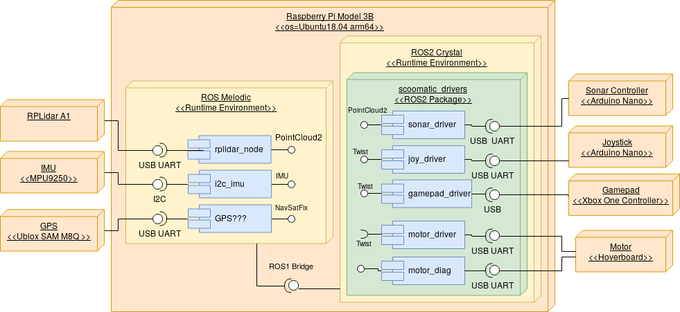
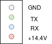
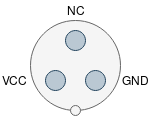
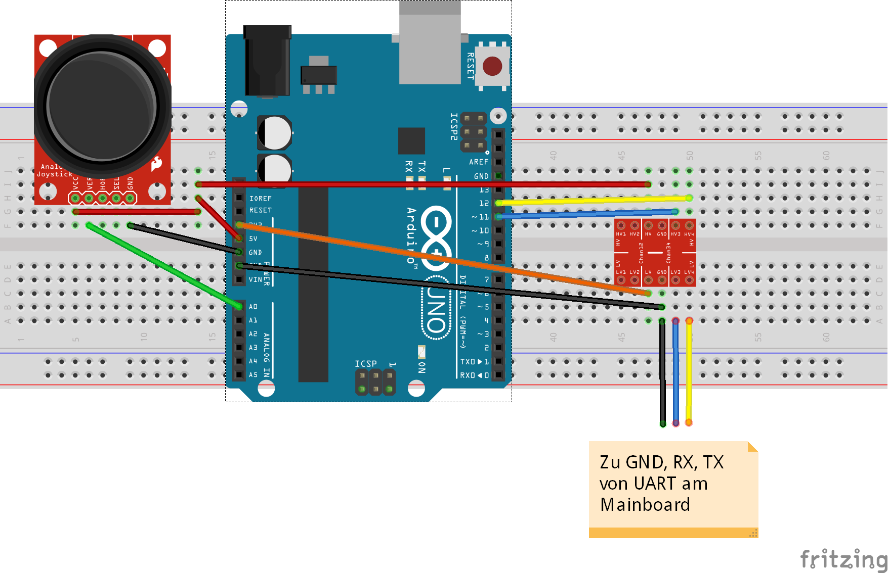
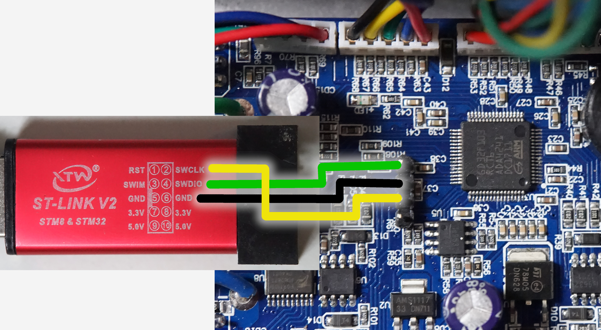
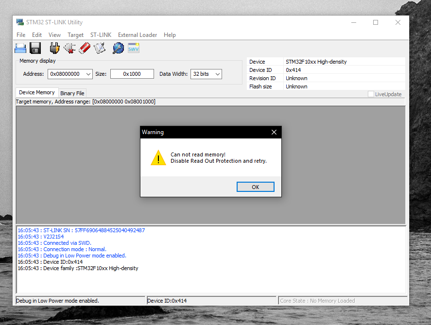
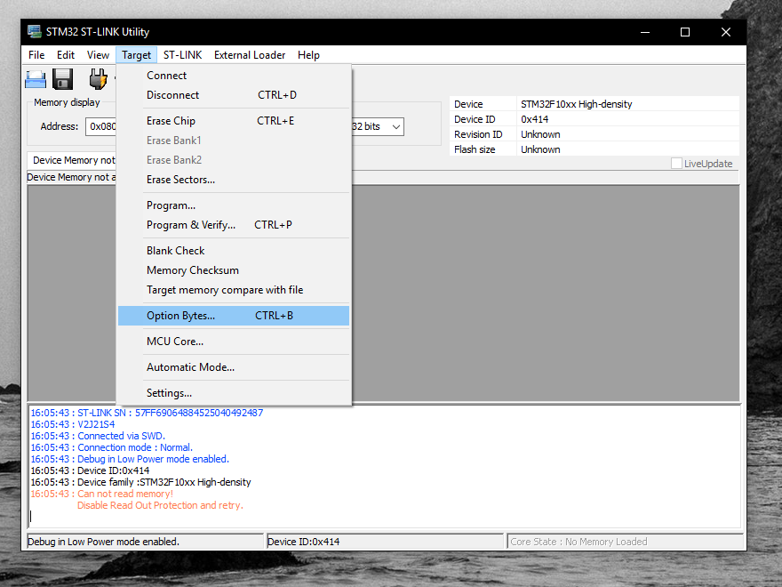
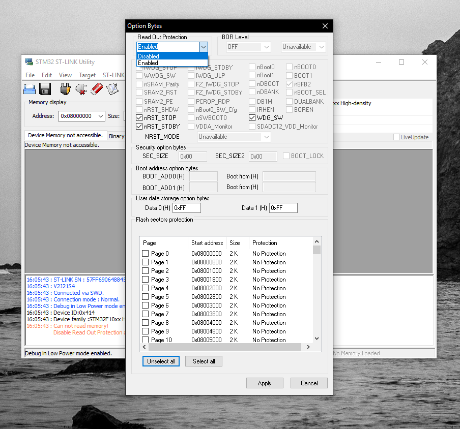
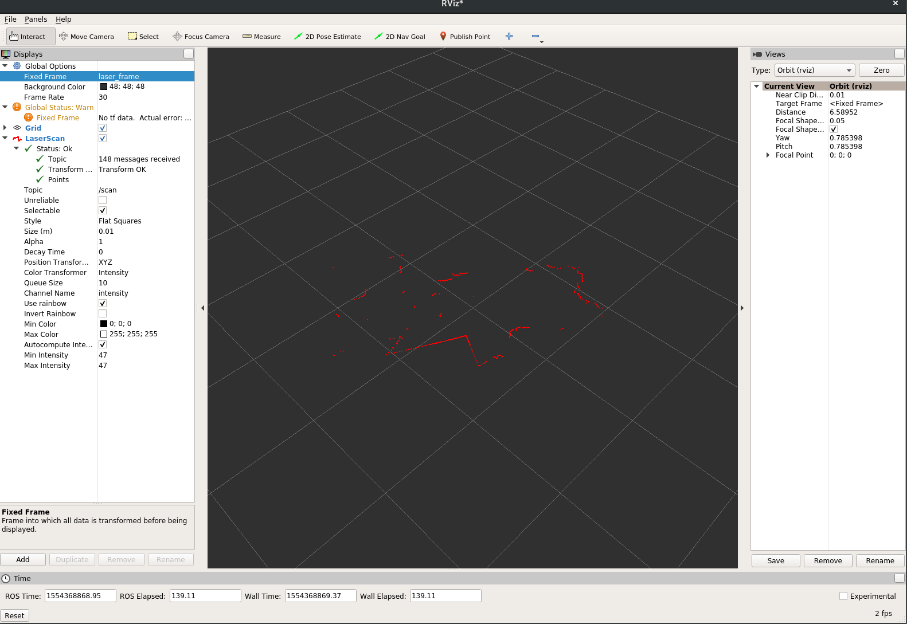
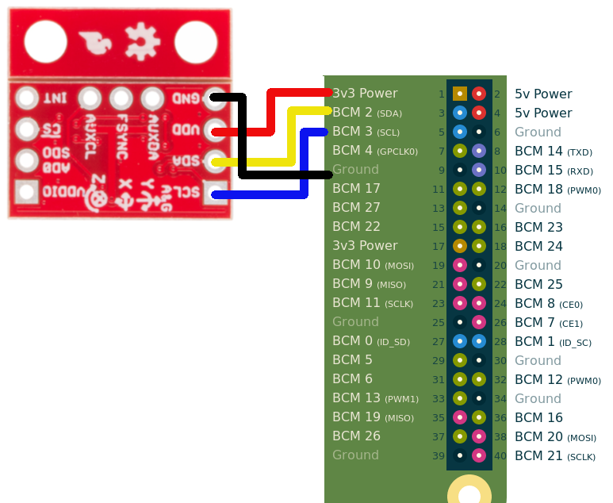

GAMDokumentation Projektmodul
=========
TODO: TOC
# Softwarearchitektur
* ROS2 Weil requirements erfüllt werden
* Modularer, flexibler Aufbau
* Echtzeitfähige Kommunikation
* Kommunikationslayer muss nicht extra implementiert werden
* Publish / Subscribe Nachrichtenstruktur als Basis für Kommunikation
* Große Community
* Noch nicht viele Funktionen Implementiert, wird aber stark weiterentwickelt
* -> Kombination aus ROS1 Melodic und ROS2 Crystal auf Ubuntu 18.04 (Weil nur da unterstützt)
* Angebotene Services werden im Hardwareteil genauer erklärt

Das Motortreiberboards verfügt über zwei UARTs. Davon wird einer für die Ansteuerung der Motoren verwendet, während der andere Debuginformationen zurücksendet. Daraus resultieren die zwei separaten Verbindungen zum Motortreiberboard.
TODO
* topics und nodes
* launchfiles und nodes übersicht


# Konfiguration Ubuntu
Auf dem Raspberry Pi lauft die [64-Bit Arm-Version von Ubuntu 18.04](https://wiki.ubuntu.com/ARM/RaspberryPi). Die Kombination aus Raspberry Pi 3B und diesem Ubuntu Image ist zum jetztigen Zeitpunkt (Stand Juni 2019) die Einzige, die es ermöglicht, ROS Melodic und ROS2 Crystal parallel zu installieren. Dementsprechend sind diese beiden ROS Versionen auch auf dem Image vorinstalliert. Das Image kann unter TODO heruntergeladen werden und passt auf SD-Karten ab 32GB Größe.


## Verbindung zum Pi
Auf dem Raspberry Pi läuft standardmäßig ein SSH-Server, mit dem man sich über folgenden Befehl verbinden kann.
```bash
ssh -X ubuntu@scoomatic_ip
```
Das `-X` Flag ermöglicht es bei Verwendung eines Linux-PCs als Client, grafische Programme wie rviz über SSH auf dem Pi auszufürhren und am lokalen Desktop auszuführen (s. [X11-Forwarding über SSH](http://www.tacticalcode.de/2013/02/x11-forwarding-uber-ssh.html))

Statt `scoomatic_ip` muss die IP Adresse des Pis im lokalen Netzwerk eingetragen werden
Das Passwort für den nutzer `ubuntu` wurde als `notubuntu` festgelegt
## Netzwerkkonfiguration
Die Netzwerkkonfiguration auf dem von Ubuntu bereitgestellten Image war kaputt und wurde manuell wie folgt festgelegt:
Die Verwaltung des LAN Ports (`eth0`) erfolgt klassisch über die Datei `/etc/network/interfaces` und stellt bei Verbinden eines Kabels automatisch eine Verbindung her und bezieht eine Netzwerkadresse über DCHP

Die WLAN-Schinttstelle `wlan0` ließ sich nicht über den selben Weg konfigureieren und wird deshalb über Ubuntus `network-manager` Paket verwaltet. Über das Tool `nmcli` können Verbindungen hergestellt werden.


```bash
sudo nmcli device wifi rescan
sudo nmcli device wifi list
sudo nmcli device wifi connect SSID-Name password wireless-password
```

Das `rt` Netzwerk ist bereits eingerichtet und der Pi verbindet sich damit automatisch.


## Dateisystemstruktur
Grundsätzlich ist das Dateisystem aufgebaut wie in jeder Linux Installation ([Linux File System/Structure Explained](https://www.youtube.com/watch?v=HbgzrKJvDRw))
Im Nutzerverzeichnis `/home/ubuntu` (`~`) wurde  das Verzeichnis git angelegt, in das alle genutzten git-Repositorys geklont wurden. Sofern es sich bei den Repositorys um ROS1 oder 2 Pakete handelte, wurde ein Symlink in den src Ordner des jeweiligen Workspaces erzeugt (`ln -s /home/ubuntu/git/somerepo /home/ubuntu/catkin_ws/src)`)

Der Workspace für ROS1 liegt unter `~/catkin_ws`, der für ROS2 unter `~/ros2_ws`

Die ROS Installationen wurden nach den offiziellen Anleitungen über die Ubuntu Paketverwaltung Installiert und befinden sich in den Verzeichnissen `/opt/ros/melodic` bzw. `/opt/ros/crystal`.

Neue ROS-Paket können über `apt-cache search Suchbegriff` gesucht, und über `sudo apt install -y paketname` installiert werden
> **Hinweis:** In letzter Zeit scheint Ubuntu immer wieder den gespeicherten Key für die ROS Repos zu vergessen. Sollte es während der Ausführung von `sudo apt update` zu Problemen mit den ROS Paketquellen kommen, einfach den Befehl `sudo apt-key adv --keyserver 'hkp://keyserver.ubuntu.com:80' --recv-key C1CF6E31E6BADE8868B172B4F42ED6FBAB17C654` ausführen und erneut updaten.

TODO .bashrc
## ROS2 bedienung
Für die Nutzung einer ROS-Version muss immer eine setup.bash datei der jeweiligen Version über den `source` befehl geladen werden. Standardmäßig werden beim öffnen einer neuen bash Shell die Dateien `/opt/ros/crystal/setup.bash` und `~/ros2_ws/install/setup.bash` geladen. Dadurch wird die ROS2 Umgebung inklusive der im ROS2 Workspace installierten Pakete geladen.

Pakete aus git Repositorys sind über symlinks vom Repo in `~/git` in den `src` Ordner verlinkt. Somit können nicht mehr benötigte Pakete durch Löschen des Symlinks aus dem `src` Ordner entfernt werden, bleiben aber trotzdem auf der Platte erhalten

Nachdem für ROS2 noch kaum Dokumentation existiert, wird hier die Nutzung einiger wichtiger tools für ROS2 erklärt.

Nachdem die Befehle für das Erstellen und Cleanen eines Workspaces recht sperrig sind, wurden in `~/.bashrc` aliase für die beiden Funktionen erstellt
```bash
alias rbuild="cd ~/ros2_ws && colcon build --symlink-install && source install/setup.bash"
alias rclean="cd ~/ros2_ws && rm -rf build/ install/ log/")
```

Das Steuern von ROS2 erfolgt über das `ros2` binary

```bash
usage: ros2 [-h] Call `ros2 <command> -h` for more detailed usage. ...

ros2 is an extensible command-line tool for ROS 2.

optional arguments:
  -h, --help            show this help message and exit

Commands:
  daemon     Various daemon related sub-commands
  launch     Run a launch file
  lifecycle  Various lifecycle related sub-commands
  msg        Various msg related sub-commands
  multicast  Various multicast related sub-commands
  node       Various node related sub-commands
  param      Various param related sub-commands
  pkg        Various package related sub-commands
  run        Run a package specific executable
  security   Various security related sub-commands
  service    Various service related sub-commands
  srv        Various srv related sub-commands
  topic      Various topic related sub-commands

  Call `ros2 <command> -h` for more detailed usage.
```
Die Kommandos `topic`, `srv`, `node` und `msg`  haben jeweils die Möglichkeit über `list` eine Auflistung aller Verfügbaren Möglichekeiten anzuzeigen oder über `info` Details zu einzelnen topics / nodes / services / messages abzurufen

Besipiele
```bash
ros2 srv list
ros2 topic info /cmd_vel
```


```bash
ros2 topic echo /sonar # Gibt alle Nachrichen in Topic /sonar aus
```
In ROS2 gibt es wie in ROS1 die Unterscheidung zwischen dem Start einzelner Nodes und dem Start von launch files, die mehrere Nodes Starten können. Anders als in ROS1 muss beim Starten einzelner Nodes vorher kein Master gestartet werden.


```bash
ros2 run package_name node_name # Node starten
ros2 run scoomatic_drivers motor_driver # Motortreiber starten

ros2 launch package_name launchfile_name
```
Eine Shell kann über den folgenden Befehl für die Nutzung einer anderen ROS-Version Konfiguriert werden
```bash
source /opt/ros/[crystal oder melodic]/setup.bash
source [~/ros2_ws/install/setup.bash oder ~/catkin_ws/devel/setup.bash]
```

# ROS1 Bedienung
Standardmäßig wird eine neue Shell Session für ROS2 Crystal initialisiert. Durch die ausführung des nachfolgenden Befehls kann die Umgebung allerdings auf ROS1 umgestellt werden
```bash
source /opt/ros/melodic/setup.bash
source ~/catkin_ws/devel/setup.bash
```
Pakete aus git Repositorys sind über symlinks vom Repo in `~/git` in den `src` Ordner verlinkt. Somit können nicht mehr benötigte Pakete durch Löschen des Symlinks aus dem `src` Ordner entfernt werden, bleiben aber trotzdem auf der Platte erhalten

Die Kommandozeilentools für ROS1 sind [im ROS Wiki](http://wiki.ros.org/ROS/CommandLineTools) detailliert erklärt.

## ROS2-Bridge
TODO
# Hardware
## Hoverboard
[Bezugsquelle Verwendetes Board](https://www.toysstoregmbh.de/10-hoverboard-smart-self-balance-board-bluetooth-luftbereifung-elektroroller-tuev-ce_343_1442)
### Mainboard
Das Mainboard unterscheidet sich sowohl in der Geometrie als auch vom Prozessor zu dem von [Fauth et al](https://www.youtube.com/watch?v=qnQSL9DBPaE&t=1788s) vorgestellten sowohl in der Boardgeometrie als auch im verwendeten Hauptprozessor. Statt des STM32F103 kommt ein [GD32F103](https://smdprutser.nl/blog/stm32f103-vs-gd32f103/) zum Einsatz, welcher dem STM zwar ähnelt, sich aber durch mehr Speicher und eine höhere Taktrate von ihm unterscheidet. Allerdings scheint die Firmware zwischen den beiden Chips und Boards kompatibel zu sein.


[Quelle](https://github.com/NiklasFauth/hoverboard-firmware-hack)
Zu den auf dem Board verwendeten MOSFETs vom Typ HN75N09AP war kein Datenblatt auffindbar. Die technischen Daten, die aus einer [Produktbeschreibung](http://dalincom.ru/goods-10601.html) entnommen werden konnten sind nachfolgend aufgelistet:
| Bezeichnung                      | Wert      |
| ---                              | ---       |
| Typ                              | N-Channel |
| Maximale Drain/Source Spannung   | 90V       |
| Maximaler Storm Drain/Source     | 75A       |
| Gehäuse                          | TO-220    |

### Sensorboard


Auf der linken und rechten Hälfte des Hoverboards befindet sich je ein *Sensorboard*. Dieses misst den Neigungswinkel der Boardseite und erkennt, ob eine Person auf dem Board steht.
Auf dem Sensorboard befindet sich ein MindMotion [MM32F031 Datasheet](http://www.mindmotion.com.cn/userfiles/images/mm32f031wendangziliao/ds_mm32f031_ver2.0.pdf) Microcontroller, welcher ein Klon des  [STM032F031](https://www.st.com/resource/en/datasheet/stm32f031c4.pdf) zu sein scheint. Ebenso finden sich auf dem Board Steckverbinder für die LED-Beleuchtungs- und Anzeigemodule der jeweiligen Seite.
Um zu erkennen, ob sich eine Person auf der jeweiligen Boardseite befindet, befinden sich je zwei Lichtschranken auf jedem Sensorboard. Diese werden unterbrochen, wenn eine Person auf das Hoverboard steigt und damit ein sich über den Lichtschranken befindendes Silikonteil in den Erkennungsbereich letzterer drückt. Es genügt dabei, eine der beiden Lichtschranken zu unterbrechen, um den Motor der jeweiligen Seite anzuschalten. Für Testzwecke kann im ausgebauten Zustand ein Stück Schrumpfschlauch über eine der Lichtschranken gezogen werden, um den Motor zu aktivieren.


Die 14.4V Versorgungsspannung wird von Linearreglern auf 5V und 3.3V zur Versorgung der LEDs und Lichtschranken sowie der IMU und des Mikrocontrollers verwendet. Der Typ der IMU ließ sich nicht ermitteln.

Nachfolgend ist die Pinbelegung des Verbindungssteckers zum Mainboard aufgezeichnet.
Das Protokoll, über das das Sensorboard dem Mainboard die Motorgeschwindigkeit vorgibt, wird im Abschnitt [Ansteuerung der Motoren mit Originalfirmware](#ansteuerung-der-motoren-mit-originalfirmware) erklärt.


### Netzteil
Das beim Hoverboard mitgelieferte Netzteil hat eine Spannung von 42V und liefert einen maximalen Strom von 2A. Der Stecker für die Verbindung zum Board ist vom Typ TODO
Die Pinbelegung der *Buchse* ist nachfolgen dargestellt:


### Ansteuerung der Motoren mit Originalfirmware


Zum Ansteuern der Motoren mit der originalen Mainboard-Firmware wurde die serielle Kommunikation zwischen Sensor- und Mainboard analysiert. Hierfür kam ein [Logic-Analyzer](https://eur.saleae.com/products/saleae-logic-8?variant=10963959349291) zum Einsatz. Das ermittelte Protokoll ähnelt dem [hier](http://drewspewsmuse.blogspot.com/2016/06/how-i-hacked-self-balancing-scooter.html) vorgestellten. Die folgenden Parameter konnten für die serielle Verbindung ermittelt werden.
| Bezeichnung | Wert       |
| ---         | ---        |
| Baudrate    | 27000      |
| Datenbits   | 8          |
| Stopbits    | 1          |
| Paritybits  | 0          |
| Bitorder    | LSB first  |

Da vom Mainboard aus scheinbar nur Befehle zum An- und Abschalten der LED-Beleuchtung gesendet werden, wurde nur die Kommunikation vom Sensor- zum Mainboard reverse-engineert.
Das Sensorboard sendet wiederholt ein Datenpaket, welches die Geschwindigkeit des Motors vorgibt.

| BYTE_0 | BYTE_1 | BYTE_2 | BYTE_3 | BYTE_4 | BYTE_5 | BYTE_6 | BYTE_7  |
| ---    | ---    | ---    | ---    | ---    | ---    | ---    | ---     |
| STATE  | SPD_L  | SPD_H  | SPD_L  | SPD_H  | UNK1   | UNK1   | TRAILER |

In Byte0 des Pakets wird der Status der Lichtschranke (0x55 ^= mindestens eine Schranke unterbrochen -> Motor aktivieren, 0x TODO ^= keine Schranke unterbrochen, Motor abschalten) übermittelt. Anschließend wird zweimal das Low- und das High-Byte der Sollgeschwindigkeit übertragen. Die Geschwindigkeit ist hierbei als 16-Bit-Signed-Integer in [2K Darstellung](https://de.wikipedia.org/wiki/Zweierkomplement) codiert. Danach folgen weitere zwei Bytes, deren Wert immer gleich ist. Die Bedeutung dieser Bytes ist nicht bekannt. Welcher Wert hier übertragen wird, scheint aber keine Auswirkung auf die Funktion des Boards zu haben. Jedes Paket wird mit einem konstanten Trailerbyte mit dem Wert 0xC0 beendet.

> **Hinweis:** Um Beschädigungen am Hoverboard durch zu hohe Ströme bei Kurzschlüssen etc. zu vermeiden, wurde der Akku ausgebaut und ein Labornetzgerät mit Strombegrenzung mit der XT-60 Akkubuchse verbunden. Die Strombegrenzung kann auf 2A eingestellt werden, wenn nur ein Motor im Leerlauf betrieben wird. Die Eingangsspannung sollte 36-42V betragen.

Anschließend wurde mit einem [Arduino Uno](https://store.arduino.cc/arduino-uno-rev3) eine Verbindung zum Seriellen Port des Mainboards hergestellt. Hierbei ist der richtige der beiden Ports für den jeweiligen Motor zu wählen (vgl. Abschnitt [Mainboard](#mainboard)). Zusätzlich wurde ein [Joystickmodul](https://www.conrad.de/de/sensor-kit-ky023jm-arduino-banana-pi-pcduino-raspberry-pi-1707629.html) mit dem Arduino verbunden. Dieser dient als Eingabegerät für die Motorgeschwindigkeit.

> **Hinweis:** Das Hoverboard-Mainboard arbeitet mit **3.3V Logik**. Wird ein gängiger 5V-Arduino mit dem Board verbunden, muss ein [Level Shifter](https://learn.sparkfun.com/tutorials/bi-directional-logic-level-converter-hookup-guide/all) verwendet werden. Außerdem muss auf das rote Kabel des Steckverbinders zum Sensorboard besonders geachtet werden. An diesem liegt eine Spannung von **14.4V** an, die sowohl am Arduino als auch beim Mainboard, wenn falsch verbunden, schnell sehr viel kaputt machen kann.


> **Hinweis:** Bei dem hier gezeigten Versuch wurde nur der Motor einer Seite angesteuert. Wird jedoch ein weiteres Arduino-Board auf dem Seriellen Port der anderen Seite verwendet, sollten sich Problemlos beide Motoren gleichzeitig ansteuern lassen.


TODO Kabelfarben von Hoverboardstecker übernehmen

Der Arduinocode für diesen Aufbau findet sich im Git-Repository unter */code/examples/hoverboard_stock_example/*

Durch den beschriebenen Versuchsaufbau lassen sich also beide Räder des Hoverboards ansteuern. Allerdings ergeben sich bei dem Aufbau einige Nachteile:
* Der Motortreiber schaltet sich nach einigen Minuten aus, wenn keiner der Motoren aktiviert wurde. Danach muss er erst wieder über den Anschalter aktiviert werden.
* Für die Ansteuerung beider Motoren müssen beide seriellen Schnittstellen verwendet werden.
* Die Baudrate ist keine Standardgeschwindigkeit und wird nativ von wenigen Mikrocontrollern unterstützt.
* Das Kommunikationsprotokoll ist seltsam aufgebaut.

Diese Nachteile ließen sich durch den Einsatz einer anderen Firmware lösen. Wie sich dieses Vorhaben umsetzen lässt, wird im nachfolgenden Kapitel beschrieben.
### Aufspielen einer anderen Firmware auf das Mainboard
Fauth et al. haben für eins der in den Hoverboards verwendeten Mainboards eine Open-Source Firmware erstellt und bieten diese über [github](https://github.com/NiklasFauth/hoverboard-firmware-hack) an. Weitere Details zu der Firmware lassen sich auch in dem Talk [GPN18 - HowTo: Moving Objects](https://www.youtube.com/watch?v=qnQSL9DBPaE) finden. Nachfolgend wird kurz erklärt, wie die Software kompiliert und auf das Board übertragen wurde. Eine ausführliche Anleitung lässt sich aber in den [Build Instructions vom TranspOtter](https://github.com/NiklasFauth/hoverboard-firmware-hack/wiki/Build-Instruction:-TranspOtter) finden.

#### Kompilieren
Die Firmware wurde unter Ubuntu 18.04 kompiliert. Zuerst müssen die notwendigen Abhängigkeiten installiert werden.

```bash
  sudo add-apt-repository ppa:team-gcc-arm-embedded/ppa
  sudo apt update
  sudo apt install gcc-arm-embedded build-essential openocd git
```

> **Hinweis:** Die Anweisungen zum kompilieren unter Windows finden sich [hier](https://github.com/NiklasFauth/hoverboard-firmware-hack/wiki/Build-Instruction:-TranspOtter#24-toolchain)

Anschließend kann die Firmware heruntergeladen werden
```bash
  git clone https://github.com/NiklasFauth/hoverboard-firmware-hack.git
```
im Ordner *hoverboard-firmware-hack/Inc/* können nun in der Datei *config.h* die Einstellungen der Firmware angepasst werden.
Die folgenden Änderungen wurden dabei durchgführt:
```c
  // Diese Zeile einkommentieren:

  #define CONTROL_SERIAL_USART2       // left sensor board cable, disable if ADC or PPM is used!


  // Diese Zeilen auskommentieren:

  //#define CONTROL_ADC                 // use ADC as input. disable DEBUG_SERIAL_USART2!
  //#define ADC1_MIN 0                // min ADC1-value while poti at minimum-position (0 - 4095)
  //#define ADC1_MAX 4095               // max ADC1-value while poti at maximum-position (0 - 4095)
  //#define ADC2_MIN 0                // min ADC2-value while poti at minimum-position (0 - 4095)
  //#define ADC2_MAX 4095               // max ADC2-value while poti at maximum-position (0 - 4095)

```

Jetzt kann die Firmware durch Ausführen von make im Wurzelverzeichnis des Repos gebaut werden.

```bash
  cd hoverboard-firmware-hack
  make
```

#### Flashen des Boards
Vor dem ersten Flashen muss auf dem Mainboard der Programmierheader installiert werden (s. Bild). Dafür müssen alle acht Schrauben der MOSFETs gelöst und der Header von hinten verlötet werden.


Anschließend kann der ST-LinkV2 Programmieradapter an dem Header angeschlossen werden.



Zum Übertragen (*Flashen*) der Firmware auf das Board wird dieses mit dem Labornetzgerät bei einer Spannung zwischen 36 und 42V verbunden und die beiden Pins des Anschalters am Board dauerhaft gebrückt.

> **Hinweis:** Um Beschädigungen am Hoverboard durch zu hohe Ströme bei Kurzschlüssen etc. zu vermeiden, wurde der Akku ausgebaut und ein Labornetzgerät mit Strombegrenzung mit der XT-60 Akkubuchse verbunden. Die Strombegrenzung kann auf 2A eingestellt werden, wenn nur ein Motor im Leerlauf betrieben wird. Die Eingangsspannung sollte 36-42V betragen.


Vor dem ersten Flashen des Mainboards muss die *Readout-Protection* (ROP) des GD32F103-Chips entfernt werden. Diese Verhindert das Auslesen der ursprünglichen Firmware des Boards, aber auch das Aufspielen neuer Software. Dieser Vorgang muss nur einmal durchgeführt werden und ist bei späteren Updates nicht mehr nötig.

Das ROP aktiviert ist, lässt sich daran erkennen, dass beim Verbinden des Chips mit dem ST-Link Utillity die folgende Fehlermeldung erscheint:



Durch Auswählen von Target -> Option Bytes..



öffnet sich ein Dialogfenster, in dem Read Out Protection auf Disabled gesetzt werden kann.



Nach dem Bestätigen der Dialoge wird der gesamte Speicher des Chips mit 0xFF überschrieben. Anschließend kann über File/Open die vorher kompilierte Datei *hover.hex* aus dem */build* Verzeichnis des Firmwarerepositorys geöffnet und per *Target -> Program & Verify* auf das Board übertragen werden.

Danach wird ein Arduino mit dem Beispielcode aus dem Verzeichnis */examples/serial_hoverboard* bespielt und die nachfolgende Beispielschaltung aufgebaut


TODO Kabelfarben von Hoverboardstecker übernehmen

Der Arduino liest, nachdem er mit einer Stromquelle verbunden wurde, periodisch die Analogwerte des Joysticks aus und sendet diese über den seriellen Port an das Hoverboard. Auf- und Abbewegen des Sticks lässt das Board dabei nach vorne und hinten fahren, bei Bewegungen nach links und rechts fährt das Board eine entsprechende Kurve.

> **Hinweis:** Auch an dieser Stelle sei nochmal erwähnt, dass durch die unterschiedlichen Logiklevel am Arduino Uno (5V) und am Hoverboard (**3.3V**) ein **Level-Shifter** notwendig ist, das das Mainboard sonst Schaden nemen kann. Außerdem liegt am roten Kabel des Steckverbinders zum Hoverboard eine Spannung von **14.4V** an, die, wenn falsch verbunden, sowohl den Arduino als auch das Mainboard zerstören kann (Zitat NiklasFauth:  "15v will destroy everything.")


### Motortreiber
Für ROS2 wurde ein Treiber erstellt, welcher auf standardmäßig einen Listener vom Typ [geometry_msgs/Twist](http://docs.ros.org/api/geometry_msgs/html/msg/Twist.html) auf /cmd_vel erstellt und die darin empfangenen werte (jeweils zw. -1 und 1) an den Motor weitergibt. Für die Bewegung nach vorne bzw hinten wird der Wert linear.x und für die Drehung um die eigene Achse der Wert angular.z ausgewertet.

Für die Ansteuerung des Motortreiberboards wurde die UART2 Schnittstelle über einen USB UART adapter mit dem Pi verbunden


Parameter:
```yaml
motor_driver:
       ros__parameters:
               topic: "/cmd_vel"
               port: "/dev/ttyUSB0"
```


### Motor Debug
Die alternative Firmware für das Hoverboard liefert auf dem ersten UART die folgenden Diagnoseinformationen in periodischen Abständen
```
1: ADC1
2: ADC2
3: output speed R 0-1000
4: output speed L 0-1000
5: battery voltage calibration
6: battery voltage * 100
7: for board temperature calibration
8: board temperature
```
Die Werte ADC1 und ADC2 sind die Werte der beiden Analog zu Digitalconverter am Board. An diese Eingänge können Analogsignale zwischen 0 und 3,3V angeschlossen werden. Die Spannungen an den Eingängen werden dann als Zahlenwert zwischen 0 und 4096 (12 Bit ADC im STM32F103) in den entsprechenden ROS Topics angezeigt.

Die Geschwindigkeit hat keine genaue Einheit.
Für die Kalibrierung der Batteriespannung und Boardtemperatur sei auf das [Hoverboard Firmware Hack Video](https://www.youtube.com/watch?v=qnQSL9DBPaE) verwiesen.

> **Hinweis:** Wo die ADCs herausgeführt werden kann aus der Abbildung im Abschnitt [Mainboard](#mainboard) entnommen werden.
Dafür wird der folgender ASCII String gesendet:

 ```
 1:0 2:0 3:0 4:0 5:1384 6:3491 7:1651 8:36\r\n
 ```

TODO topicprefix auch auswerten


Anschließend werden die Werte in zugehörige Topics gepostet. Dabei wird beim Topicnamen ein gemeinsames, wählbares Prefix (standardmäßig `hoverdiag`) vorangestellt.

| Messagetyp | Topicname (Ohne Prefix)              |
| ---        | ---                                  |
| int32      | /adc1                                |
| int32      | /adc2                                |
| int32      | /wheelspeed_l # (0..1000)            |
| int32      | /wheelspeed_r  # (0..1000)           |
| int32      | /battery_voltage_calibration_value   |
| float32    | /battery_voltage                     |
| int32      | /board_temperature_calibration_value |
| int32      | /board_temperature                   |


Parameter:
```yaml
motor_diag:
        ros__parameters:
                topic: "/motor_diag" # prfix
                port: "/dev/ttyUSB0" # Serial Port
                rate: "5"            # Updaterate für Topics
```

## Ultraschall
Das Ultraschallsensorarray basiert auf dem [Sonic Disc](https://platis.solutions/blog/2017/08/27/sonicdisc-360-ultrasonic-scanner/) Projekt von Dimitris Platis. Der Hardwareaufbau wurde analog  zum dort verwendeten Schaltplan durchgeführt. Allerdings wurde ein Arduino Nano Board genutzt und dieses mithilfe von steckbaren Kabeln mit dem Nano verbunden.

> **Hinweis:** Die Kabel sind Durchnummeriert und Farbig Kodiert. Gleiche Nummer zu gleicher Nummer und gleiche Farbe zu gleicher Farbe. Die Polarität der Stecker ist über eine weiße Farbmarkierung an Stecker und Buchse erkennbar.

Auf den Arduino Nanos (FTDI-Version von az-delivery) ist der "alte Bootloader" installiert. Zum Uploaden muss als Prozessor in der Arduino IDE "Atmega 328P (old bootloader)" gewählt werden, sonst klappt das flashen nicht.

Der SonicDisc sketch benötigt eine akutelle version der Arduino IDE (1.8.8 und 1.8.9 getestet). Mit der Version 1.0.5 aus den Ubuntu-Paketquellen kompiliert der sketch nicht.

Die Firmware für den Arduino liegt im git unter `/code/Arduino Firmware/scoomatic-sonar`, der ROS2 Treiber  befindet sich in  `/code/ROS-Drivers/scoomatic_drivers/scoomatic_drivers/sonar_driver.py` und kann über folgenden Befehl gestartet werden:
```bash
ros2 run scoomatic_drivers sonar_driver __params:=~/ros2_ws/src/ros2_drivers/config/params.yaml
```
Parameter:
```yaml
sonar_driver:
        ros__parameters:
                port: "/dev/ttyUSB0"  # Serial port des Sensors
                topic: "/sonar"       # Topic in das gepublisht werden soll
```

## LIDAR
Der [Treiber für den RPLIDAR A1](http://wiki.ros.org/rplidar) (ROS1) ist schon installiert und startet automatisch
Soll er manuell gestartet werden, muss folgender Befehl ausgeführt werden:
```bash
source /opt/ros/melodic/setup.bash # ROS1 Sourcen
rosrun rplidar_ros rplidarNode serial_port:=/dev/ttyUSB... # Node Starten
```
Der Serial Port muss natürlich durch den aktuellen Port des Lidars ersetzt werden.

Der Treiber publisht Nachrichten vom Typ sensor_msgs/PointCloud2 nach /scan

### Installation der Treiber
Auf dem Installierten Image sind die Treiber für den LIDAR bereits installiert. Soll der LIDAR an einem anderen Rechner betrieben werden, muss das Paket [ros-melodic-rplidar-ros](http://wiki.ros.org/rplidar) aus den ROS1 Paketquellen installiert werden.
```bash
  sudo apt install ros-melodic-rplidar-ros
```
### Manueller Start des Treibers
```bash
  ssh -X ubuntu@scoomatic_ip
  source /opt/ros/melodic/setup.bash
  roscore &
  rosrun rplidar_ros rplidarNode &
  rviz
```
> **Hinweis:** Die rviz GUI lässt sich nur über ssh starten, wenn man sich von einem Linux mit X-Server aus verbindet.


In rviz das 'Laser Scan' plugin hinzufügen und bei Fehlern mit tf 'laser_frame' als FixedFrame setzen


### rviz auf anderem Rechner ausführen
Wenn die Framerate bei Ausführung von rviz über SSH zu niedrig sein, kann rviz auch auf einem anderen Rechner gestartet werden und dann die *ROS_MASTER_URI* auf die des Scoomatic-Pis gesetzt werden. Damit sollte eine flüssigere Darstellung möglich sein.
```bash
source /opt/ros/melodic/setup.bash
export ROS_MASTER_URI=http://scoomatic_ip:11311/
rviz
```
Die Konfiguration von rviz erfolgt dann wie im vorherigen Abschnitt.

## GPS
Matek Systems GPS Ublox SAM-M8Q

### ROS1
https://github.com/KumarRobotics/ublox
https://www.fpv24.com/de/matek-systems/matek-systems-gps-ublox-sam-m8q


### IMU
Als IMU kommt das [MPU9250 Board](https://www.sparkfun.com/products/13762?_ga=2.80323807.954031109.1562450120-313791285.1548811828) von Sparkfun zum Einsatz. Dieses ist direkt über I2C mit dem Pi verbunden. Die Verkabelung kann dem folgenden Diagramm entnommen werden.


Um auf einer neuen Installation oder mit einem anderen Nutzer ohne root-Rechte auf die i2c Schnittstelle zugreifen zu können, muss der Nutzer (in dem Fall `ubuntu`) in die Gruppe `i2c` aufgenommen werden.

```bash
sudo usermod -G i2c ubuntu
sudo reboot
```
Für den MPU9250-Chip existieren mehrere, meist veraltete Pakete für ROS1, [ros-mpu9250-imu](https://github.com/jusgomen/ros-mpu9250-imu) kompiliert nicht, der im Repo enthaltene Arduino-Sketch liefert aber Daten zurück. [ros-mpu9250-node](https://github.com/wolfeidau/ros-mpu9250-node) kompiliert zwar, schmeißt aber einen Fehler wegen Zugriffsproblemen auf die i2c Schnittstelle.

Letztendlich funktionierte nur das Paket [i2c_imu](https://github.com/jeskesen/i2c_imu)
Dieses ist auf dem Image installiert. Im falle einer Installation auf einem anderen System muss die Builddependency [RTIMULib2](https://github.com/RTIMULib/RTIMULib2) folgendermaßen installiert werden:

```bash
git clone https://github.com/RTIMULib/RTIMULib2.git
cd RTIMULib2/RTIMULib
mkdir build && cd build
cmake ..
make
sudo make install
sudo ldconfig
```

Der eigentliche Start des Nodes erfolgt in einem ROS1 Workspace über den folgenden Befehl
```bash
source /opt/ros/melodic/setup.bash
source ~/catkin_ws/devel/setup.bash
roslaunch i2c_imu mpu_9250.launch
```


### XBOX One Controller
Der `gamepad_driver` ermöglicht das Steuern des Scoomatic über einen beliebigen von Linux unterstützen Gamecontroller. Dabei wird auf das [Inputs](https://pypi.org/project/inputs/) Framework zurückgegriffen. Bei einem XBOX One Controller dient der linke Analogstick zur Lenkung und die Trigger links und rechts zum Festlegen der Geschwindigkeit nach vorne oder hinten. Zusätzlich muss immer der **A**-Button als eine Art Totmannschalter gehalten werden, sonst wird keine Bewegung ausgeführt.
Der Treiber kann über den folgenden Befehl gestartet werden.
```bash
ros2 run scoomatic_drivers gamepad_driver __params:=params.yaml
```

Der Treiber publisht eine Message vom Typ geometry_msgs/Twist, deren Inhalt direkt kompatibel zum Motortreiber ist. Es wird also auch hier die Geschwindigkeit in `linear.x` und die Drehgeschwindigkeit in `angular.z` gespeichert.

Dependencies:
Der Treiber benutzt die `inputs` library von python. Bei der neuinstallation des Treibers auf einem anderen System muss diese deshalb folgendermaßen installiert werden:
```bash
pip install inputs
```

Außerdem muss der Nutzer in diesem Fall `ubuntu` zugriffsrechte auf `input` Geräte bekommen
```bash
sudo usermod -G input ubuntu
```
Parameter:
```yaml
gamepad_driver:
        ros__parameters:
                topic: "/gamepad" # Topic for geometry_msgs/Twist message
                rate: 10 # Updaterate for Topic
```


#### Verbindung XBOX One Controller über Bluetooth
Der Bluetoothstack von der verwendeten Ubuntu Installation ist broken, sollte sich das allerdings einmal ändern, müssen folgende Schritte ausgeführt werden, damit der XBOX One Controller die Verbindung über Bluetooth zuverlässig hält ([Quelle](https://www.youtube.com/watch?v=bAI4vnlQhPg))
```bash
 sudo apt install sysfsutils
 sudo nano /etc/sysfs.conf
 # place the following at the end of the file.
 "/module/bluetooth/parameters/disable_ertm=1"
```

[Tutorial Bluetooth Controller mit Pi verbinden](https://core-electronics.com.au/tutorials/using-usb-and-bluetooth-controllers-with-python.html)

### Joystick
TODO
TODO Protokoll dokumentieren, Protokoll sonar?
# Sonstiges
Die Befehle in dieser Dokumentation sind, sofern nicht anders angegeben, in einer Linux Shell auszuführen und in bash getestet. Wer sich das Leben schwer machen und Windows verwenden will, [installiert am besten das Linux Subsystem für Windows](https://www.netzwelt.de/tutorial/164359-windows-10-so-installiert-aktiviert-linux-subsystem-bash.html)
## Verwendete Software
Für die Erstellung der Bilder wurde die Software [GIMP](https://www.gimp.org/) sowie die die Webapplikation [draw.io](https://www.draw.io/) verwendet. Die .svg Dateien können mit draw.io geöffnet und bearbeitet werden.
Der Logic Analyzer wurde mit der Software [sigrok](https://sigrok.org/wiki/Main_Page) zusammen mit der dazugehörigen GUI PulseView verwendet.
Die Schaltpläne für die Versuchsaufbauten wurden mit der Software [fritzing](http://fritzing.org/home/) erstellt.

TODO
image dumpen wenn fertig
