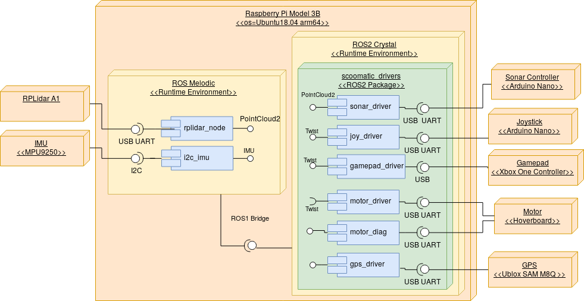

Dokumentation Projektmodul
=========
TODO: TOC
# Vorstellung des Projekts
In dieser Dokumentation sollen die in der Seminararbeit erarbeiteten Kenntnisse genutzt werden, um einen Prototypen zu entwickeln, der die dort definierten Anforderungen erfüllt. Der Prototyp hält sich dabei weitestgehend an den Bauvorschlag 2: Hoverboard aus der Arbeit. Aus diesem Grund wird der grundsätzliche Aufbau hier nicht genauer erklärt und nur auf die Seminararbeit verwiesen. Im Folgenden wird zunächst die Softwarearchitektur des Scoomatic erklärt und dabei auch auf die Bedienung des Bordcomputers eingegangen. Anschließend wird die Hardware, ihre Treiber und das Zusammenspiel der Elektronischen Komponenten genauer erklärt. Abschließend wird noch kurz auf den mechanischen Aufbau eingegangen.

# Softwarearchitektur
Als Softwareframework wurde ROS2 ausgewählt, das es die im Seminar aufgestellten Requirements erfüllt und damit ein flexibles, modulares Framework bietet, dass echtzeitfähige Kommunikation der Komponenten erlaubt und bereits viele Tools, Treiber sowie eine Kommunikationsinfrastruktur mitbringt.

Ein weiterer Punkt, der für die Verwendung von ROS spricht, ist die große Community, die Treiber und Tools für verschiedene Geräte wie z.B. Sensoren bereitstellt. Dadurch kann erheblicher Implementierungsaufwand gespart werden.

Der Kommunikationslayer basiert auf einer Publish / Subscribe Nachrichtenarchitektur mit verschiedenen Kanälen (sogenannten Topics). Jedes Programm ist ein Node und kann in Topics schreiben (publish) und über neue Nachrichten informiert werden (subscribe). Darauf aufbauend gibt es für Nodes auch die möglichkeit Services und Actions anzubieten, die von anderen Nodes aufgerufen werden können. Der Unterschiede zwischen Services und Actions liegt dabei in der Ausführungsdauer. Service Calls blockieren in der Regel nicht bzw terminieren innerhalb von kurzer Zeit (z.B. Das Scharfschalten von Motoren bei Quadcoptern). Actions benötigen längere Zeit um ausgeführt zu werden (z.B. Das fahren einer Bewegung mit einem Roboterarm). Zu diesem Zweck bieten Actions zusätzlich die Möglichkeit, den aktuellen Fortschritt mitzuteilen. Zur Organisation von Nodes können diese in Pakete gruppiert und so verteilt werden. Nodes können nativ in C++ oder Python implementiert werden, es gibt aber einige Communityprojekte, die das Schreiben von Nodes mit anderen Sprachen wie z.B. C# oder Java ermöglichen.

Dadurch, dass die Version 2 von ROS noch in den Kinderschuhen steckt, sind noch wenige Pakete von ROS1 portiert und die momentane Treiber- und Toolunterstützung lässt noch zu wünschen übrig. Um die umfangreichen ROS1 Pakete dennoch nutzen zu können, existiert eine ROS1 Bridge, die es ermöglicht, ROS1 und ROS2 parallel nebeneinander auszuführen und auf die Daten der jeweils anderen Version zuzugreifen.

Um so von den Vorteilen beider ROS Versionen gebrauch machen zu können, wurde eine Kombination aus ROS1 und ROS2 auf dem Bordcomputer installiert. Dabei wurde die akutelle LTS version von ROS1 (Melodic) und die zum Start der Arbeit aktuelle ROS2 Version (Crystal) installiert. Diese wurden beide für die Installation auf Ubuntu 18.04 ausgelegt.

Hier wird nun ein kurzer Überblick über die Architektur der Software gegeben, die verwendeten Treiber für die einzelnen Geräte werden später genau erklärt.

Für den verwendeten LIDAR Sensor und die IMU existierten bereits ROS1 Treiber, die sich problemlos verwenden ließen. Daher wurden diese nicht auf ROS2 implementiert bzw portiert.
Der ROS1 Ublox-Treiber für das GPS-Modul war leider veraltet und unterstütze den vewendeten SAM M8Q Chip nicht, weshalb ein eigener Treiber in ROS2 implementiert wurde. Der Treiber für das Gamepad war in python leicht zu implementieren, weswegen nicht auf ein ROS1 Paket zurückgegriffen wurde. Bei den anderen Treibern handelt es sich um Eigenentwicklungen bzw. Geräte die nicht in ROS1 unterstützt werden, weswegen ein eigener ROS2 Treiber implementiert wurde.

Im Aktuellen Stand laufen also der Treiber für den LIDAR und die IMU auf ROS1 und sind über die ROS1 Bridge in ROS2 verfügbar. Sämtliche anderen Treiber laufen unter ROS2





Das Motortreiberboards verfügt über zwei UARTs. Davon wird einer für die Ansteuerung der Motoren verwendet, während der andere Debuginformationen zurücksendet. Daraus resultieren die zwei separaten Verbindungen zum Motortreiberboard.

# Konfiguration Ubuntu
Auf dem Raspberry Pi lauft die [64-Bit Arm-Version von Ubuntu 18.04](https://wiki.ubuntu.com/ARM/RaspberryPi). Die Kombination aus Raspberry Pi 3B und diesem Ubuntu Image ist zum jetztigen Zeitpunkt (Stand Juni 2019) die Einzige, die es ermöglicht, ROS Melodic und ROS2 Crystal parallel zu installieren. Dementsprechend sind diese beiden ROS Versionen auch auf dem Image vorinstalliert. Das Image kann unter TODO heruntergeladen werden und passt auf SD-Karten ab 32GB Größe.

> **Hinweis:** Inzwischen gibt es auch 64-Bit Images von [Ubuntu Mate](https://ubuntu-mate.org/download/) für den Raspberry Pi. Diese sind allerdings noch als experimental eingestuft.


## Verbindung zum Pi
Auf dem Raspberry Pi läuft standardmäßig ein SSH-Server, mit dem man sich über folgenden Befehl verbinden kann.
```bash
ssh -X ubuntu@scoomatic_ip
```
Das `-X` Flag ermöglicht es bei Verwendung eines Linux-PCs als Client, grafische Programme wie rviz über SSH auf dem Pi auszufürhren und am lokalen Desktop auszuführen (s. [X11-Forwarding über SSH](http://www.tacticalcode.de/2013/02/x11-forwarding-uber-ssh.html))

Statt `scoomatic_ip` muss die IP Adresse des Pis im lokalen Netzwerk eingetragen werden
Das Passwort für den nutzer `ubuntu` wurde als `notubuntu` festgelegt
## Netzwerkkonfiguration
Die Netzwerkkonfiguration auf dem von Ubuntu bereitgestellten Image war kaputt und wurde manuell wie folgt festgelegt:
Die Verwaltung des LAN Ports (`eth0`) erfolgt klassisch über die Datei `/etc/network/interfaces` und stellt bei Verbinden eines Kabels automatisch eine Verbindung her und bezieht eine Netzwerkadresse über DCHP

Die WLAN-Schinttstelle `wlan0` ließ sich nicht über den selben Weg konfigureieren und wird deshalb über Ubuntus `network-manager` Paket verwaltet. Über das Tool `nmcli` können Verbindungen hergestellt werden.


```bash
sudo nmcli device wifi rescan
sudo nmcli device wifi list
sudo nmcli device wifi connect SSID-Name password wireless-password
```

Das `rt` Netzwerk ist bereits eingerichtet und der Pi verbindet sich damit automatisch.


## Dateisystemstruktur
Grundsätzlich ist das Dateisystem aufgebaut wie in jeder Linux Installation ([Linux File System/Structure Explained](https://www.youtube.com/watch?v=HbgzrKJvDRw))
Im Nutzerverzeichnis `/home/ubuntu` (`~`) wurde  das Verzeichnis git angelegt, in das alle genutzten git-Repositorys geklont wurden. Sofern es sich bei den Repositorys um ROS1 oder 2 Pakete handelte, wurde ein Symlink in den src Ordner des jeweiligen Workspaces erzeugt (`ln -s /home/ubuntu/git/somerepo /home/ubuntu/catkin_ws/src)`)

Der Workspace für ROS1 liegt unter `~/catkin_ws`, der für ROS2 unter `~/ros2_ws`

Die ROS Installationen wurden nach den offiziellen Anleitungen über die Ubuntu Paketverwaltung Installiert und befinden sich in den Verzeichnissen `/opt/ros/melodic` bzw. `/opt/ros/crystal`.

Neue ROS-Paket können über `apt-cache search Suchbegriff` gesucht, und über `sudo apt install -y paketname` installiert werden
> **Hinweis:** In letzter Zeit scheint Ubuntu immer wieder den gespeicherten Key für die ROS Repos zu vergessen. Sollte es während der Ausführung von `sudo apt update` zu Problemen mit den ROS Paketquellen kommen, einfach den Befehl `sudo apt-key adv --keyserver 'hkp://keyserver.ubuntu.com:80' --recv-key C1CF6E31E6BADE8868B172B4F42ED6FBAB17C654` ausführen und erneut updaten.

## ROS2 bedienung
Für die Nutzung einer ROS-Version muss immer eine setup.bash datei der jeweiligen Version über den `source` befehl geladen werden. Standardmäßig werden beim öffnen einer neuen bash Shell die Dateien `/opt/ros/crystal/setup.bash` und `~/ros2_ws/install/setup.bash` geladen. Dadurch wird die ROS2 Umgebung inklusive der im ROS2 Workspace installierten Pakete geladen.

Pakete aus git Repositorys sind über symlinks vom Repo in `~/git` in den `src` Ordner verlinkt. Somit können nicht mehr benötigte Pakete durch Löschen des Symlinks aus dem `src` Ordner entfernt werden, bleiben aber trotzdem auf der Platte erhalten

Nachdem für ROS2 noch kaum Dokumentation existiert, wird hier die Nutzung einiger wichtiger tools für ROS2 erklärt.

Nachdem die Befehle für das Erstellen und Cleanen eines Workspaces recht sperrig sind, wurden in `~/.bashrc` aliase für die beiden Funktionen erstellt
```bash
alias rbuild="cd ~/ros2_ws && colcon build --symlink-install && source install/setup.bash"
alias rclean="cd ~/ros2_ws && rm -rf build/ install/ log/")
```

Das Steuern von ROS2 erfolgt über das `ros2` binary

```bash
usage: ros2 [-h] Call `ros2 <command> -h` for more detailed usage. ...

ros2 is an extensible command-line tool for ROS 2.

optional arguments:
  -h, --help            show this help message and exit

Commands:
  daemon     Various daemon related sub-commands
  launch     Run a launch file
  lifecycle  Various lifecycle related sub-commands
  msg        Various msg related sub-commands
  multicast  Various multicast related sub-commands
  node       Various node related sub-commands
  param      Various param related sub-commands
  pkg        Various package related sub-commands
  run        Run a package specific executable
  security   Various security related sub-commands
  service    Various service related sub-commands
  srv        Various srv related sub-commands
  topic      Various topic related sub-commands

  Call `ros2 <command> -h` for more detailed usage.
```
Die Kommandos `topic`, `srv`, `node` und `msg`  haben jeweils die Möglichkeit über `list` eine Auflistung aller Verfügbaren Möglichekeiten anzuzeigen oder über `info` Details zu einzelnen topics / nodes / services / messages abzurufen

Besipiele
```bash
ros2 srv list
ros2 topic info /cmd_vel
```


```bash
ros2 topic echo /sonar # Gibt alle Nachrichen in Topic /sonar aus
```
In ROS2 gibt es wie in ROS1 die Unterscheidung zwischen dem Start einzelner Nodes und dem Start von launch files, die mehrere Nodes Starten können. Anders als in ROS1 muss beim Starten einzelner Nodes vorher kein Master gestartet werden.


```bash
ros2 run package_name node_name # Node starten
ros2 run scoomatic_drivers motor_driver # Motortreiber starten

ros2 launch package_name launchfile_name
```
Eine Shell kann über den folgenden Befehl für die Nutzung einer anderen ROS-Version Konfiguriert werden
```bash
source /opt/ros/[crystal oder melodic]/setup.bash
source [~/ros2_ws/install/setup.bash oder ~/catkin_ws/devel/setup.bash]
```
Das Skript `~/ros2_ws/src/scoomatic_drivers/start_ros2.bash` startet alle ROS2 Nodes auf einmal. Wichtig ist, dass die USB Serial Adapter in der richtigen Reihenfolge (s. Label) eingesteckt wurden, damit die Serial Ports den richtigen Nodes zugewiesen werden. Leider teilt Linux die Portnummern scheinbar zufällig zu, weshalb die Serial Adapter nach jedem Neustart an- und abgesteckt werden müssen.

# ROS1 Bedienung
Standardmäßig wird eine neue Shell Session für ROS2 Crystal initialisiert. Durch die ausführung des nachfolgenden Befehls kann die Umgebung allerdings auf ROS1 umgestellt werden
```bash
source /opt/ros/melodic/setup.bash
source ~/catkin_ws/devel/setup.bash
```
Pakete aus git Repositorys sind über symlinks vom Repo in `~/git` in den `src` Ordner verlinkt. Somit können nicht mehr benötigte Pakete durch Löschen des Symlinks aus dem `src` Ordner entfernt werden, bleiben aber trotzdem auf der Platte erhalten

Die Kommandozeilentools für ROS1 sind [im ROS Wiki](http://wiki.ros.org/ROS/CommandLineTools) detailliert erklärt.

Das Skript `~/catkin_ws/src/scoomatic_ros1/start_ros1.bash` startet alle ROS1 Nodes auf einmal. Wichtig ist, dass die USB Serial Adapter in der richtigen Reihenfolge (s. Label) eingesteckt wurden, damit die Serial Ports den richtigen Nodes zugewiesen werden. Leider teilt Linux die Portnummern scheinbar zufällig zu, weshalb die Serial Adapter nach jedem Neustart an- und abgesteckt werden müssen.

## ROS2-Bridge
TODO
# Hardware
Im Folgenden werden die Hardwareelemente und ihre Treiber genauer vorgestellt. Dabei wird zuerst das Reverseengineering des Hoverboards genauer erklärt und anschließend auf die Sensoren und Eingabegeräte eingegangen.


## Hoverboard
[Bezugsquelle Verwendetes Board](https://www.toysstoregmbh.de/10-hoverboard-smart-self-balance-board-bluetooth-luftbereifung-elektroroller-tuev-ce_343_1442)
### Mainboard
Das Mainboard unterscheidet sich sowohl in der Geometrie als auch vom Prozessor zu dem von [Fauth et al](https://www.youtube.com/watch?v=qnQSL9DBPaE&t=1788s) vorgestellten sowohl in der Boardgeometrie als auch im verwendeten Hauptprozessor. Statt des STM32F103 kommt ein [GD32F103](https://smdprutser.nl/blog/stm32f103-vs-gd32f103/) zum Einsatz, welcher dem STM zwar ähnelt, sich aber durch mehr Speicher und eine höhere Taktrate von ihm unterscheidet. Allerdings scheint die Firmware zwischen den beiden Chips und Boards kompatibel zu sein.


[Quelle](https://github.com/NiklasFauth/hoverboard-firmware-hack)

Zu den auf dem Board verwendeten MOSFETs vom Typ HN75N09AP war kein Datenblatt auffindbar. Die technischen Daten, die aus einer [Produktbeschreibung](http://dalincom.ru/goods-10601.html) entnommen werden konnten sind nachfolgend aufgelistet:
| Bezeichnung                      | Wert      |
| ---                              | ---       |
| Typ                              | N-Channel |
| Maximale Drain/Source Spannung   | 90V       |
| Maximaler Storm Drain/Source     | 75A       |
| Gehäuse                          | TO-220    |

### Sensorboard


Auf der linken und rechten Hälfte des Hoverboards befindet sich je ein *Sensorboard*. Dieses misst den Neigungswinkel der Boardseite und erkennt, ob eine Person auf dem Board steht.
Auf dem Sensorboard befindet sich ein MindMotion [MM32F031 Datasheet](http://www.mindmotion.com.cn/userfiles/images/mm32f031wendangziliao/ds_mm32f031_ver2.0.pdf) Microcontroller, welcher ein Klon des  [STM032F031](https://www.st.com/resource/en/datasheet/stm32f031c4.pdf) zu sein scheint. Ebenso finden sich auf dem Board Steckverbinder für die LED-Beleuchtungs- und Anzeigemodule der jeweiligen Seite.
Um zu erkennen, ob sich eine Person auf der jeweiligen Boardseite befindet, befinden sich je zwei Lichtschranken auf jedem Sensorboard. Diese werden unterbrochen, wenn eine Person auf das Hoverboard steigt und damit ein sich über den Lichtschranken befindendes Silikonteil in den Erkennungsbereich letzterer drückt. Es genügt dabei, eine der beiden Lichtschranken zu unterbrechen, um den Motor der jeweiligen Seite anzuschalten. Für Testzwecke kann im ausgebauten Zustand ein Stück Schrumpfschlauch über eine der Lichtschranken gezogen werden, um den Motor zu aktivieren.


Die 14.4V Versorgungsspannung wird von Linearreglern auf 5V und 3.3V zur Versorgung der LEDs und Lichtschranken sowie der IMU und des Mikrocontrollers verwendet. Der Typ der IMU ließ sich nicht ermitteln.

Nachfolgend ist die Pinbelegung des Verbindungssteckers zum Mainboard aufgezeichnet.
Das Protokoll, über das das Sensorboard dem Mainboard die Motorgeschwindigkeit vorgibt, wird im Abschnitt [Ansteuerung der Motoren mit Originalfirmware](#ansteuerung-der-motoren-mit-originalfirmware) erklärt.


### Netzteil
Das beim Hoverboard mitgelieferte Netzteil hat eine Spannung von 42V und liefert einen maximalen Strom von 2A.
Die Pinbelegung der **Buchse** ist nachfolgen dargestellt:


### Ansteuerung der Motoren mit Originalfirmware


Zum Ansteuern der Motoren mit der originalen Mainboard-Firmware wurde die serielle Kommunikation zwischen Sensor- und Mainboard analysiert. Hierfür kam ein [Logic-Analyzer](https://eur.saleae.com/products/saleae-logic-8?variant=10963959349291) zum Einsatz. Das ermittelte Protokoll ähnelt dem [hier](http://drewspewsmuse.blogspot.com/2016/06/how-i-hacked-self-balancing-scooter.html) vorgestellten. Die folgenden Parameter konnten für die serielle Verbindung ermittelt werden.
| Bezeichnung | Wert       |
| ---         | ---        |
| Baudrate    | 27000      |
| Datenbits   | 8          |
| Stopbits    | 1          |
| Paritybits  | 0          |
| Bitorder    | LSB first  |

Da vom Mainboard aus scheinbar nur Befehle zum An- und Abschalten der LED-Beleuchtung gesendet werden, wurde nur die Kommunikation vom Sensor- zum Mainboard reverse-engineert.
Das Sensorboard sendet wiederholt ein Datenpaket, welches die Geschwindigkeit des Motors vorgibt.

| BYTE_0 | BYTE_1 | BYTE_2 | BYTE_3 | BYTE_4 | BYTE_5 | BYTE_6 | BYTE_7  |
| ---    | ---    | ---    | ---    | ---    | ---    | ---    | ---     |
| STATE  | SPD_L  | SPD_H  | SPD_L  | SPD_H  | UNK1   | UNK1   | TRAILER |

In Byte0 des Pakets wird der Status der Lichtschranke (0x55 ^= mindestens eine Schranke unterbrochen -> Motor aktivieren, 0x TODO ^= keine Schranke unterbrochen, Motor abschalten) übermittelt. Anschließend wird zweimal das Low- und das High-Byte der Sollgeschwindigkeit übertragen. Die Geschwindigkeit ist hierbei als 16-Bit-Signed-Integer in [2K Darstellung](https://de.wikipedia.org/wiki/Zweierkomplement) codiert. Danach folgen weitere zwei Bytes, deren Wert immer gleich ist. Die Bedeutung dieser Bytes ist nicht bekannt. Welcher Wert hier übertragen wird, scheint aber keine Auswirkung auf die Funktion des Boards zu haben. Jedes Paket wird mit einem konstanten Trailerbyte mit dem Wert 0xC0 beendet.

> **Hinweis:** Um Beschädigungen am Hoverboard durch zu hohe Ströme bei Kurzschlüssen etc. zu vermeiden, wurde der Akku ausgebaut und ein Labornetzgerät mit Strombegrenzung mit der XT-60 Akkubuchse verbunden. Die Strombegrenzung kann auf 2A eingestellt werden, wenn nur ein Motor im Leerlauf betrieben wird. Die Eingangsspannung sollte 36-42V betragen.

Anschließend wurde mit einem [Arduino Uno](https://store.arduino.cc/arduino-uno-rev3) eine Verbindung zum Seriellen Port des Mainboards hergestellt. Hierbei ist der richtige der beiden Ports für den jeweiligen Motor zu wählen (vgl. Abschnitt [Mainboard](#mainboard)). Zusätzlich wurde ein [Joystickmodul](https://www.conrad.de/de/sensor-kit-ky023jm-arduino-banana-pi-pcduino-raspberry-pi-1707629.html) mit dem Arduino verbunden. Dieser dient als Eingabegerät für die Motorgeschwindigkeit.

> **Hinweis:** Das Hoverboard-Mainboard arbeitet mit **3.3V Logik**. Wird ein gängiger 5V-Arduino mit dem Board verbunden, muss ein [Level Shifter](https://learn.sparkfun.com/tutorials/bi-directional-logic-level-converter-hookup-guide/all) verwendet werden. Außerdem muss auf das rote Kabel des Steckverbinders zum Sensorboard besonders geachtet werden. An diesem liegt eine Spannung von **14.4V** an, die sowohl am Arduino als auch beim Mainboard, wenn falsch verbunden, schnell sehr viel kaputt machen kann.


> **Hinweis:** Bei dem hier gezeigten Versuch wurde nur der Motor einer Seite angesteuert. Wird jedoch ein weiteres Arduino-Board auf dem Seriellen Port der anderen Seite verwendet, sollten sich Problemlos beide Motoren gleichzeitig ansteuern lassen.


Der Arduinocode für diesen Aufbau findet sich im Git-Repository unter */code/examples/hoverboard_stock_example/*

Durch den beschriebenen Versuchsaufbau lassen sich also beide Räder des Hoverboards ansteuern. Allerdings ergeben sich bei dem Aufbau einige Nachteile:
* Der Motortreiber schaltet sich nach einigen Minuten aus, wenn keiner der Motoren aktiviert wurde. Danach muss er erst wieder über den Anschalter aktiviert werden.
* Für die Ansteuerung beider Motoren müssen beide seriellen Schnittstellen verwendet werden.
* Die Baudrate ist keine Standardgeschwindigkeit und wird nativ von wenigen Mikrocontrollern unterstützt.
* Das Kommunikationsprotokoll ist seltsam aufgebaut.

Diese Nachteile ließen sich durch den Einsatz einer anderen Firmware lösen. Wie sich dieses Vorhaben umsetzen lässt, wird im nachfolgenden Kapitel beschrieben.
### Aufspielen einer anderen Firmware auf das Mainboard
Fauth et al. haben für eins der in den Hoverboards verwendeten Mainboards eine Open-Source Firmware erstellt und bieten diese über [github](https://github.com/NiklasFauth/hoverboard-firmware-hack) an. Weitere Details zu der Firmware lassen sich auch in dem Talk [GPN18 - HowTo: Moving Objects](https://www.youtube.com/watch?v=qnQSL9DBPaE) finden. Nachfolgend wird kurz erklärt, wie die Software kompiliert und auf das Board übertragen wurde. Eine ausführliche Anleitung lässt sich aber in den [Build Instructions vom TranspOtter](https://github.com/NiklasFauth/hoverboard-firmware-hack/wiki/Build-Instruction:-TranspOtter) finden.

#### Kompilieren
Die Firmware wurde unter Ubuntu 18.04 kompiliert. Zuerst müssen die notwendigen Abhängigkeiten installiert werden.

```bash
  sudo add-apt-repository ppa:team-gcc-arm-embedded/ppa
  sudo apt update
  sudo apt install gcc-arm-embedded build-essential openocd git
```

> **Hinweis:** Die Anweisungen zum kompilieren unter Windows finden sich [hier](https://github.com/NiklasFauth/hoverboard-firmware-hack/wiki/Build-Instruction:-TranspOtter#24-toolchain)

Anschließend kann die Firmware heruntergeladen werden
```bash
  git clone https://github.com/NiklasFauth/hoverboard-firmware-hack.git
```
im Ordner *hoverboard-firmware-hack/Inc/* können nun in der Datei *config.h* die Einstellungen der Firmware angepasst werden.
Die folgenden Änderungen wurden dabei durchgführt:
```c
  // Diese Zeile einkommentieren:

  #define CONTROL_SERIAL_USART2       // left sensor board cable, disable if ADC or PPM is used!


  // Diese Zeilen auskommentieren:

  //#define CONTROL_ADC                 // use ADC as input. disable DEBUG_SERIAL_USART2!
  //#define ADC1_MIN 0                // min ADC1-value while poti at minimum-position (0 - 4095)
  //#define ADC1_MAX 4095               // max ADC1-value while poti at maximum-position (0 - 4095)
  //#define ADC2_MIN 0                // min ADC2-value while poti at minimum-position (0 - 4095)
  //#define ADC2_MAX 4095               // max ADC2-value while poti at maximum-position (0 - 4095)

  #define SPEED_COEFFICIENT   -1.0  // higher value == stronger. 0.0 to ~2.0?
```
> **Hinweis:** Sollte die Leistung / Geschwindigkeit der Motoren nicht ausreichen, könnte der SPEED_COEFFICIENT noch hochgesetzt werden. Ebenso kann der STEER_COEFFICIENT erhöht werden, um höhere Drehgeschwindigkeiten zu erreichen.

Das komplette Konfigurationsdatei und eine kompilierte Firmwaredatei finden sich im Repository unter `/code/hoverboard-firmware/`

Jetzt kann die Firmware durch Ausführen von make im Wurzelverzeichnis des Repos gebaut werden.

```bash
  cd hoverboard-firmware-hack
  make
```

#### Flashen des Boards
Vor dem ersten Flashen muss auf dem Mainboard der Programmierheader installiert werden (s. Bild). Dafür müssen alle acht Schrauben der MOSFETs gelöst und der Header von hinten verlötet werden.


Anschließend kann der ST-LinkV2 Programmieradapter an dem Header angeschlossen werden.


Zum Übertragen (*Flashen*) der Firmware auf das Board wird dieses mit dem Labornetzgerät bei einer Spannung zwischen 36 und 42V verbunden und die beiden Pins des Anschalters am Board dauerhaft gebrückt.

> **Hinweis:** Um Beschädigungen am Hoverboard durch zu hohe Ströme bei Kurzschlüssen etc. zu vermeiden, wurde der Akku ausgebaut und ein Labornetzgerät mit Strombegrenzung mit der XT-60 Akkubuchse verbunden. Die Strombegrenzung kann auf 2A eingestellt werden, wenn nur ein Motor im Leerlauf betrieben wird. Die Eingangsspannung sollte 36-42V betragen.


Vor dem ersten Flashen des Mainboards muss die *Readout-Protection* (ROP) des GD32F103-Chips entfernt werden. Diese Verhindert das Auslesen der ursprünglichen Firmware des Boards, aber auch das Aufspielen neuer Software. Dieser Vorgang muss nur einmal durchgeführt werden und ist bei späteren Updates nicht mehr nötig.

Das ROP aktiviert ist, lässt sich daran erkennen, dass beim Verbinden des Chips mit dem ST-Link Utillity die folgende Fehlermeldung erscheint:


Durch Auswählen von Target -> Option Bytes..


öffnet sich ein Dialogfenster, in dem Read Out Protection auf Disabled gesetzt werden kann.


Nach dem Bestätigen der Dialoge wird der gesamte Speicher des Chips mit 0xFF überschrieben. Anschließend kann über File/Open die vorher kompilierte Datei *hover.hex* aus dem */build* Verzeichnis des Firmwarerepositorys geöffnet und per *Target -> Program & Verify* auf das Board übertragen werden.

Danach wird ein Arduino mit dem Beispielcode aus dem Verzeichnis */examples/serial_hoverboard* bespielt und die nachfolgende Beispielschaltung aufgebaut


Der Arduino liest, nachdem er mit einer Stromquelle verbunden wurde, periodisch die Analogwerte des Joysticks aus und sendet diese über den seriellen Port an das Hoverboard. Auf- und Abbewegen des Sticks lässt das Board dabei nach vorne und hinten fahren, bei Bewegungen nach links und rechts fährt das Board eine entsprechende Kurve.

> **Hinweis:** Auch an dieser Stelle sei nochmal erwähnt, dass durch die unterschiedlichen Logiklevel am Arduino Uno (5V) und am Hoverboard (**3.3V**) ein **Level-Shifter** notwendig ist, das das Mainboard sonst Schaden nemen kann. Außerdem liegt am roten Kabel des Steckverbinders zum Hoverboard eine Spannung von **14.4V** an, die, wenn falsch verbunden, sowohl den Arduino als auch das Mainboard zerstören kann (Zitat NiklasFauth:  "15v will destroy everything.")


### Motortreiber
Für ROS2 wurde ein Treiber erstellt, welcher auf standardmäßig einen Listener vom Typ [geometry_msgs/Twist](http://docs.ros.org/api/geometry_msgs/html/msg/Twist.html) auf /cmd_vel erstellt und die darin empfangenen werte (jeweils zw. -1 und 1) an den Motor weitergibt. Für die Bewegung nach vorne bzw hinten wird der Wert linear.x und für die Drehung um die eigene Achse der Wert angular.z ausgewertet.

Für die Ansteuerung des Motortreiberboards wurde die UART2 Schnittstelle über einen USB UART adapter mit dem Pi verbunden


Parameter:
```yaml
motor_driver:
       ros__parameters:
               topic: "/cmd_vel"
               port: "/dev/ttyUSB0"
```


### Motor Debug
Die alternative Firmware für das Hoverboard liefert auf dem ersten UART die folgenden Diagnoseinformationen in periodischen Abständen
```
1: ADC1
2: ADC2
3: output speed R 0-1000
4: output speed L 0-1000
5: battery voltage calibration
6: battery voltage * 100
7: for board temperature calibration
8: board temperature
```
Die Werte ADC1 und ADC2 sind die Werte der beiden Analog zu Digitalconverter am Board. An diese Eingänge können Analogsignale zwischen 0 und 3,3V angeschlossen werden. Die Spannungen an den Eingängen werden dann als Zahlenwert zwischen 0 und 4096 (12 Bit ADC im STM32F103) in den entsprechenden ROS Topics angezeigt.

Die Geschwindigkeit hat keine genaue Einheit.
Für die Kalibrierung der Batteriespannung und Boardtemperatur sei auf das [Hoverboard Firmware Hack Video](https://www.youtube.com/watch?v=qnQSL9DBPaE) verwiesen.

> **Hinweis:** Wo die ADCs herausgeführt werden kann aus der Abbildung im Abschnitt [Mainboard](#mainboard) entnommen werden.
Dafür wird der folgender ASCII String gesendet:

 ```
 1:0 2:0 3:0 4:0 5:1384 6:3491 7:1651 8:36\r\n
 ```


> **Hinweis:** Durch die hohe baudrate von 115200 und das lange Kabel vom Board zum Serial-Adapter kommen einige Pakete korrupt an. Der Treiber meldet das dann mit der nachfolgenden Meldung. Dadurch gehen einige Pakete verloren. Sollte das ein Problem werden, sollte sich dies lösen lassen, indem das Kabel vom Hoverboard zum Serial Adapter gekürzt und die restliche Strecke mittels eines USB Verlängerungskabels überbrückt wird.

```
WARN] [motor_diag]: Serial package Invalid. Did you set the right port?
```

Anschließend werden die Werte in zugehörige Topics gepostet. Dabei wird beim Topicnamen ein gemeinsames, wählbares Prefix (standardmäßig `hoverdiag`) vorangestellt.

| Messagetyp | Topicname (Ohne Prefix)              |
| ---        | ---                                  |
| int32      | /adc1                                |
| int32      | /adc2                                |
| int32      | /wheelspeed_l # (0..1000)            |
| int32      | /wheelspeed_r  # (0..1000)           |
| int32      | /battery_voltage_calibration_value   |
| float32    | /battery_voltage                     |
| int32      | /board_temperature_calibration_value |
| int32      | /board_temperature                   |


Parameter:
```yaml
motor_diag:
        ros__parameters:
                topic: "/motor_diag" # prefix
                port: "/dev/ttyUSB0" # Serial Port
                rate: "5"            # Updaterate für Topics
```

## Ultraschall
Das Ultraschallsensorarray basiert auf dem [Sonic Disc](https://platis.solutions/blog/2017/08/27/sonicdisc-360-ultrasonic-scanner/) Projekt von Dimitris Platis, welches 8 [HC-SR04](https://www.az-delivery.de/products/3er-set-hc-sr04-ultraschallmodule?_pos=1&_sid=8461b06a4&_ss=r) Module parallel ausliest. Der Hardwareaufbau wurde analog  zum dort verwendeten Schaltplan durchgeführt. Allerdings wurde ein [Arduino Nano](https://www.az-delivery.de/products/nano-v3-mit-ch340-arduino-kompatibel?_pos=12&_sid=811dd7343&_ss=r&ls=de) Board genutzt und dieses mithilfe von steckbaren Kabeln mit dem Nano verbunden.

> **Hinweis:** Die Kabel sind Durchnummeriert und Farbig Kodiert. Gleiche Nummer zu gleicher Nummer und gleiche Farbe zu gleicher Farbe. Die Polarität der Stecker ist über eine weiße Farbmarkierung an Stecker und Buchse erkennbar.

Auf den Arduino Nanos (FTDI-Version von az-delivery) ist der "alte Bootloader" installiert. Zum Uploaden muss als Prozessor in der Arduino IDE "Atmega 328P (old bootloader)" gewählt werden, sonst klappt das flashen nicht.

Der SonicDisc sketch benötigt eine akutelle version der Arduino IDE (1.8.8 und 1.8.9 getestet). Mit der Version 1.0.5 aus den Ubuntu-Paketquellen kompiliert der sketch nicht.

Die Firmware für den Arduino liegt im git unter `/code/Arduino Firmware/scoomatic-sonar`, der ROS2 Treiber  befindet sich in  `/code/ROS-Drivers/scoomatic_drivers/scoomatic_drivers/sonar_driver.py` und kann über folgenden Befehl gestartet werden:
```bash
ros2 run scoomatic_drivers sonar_driver __params:=~/ros2_ws/src/ros2_drivers/config/params.yaml
```
| #     | Bedeutung PCB    | Bedeutung Sonar |
| ---   | ---              | ---             |
| 1     | VCC              | GND             |
| 2     | GND              | Echo            |
| 3     | Trigger          | Trigger         |
| 4     | Echo             | VCC             |


Die vom Ultraschallmodul an den Pi gesendeten Datenpakete sind folgendermaßen aufgebaut:
```
S1;S2;S3;S4;S5;S6;S7;S8\r\n
```

Dabei sind S1 bis S8 die Abstandswerte der jeweiligen Ultraschallsensoren in cm. Der Wertebereich erstreckt sich dabei von 0 bis 255.

Diese Werte werden über den USB-Serial Port des Arduinos an den Raspberry Pi übertragen. Der ROS2 Node `sonar_driver` aus dem `scoomatic_drivers` Paket liest diese Werte aus und publisht sie als sensor_msgs/PointCloud2. Darin sind die einzelnen Abstandswerte als PointCloud gespeichert.

Der Treiber kann manuell über den folgenden Befehl gestartet werden.
```bash
ros2 run scoomatic_drivers sonar_driver __params:=~/ros2_ws/src/scoomatic_drivers/config/params.yaml
```

Der Schaltplan für den Sonar Controller befindet sich unter dem Ordner `/documentation/cad/schematics/` im Repository.

Parameter:
```yaml
sonar_driver:
        ros__parameters:
                port: "/dev/ttyUSB0"  # Serial port des Sensors
                topic: "/sonar"       # Topic in das gepublisht werden soll
                baudrate: 115200
                rate: 10
```

## LIDAR
Als LIDAR wird der in der Seminararbeit vorgestellte [RPLIDAR A1](https://www.robotshop.com/de/de/rplidar-a1m8-360-grad-laserscanner-entwicklungskit.html) verwendet. Der [Treiber dafür](http://wiki.ros.org/rplidar) (ROS1) ist schon installiert und startet automatisch
Soll er manuell gestartet werden, muss folgender Befehl ausgeführt werden:
```bash
source /opt/ros/melodic/setup.bash # ROS1 Sourcen
rosrun rplidar_ros rplidarNode serial_port:=/dev/ttyUSB... # Node Starten
```
Der Serial Port muss natürlich durch den aktuellen Port des Lidars ersetzt werden.

Der Treiber publisht Nachrichten vom Typ `sensor_msgs/PointCloud2` nach `/scan`.

### Installation der Treiber
Auf dem Installierten Image sind die Treiber für den LIDAR bereits installiert. Soll der LIDAR an einem anderen Rechner betrieben werden, muss das Paket [ros-melodic-rplidar-ros](http://wiki.ros.org/rplidar) aus den ROS1 Paketquellen installiert werden.
```bash
  sudo apt install ros-melodic-rplidar-ros
```
### Manueller Start des Treibers
```bash
  ssh -X ubuntu@scoomatic_ip
  source /opt/ros/melodic/setup.bash
  roscore &
  rosrun rplidar_ros rplidarNode &
  rviz
```
> **Hinweis:** Die rviz GUI lässt sich nur über ssh starten, wenn man sich von einem Linux mit X-Server aus verbindet.


In rviz das 'Laser Scan' plugin hinzufügen und bei Fehlern mit tf 'laser_frame' als FixedFrame setzen


### rviz auf anderem Rechner ausführen
Wenn die Framerate bei Ausführung von rviz über SSH zu niedrig sein, kann rviz auch auf einem anderen Rechner gestartet werden und dann die *ROS_MASTER_URI* auf die des Scoomatic-Pis gesetzt werden. Damit sollte eine flüssigere Darstellung möglich sein.
```bash
source /opt/ros/melodic/setup.bash
export ROS_MASTER_URI=http://scoomatic_ip:11311/
rviz
```
Die Konfiguration von rviz erfolgt dann wie im vorherigen Abschnitt.

## GPS
Als GPS-Modul kommt ein [Matek Systems GPS Ublox SAM-M8Q Modul](https://www.fpv24.com/de/matek-systems/matek-systems-gps-ublox-sam-m8q) zum Einsatz. Da das M8Q Modul leider nicht vom [ROS1 ublox Treiber](http://wiki.ros.org/ublox) unterstützt wird, wurde ein eigener Treiber für ROS2 entwickelt. Dieser nutzt Teile des Codes aus der [Ublox-Sam-m8q-library](https://github.com/sidd91/Ublox-Sam-m8q-library-).

Das Modul ist über den mitgelieferten USB-Serial Adapter mit dem Raspberry Pi verbunden.

Der Treiber publisht eine Nachricht vom Typ sensor_msgs/NavSatFix in das über einen Parameter festgelegte Topic. Darin enthalten sind Längen- und Breitengrad sowie momentane Höhe über dem Meeresspiegel. Sollte kein GPS Signal verfügbar sein, sind diese Werte auf 0 festgelegt und der Wert `status.status` wechselt von 0 (`STATUS_FIX`) auf -1 (`STATUS_NO_FIX`).

Der Treiber kann manuell über den folgenden Befehl gestartet werden.
```bash
ros2 run scoomatic_drivers gps_driver __params:=~/ros2_ws/src/scoomatic_drivers/config/params.yaml
```

```yaml
gps_driver:
        ros__parameters:
                port: "/dev/ttyUSB0"
                topic: "/fix"
                baudrate: 9600
```
### IMU
Als IMU wird das [MPU9250 Board](https://www.sparkfun.com/products/13762?_ga=2.80323807.954031109.1562450120-313791285.1548811828) von Sparkfun genutzt. Dieses ist direkt über I2C mit dem Pi verbunden. Die Verkabelung kann dem folgenden Diagramm entnommen werden.


Um auf einer neuen Installation oder mit einem anderen Nutzer ohne root-Rechte auf die i2c Schnittstelle zugreifen zu können, muss der Nutzer (in dem Fall `ubuntu`) in die Gruppe `i2c` aufgenommen werden.

```bash
sudo usermod -G i2c ubuntu
sudo reboot
```

Für den MPU9250-Chip existieren mehrere, meist veraltete Pakete für ROS1, [ros-mpu9250-imu](https://github.com/jusgomen/ros-mpu9250-imu) kompiliert nicht, der im Repo enthaltene Arduino-Sketch liefert aber Daten zurück. [ros-mpu9250-node](https://github.com/wolfeidau/ros-mpu9250-node) kompiliert zwar, schmeißt aber einen Fehler wegen Zugriffsproblemen auf die i2c Schnittstelle.

Letztendlich funktionierte nur das Paket [i2c_imu](https://github.com/jeskesen/i2c_imu)
Dieses ist auf dem Image installiert. Im falle einer Installation auf einem anderen System muss die Builddependency [RTIMULib2](https://github.com/RTIMULib/RTIMULib2) folgendermaßen installiert werden:

```bash
git clone https://github.com/RTIMULib/RTIMULib2.git
cd RTIMULib2/RTIMULib
mkdir build && cd build
cmake ..
make
sudo make install
sudo ldconfig
```

Der eigentliche Start des Nodes erfolgt in einem ROS1 Workspace über den folgenden Befehl
```bash
source /opt/ros/melodic/setup.bash
source ~/catkin_ws/devel/setup.bash
roslaunch i2c_imu mpu_9250.launch
```


### XBOX One Controller
Der `gamepad_driver` ermöglicht das Steuern des Scoomatic über einen beliebigen von Linux unterstützen Gamecontroller. Dabei wird auf das [Inputs](https://pypi.org/project/inputs/) Framework zurückgegriffen. Bei einem XBOX One Controller dient der linke Analogstick zur Lenkung und die Trigger links und rechts zum Festlegen der Geschwindigkeit nach vorne oder hinten. Zusätzlich muss immer der **A**-Button als eine Art Totmannschalter gehalten werden, sonst wird keine Bewegung ausgeführt.
Der Treiber kann manuell über den folgenden Befehl gestartet werden.
```bash
ros2 run scoomatic_drivers gamepad_driver __params:=~/ros2_ws/src/scoomatic_drivers/config/params.yaml
```

Der Treiber publisht eine Message vom Typ geometry_msgs/Twist, deren Inhalt direkt kompatibel zum Motortreiber ist. Es wird also auch hier die Geschwindigkeit in `linear.x` und die Drehgeschwindigkeit in `angular.z` gespeichert.

Dependencies:
Der Treiber benutzt die `inputs` library von python. Bei der neuinstallation des Treibers auf einem anderen System muss diese deshalb folgendermaßen installiert werden:
```bash
pip install inputs
```

Außerdem muss der Nutzer in diesem Fall `ubuntu` zugriffsrechte auf `input` Geräte bekommen
```bash
sudo usermod -G input ubuntu
```
Parameter:
```yaml
gamepad_driver:
        ros__parameters:
                topic: "/gamepad" # Topic for geometry_msgs/Twist message
                rate: 10 # Updaterate for Topic
                gain_lin: 2.0 # Multiplikator für Geschwindigkeit
                gain_ang: 0.5 # Multiplikator für Drehrate
```

Gain Parameter sind für den Afterglow AP.2  Controller. Der XBOX One Controller benötigt evtl andere Parameter.
#### Verbindung XBOX One Controller über Bluetooth
Der Bluetoothstack von der verwendeten Ubuntu Installation ist broken, sollte sich das allerdings einmal ändern, müssen folgende Schritte ausgeführt werden, damit der XBOX One Controller die Verbindung über Bluetooth zuverlässig hält ([Quelle](https://www.youtube.com/watch?v=bAI4vnlQhPg))
```bash
 sudo apt install sysfsutils
 sudo nano /etc/sysfs.conf
 # place the following at the end of the file.
 "/module/bluetooth/parameters/disable_ertm=1"
```

[Tutorial Bluetooth Controller mit Pi verbinden](https://core-electronics.com.au/tutorials/using-usb-and-bluetooth-controllers-with-python.html)

### Joystick
Der Joystick befindet sich an der Lenkstange des Scoomatic und ermöglicht es z.B. das Gerät zu steuern. Das Verwendete [KY-023 Joystickmodul](https://www.az-delivery.de/products/joystick-modul?_pos=5&_sid=2067bb92a&_ss=r) ist mit einem Arduino verbunden. Dieser sendet in einer Frequenz von 20Hz Datenpakete an den Raspberry Pi.

Die Verbindungen zwischen Joystick und Arduino sind im dazugehörigen Sketch unter `/code/arduino firmware/scoomatic-joy` wie folgt definiert.
``` c++
#define JOY_X     A1
#define JOY_Y     A0
#define BTN       2
```

Die vom Joystick gesendeten Datenpakete sind folgendermaßen aufgebaut:
```
JOY;JOY_X;JOY_Y;BTN_PRESSED\r\n
```
Dabei können `JOY_X` und `JOY_Y` Werte von 0 bis 1023 annehmen und entsprechen der Joystickauslenkung auf der jeweiligen Achse. `BTN_PRESSED` ist 1, wenn der Button des Joysticks gedrückt ist, andernfalls 0.

Beispiel:
```
JOY;242;823;0\r\n
```

Diese Werte werden über den USB-Serial Port des Arduinos an den Raspberry Pi übertragen. Der ROS2 Node `joy_driver` aus dem `scoomatic_drivers` Paket liest diese Werte aus und publisht sie als zwei Nachrichtentypen. Es wird jeweils eine Nachricht vom Typ `std_msgs/Bool` und `geometry_msgs/Twist` gepublisht. Die Nachricht vom Typ Bool enthält den aktuellen Zustand des Buttons. Die Twist-Nachricht enthält wie beim gamepad_driver Steuerinformationen für den Motortreiber. Auch hier ist die Geschwindigkeit nach vorne / hinten im Attribut linear.x und die Drehgeschwindigkeit in angular.z gespeichert.

Der Treiber kann manuell über den folgenden Befehl gestartet werden.
```bash
ros2 run scoomatic_drivers joy_driver __params:=~/ros2_ws/src/scoomatic_drivers/config/params.yaml
```

Parameter:
```yaml
joy_driver:
        ros__parameters:
                topic_vel: "/joy" # Topic for Joystick message
                topic_btn: "/btn" # Topic for Button pressed / not pressed mesage
                port: "/dev/ttyUSB0" # Serial Port of Joystick
                rate: "30" # Update Rate (Set to higher than 25Hz)
```

### Stromversorgung


Die Stromversorgung ist in zwei Teile aufgeteilt. Wie schon beim originalen Hoverboard versorgt der Akku das Motortreiberboard mit Strom. Das Treiberboard besitzt auch weiterhin die ursprüngliche Ladebuchse des Hoverboards wodurch das ganze System mit dem originalen Netzteil geladen werden kann. Zusätzlich wurde ein weiterer Stromkreis verbaut, der über einen Hauptschalter am Schalterboard geschalten werden kann. Daran hängt ein 24V Schaltnetzteil, welches das Accessory Power Module und das [5V Netzteil](https://www.conrad.de/de/p/dc-dc-7-40v-to-1-2-35v-300w-8a-step-down-voltage-regulator-power-modul-with-led-802244052.html) für den Raspberry Pi mit Strom versorgt.
#### Accessory Power Module

Das Accessory Power Module bietet über [2A Step-Down](https://www.az-delivery.de/products/lm2596s-dc-dc-step-down-modul-1?_pos=1&_sid=25486a72e&_ss=r&ls=de) Module die Möglichkeit zusätzliche Geräte mit 3,3V, 5V oder 12V zu versorgen. Das Board ist momentan mit 2A am Eingang Abgesichert, in Anbetracht der Tatsache, dass das [24V Schaltnetzteil von Meanwell](https://www.conrad.de/de/p/dc-dc-wandler-mean-well-psd-45c-24-1-875-a-1292639.html), dass das APM versorgt nur 1,87A liefern kann, wäre eine Absicherung auf 1,5A wahrscheinlich sinnvoller. Dafür muss lediglich die eingeklipste Glassicherung getauscht werden.

Die Pinbelegung ist auf dem Board angebracht und sollte selbsterklärend sein. Der Schaltplan ist ebenfalls recht unspektakulär und wurde deshalb nicht extra aufgezeichnet. Die 24V Eingangsspannung kommen von dem Schraubterminal und gehen direkt in die Feinsicherung. Anschließend werden die 24V parallel auf den Eingang der drei Step-Down Module gegeben und gehen von dort an das jeweilige Ausgangsterminal.
#### Ladebuchse
Die originale Ladebuchse des Hoverboards wurde mittels eines gelben Brackets zwischen Hoverboard und Trittbrett des Anhängers verlegt. Dort kann das ursprüngliche Hoverboardnetzteil angeschlossen und damit der Akku geladen werden.

#### Schalterboard


Über das Schalterboard lassen sich Motortreiber und Zubehörgeräte an- und abschalten. Der Schalter mit der Beschriftung `Motor` ist der alte anschalter des Hoverboards. Dieser wurde lediglich an den Lenker verlegt. Durch einfaches drücken lässt sich damit der Motortreiber an- und abschalten. Eine rot blinkende LED (Und leichtes fiepsen aus dem bereich des Hoverboards...) zeigt dabei ein angeschaltetes Motortreiberboard an. Über den Wippschalter mit der Aufschrift `AUX` lässt sich die Zubehörelektronik an- und abschalten. Dazu zählen der Raspberry Pi, sämtliche Senosren und die Stromversorgung für das Auxilliary Power Module. Eine grüne LED weist dabei auf eine aktive Stromversorgung hin.

# Mechanischer Aufbau
Im folgenden wird kurz der mechanische Aufbau des Boards beschrieben. Der Großteil der Konstruktion ist allerdings recht selbsterklärend und einfach, weshalb bei Unklarheiten eine Inspektion des Geräts selbst empfohlen wird.
## Chassis


Das Chassis wurde weitestgehend aus Bosch-Rexeroth Profilschienen und den zugehörigen Verbindungselementen erstellt. Für den genauen Aufbau sei auf das CAD-Modell unter `/documentation/cad/f360` und die eigentliche Hardware verwiesen. Der Rahmen des Hoverboards wurde weitestegehend unverändert übernommen. Die beiden Chassishälften wurden getrennt und über ein längeres 30mm Stahlrohr mit 2mm Wandstärke miteinander verbunden. Vorher wurde der Zapfen zur Begrenzung des rotatorischen Spiels entfernt. Das längere Rohr ermöglicht es, das Aluprofil der Chassisunterseite zwischen den Hoverboardhälften zu befestigen. Dafür wurde in dieses Profil ein 30mm Loch gefräst.
Um die beiden Hoverboardhälften am Chassis zu befestigen, wurde je ein Loch durch jede Hälfte und das Chassis gebohrt. Diese Löcher, die auch durch das Stahlrohr reichen, ermöglichen die Installation von M10 Schrauben, die verhindern, dass sich die Boardhälften auf dem Rohr drehen oder davon abfallen können.
Um einen Besseren Sitz der Schraubenköpfe und Muttern zu gewährleisten, wurde ein Teil des Runden Hoverboardchassis plan gefräst.


## Brackets


Um die Sensorik, Elektronik und sonstiges Zubehör am Chassis zu befestigen, wurden Nutensteine aus dem Rexeroth Zubehör verwendet. An diese wurden diverse 3D-gedruckte Brackets verschraubt, auf denen die eigentlichen Teile sitzen. Diese Brackets wurden in einem handelsüblichen 3D-Drucker aus PLA ausgedruckt. Die Modelle befinden sich als druckbare Mesh-Dateien im Repository unter `documentation/cat/stl`, die CAD-Modelle befinden sich in `documentation/cat/f360`. Mit dieser Technik wurden Befestigungsmöglichkeiten für die Ultraschallsensoren und deren Steuerplatine, den Joystick, das Schalterpanel, den LIDAR und das GPS-Modul, diverse Platinen zur Stromversorgung und für die Ladebuchse des Hoverboards geschaffen.

## Anhänger


Ursprünglich war angedacht, den Scoomatic in zwei Teilen aufzubauen. Der vordere Teil sollte so wie er momentan implementiert ist eine Lenkstange besitzen, aber in der finalen Version ohne Hinterteil selbstbalanciert fahren. Der hintere Teil sollte als Anhänger ausgelegt und bei Bedarf getrennt werden können. Dafür wurde eine Anhängerkupplung aus Stehlagern und einer Stahlachse konstruiert, welche ein schnelles An- und Abtrennen des Anhängers ermöglichen sollte. Der Anhänger, welcher mit zusätzlichen Batterien und Motoren zur Reichweitenerhöhung dienen sollte, erwies sich in der abkuppelbaren Ausführung als zu Komplex für einen ersten Prototypen und wurde deshalb durch das jetzt verbaute, durchgängige Rahmenprofil ersetzt. Einer Implementierung des Designs zu einem späteren Zeitpunkt steht allerdings nichts im Wege.

Der jetzige Anhänger besteht aus einer 21mm Siebdruckplatte, die über M8 Schrauben und Nutensteine am zentralen Chassis befestigt ist. An dieser Siebdruckplatte befinden sich links und Rechts zwei schwenkbare Schwerlastrollen mit einer Tragkraft von je 80kg, die über je einen 3D-Gedruckten Spacer die Platte auf die richtige Höhe heben. Die vorderen Ecken der Siebdruckplatte wurden entfernt, um großen Füßen mehr Raum zu lassen, wenn diese auf den Hoverboardtrittbrettern stehen.

# Sonstiges
Im Folgenden werden bekannte Fehler des Scoomatics aufgezählt und anschließend kurz die für die Arbeit verwendete Software vorgestellt.
## Known Bugs
### Bluetoothstack vom Ubuntu Image
Momentan kann aufgrund fehlernder Softwareunterstützung seitens Ubuntu auf dem Bordcomputer kein Bluetooth genutzt werden. Das gilt für das verbaute Bluetooth Modul und externe Bluetooth Sticks. Dadurch ist es momentan nicht möglich, den XBOX One Controller über Bluetooth mit dem Pi zu verbinden. Das Problem ist [bekannt](https://bugs.launchpad.net/ubuntu/+bug/1817133), allerdings scheint es zum jetzigen Zeitpunkt (Juli 2019) noch keine Lösung dafür zu geben.
### Sonar Sensoren zeigen 0cm an
Das Sonarsteuergerät schickt gelegentlich für einen oder mehrere Ultraschallsensoren kontinuierlich einen Wert von 0cm an ROS. Die Ursache für dieses Verhalten konnte noch nicht festgestellt werden. Ein Hardwareproblem lässt sich aber mit ziemlicher Sicherheit ausschließen, das Sensoren nach an- und abstecken weiterhin defekt bleiben und Sensoren, an deren Verkabelung nichts geändert wurde oftmals nach einem Reset des Arduinos wieder laufen. Aus diesem Grund wird als Ursache momentan ein Softwareproblem vermutet. Da der Code des [Sonic Disc Projekts](https://www.hackster.io/platisd/sonicdisc-a-360-ultrasonic-scanner-211e6a), das Grundlage für das Ultraschallmodul ist, allerdings recht komplex ist, war es nicht möglich, den Fehler bis zur Abgabe zu beheben.
Als temporären Fix könnten bei einer Auswertung Werte von 0cm einfach ignoriert und der Sensor damit quasi abgeschaltet werden.
### USB Serial Ports in zufälliger Reihenfolge
Ein Großteil der verwendeten Hardware ist über USB zu Serial Adaptern an den Pi angeschlossen. Leider entscheidet Linux beim Start zufällig, welcher USB Serial Adapter welchen port unter /dev/ttyUSB* bekommt. Um die Beispielscripte und Configdateien zu nutzen, müssen momentan nach jedem Start alle Geräte, die Seriell über USB kommunizieren (Auch die Arduinos) abgesteckt werden und anschließend in der auf den Steckern gelabelten Reihenfolge wieder angeschlossen werden. Dieses Verhalten könnte möglicherweise mit [diesem Trick](https://rolfblijleven.blogspot.com/2015/02/howto-persistent-device-names-on.html) abgestellt werden.

## Verwendete Software
Für die Erstellung der Bilder wurde die Software [GIMP](https://www.gimp.org/), Powerpoint sowie die die Webapplikation [draw.io](https://www.draw.io/) verwendet. Die .svg Dateien können mit draw.io geöffnet und bearbeitet werden.
Der Logic Analyzer wurde mit der Software [sigrok](https://sigrok.org/wiki/Main_Page) zusammen mit der dazugehörigen GUI PulseView verwendet.
Die Schaltpläne für die Versuchsaufbauten wurden mit der Software [fritzing](http://fritzing.org/home/) erstellt. Für die Schaltpläne und das Board des Ultraschallmoduls kam das webtool [easyESA](https://easyeda.com) zum Einsatz. Als CAD-Software kam [Autodesk Fusion 360]

Die Befehle in dieser Dokumentation sind, sofern nicht anders angegeben, in einer Linux Shell auszuführen und in bash getestet. Wer sich das Leben schwer machen und Windows verwenden will, [installiert am besten das Linux Subsystem für Windows](https://www.netzwelt.de/tutorial/164359-windows-10-so-installiert-aktiviert-linux-subsystem-bash.html) oder nutzt eine virtuelle Maschine

## Rest
* Foto fertiges Hoverboard
* ros bridge + doku ros bridge
* image dumpen wenn fertig
* gamepad_driver + joy mergen (Neue default params + gain)
